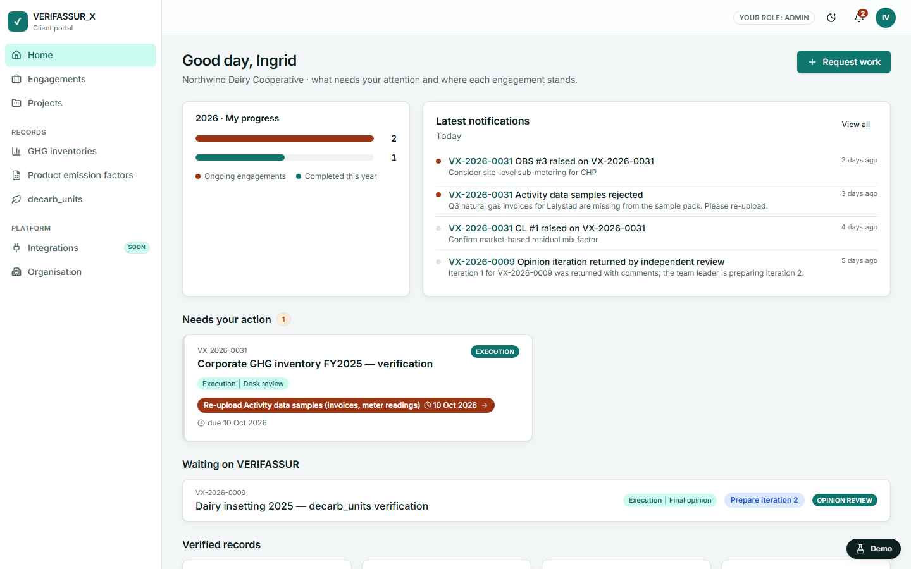
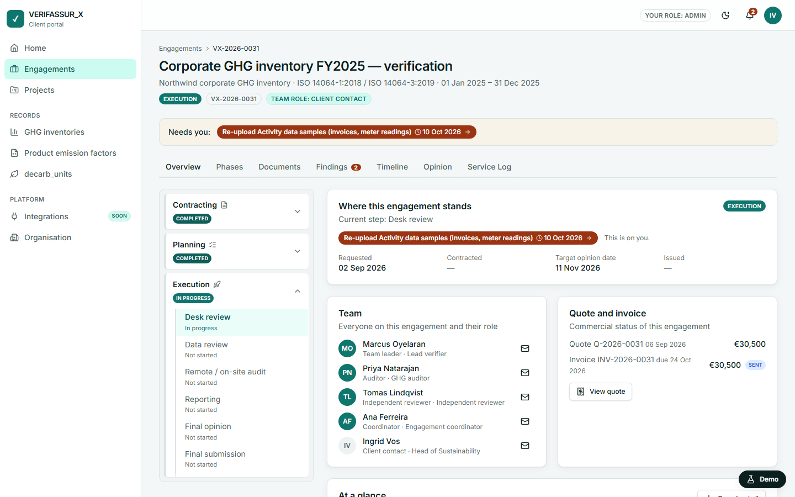
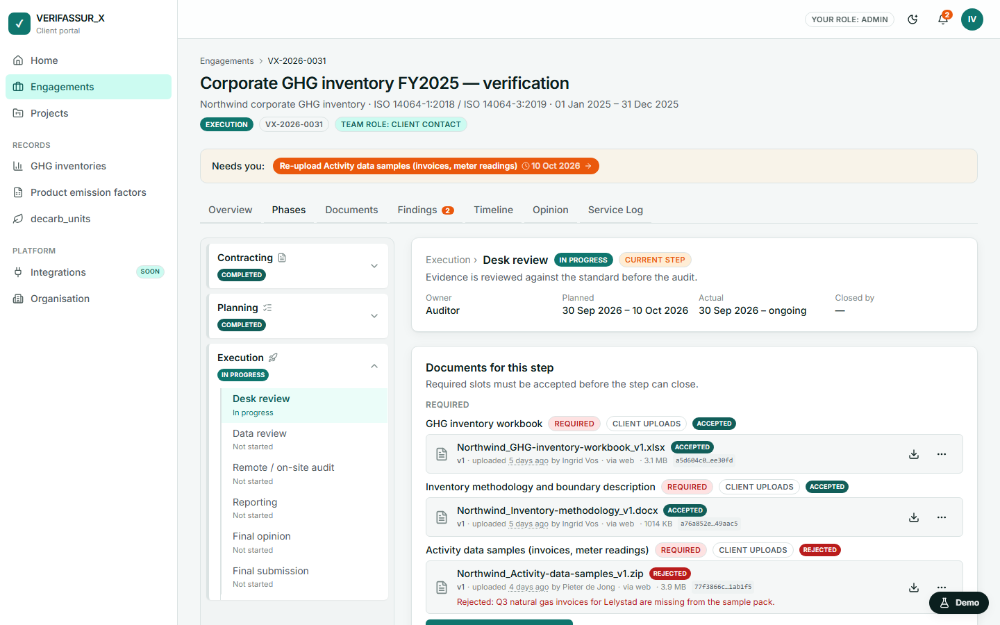
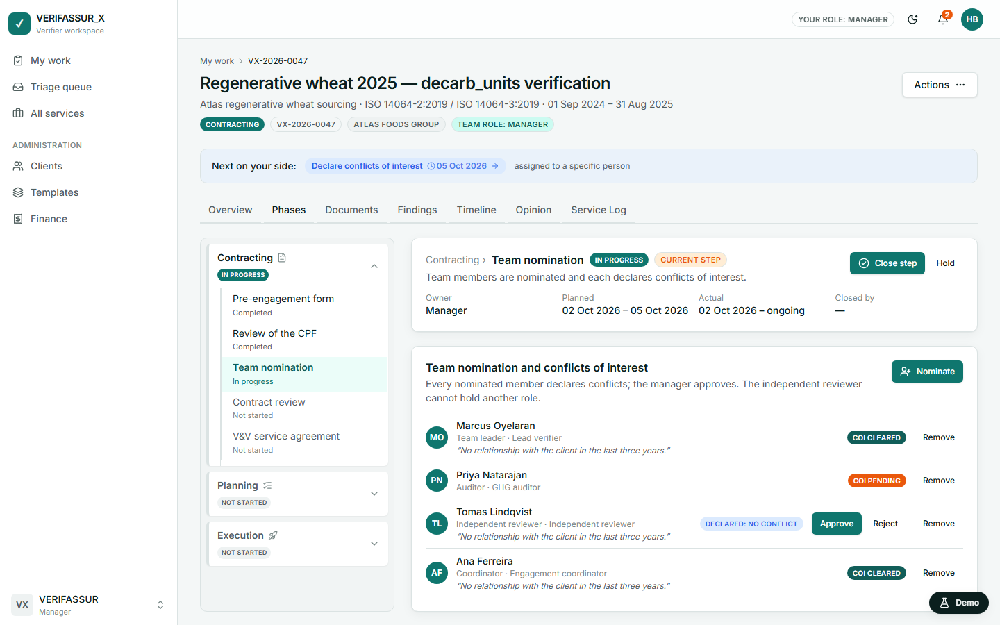
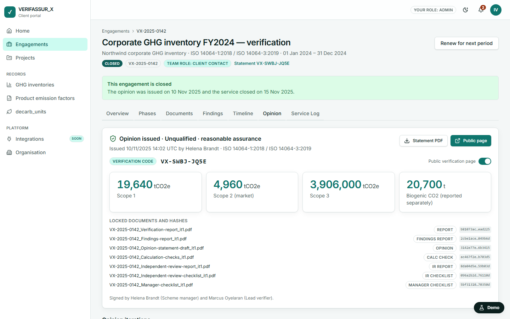
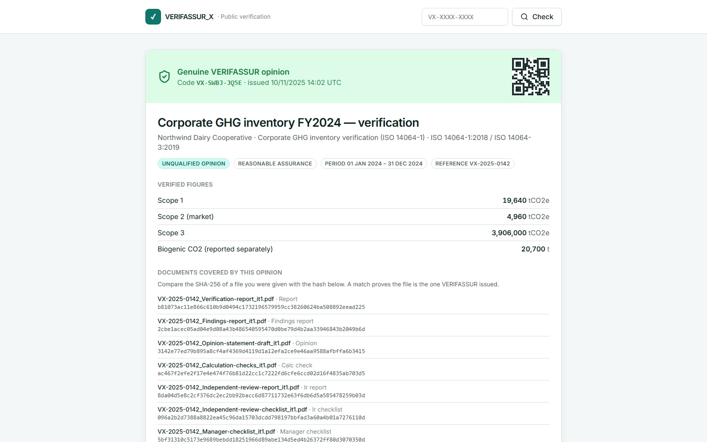
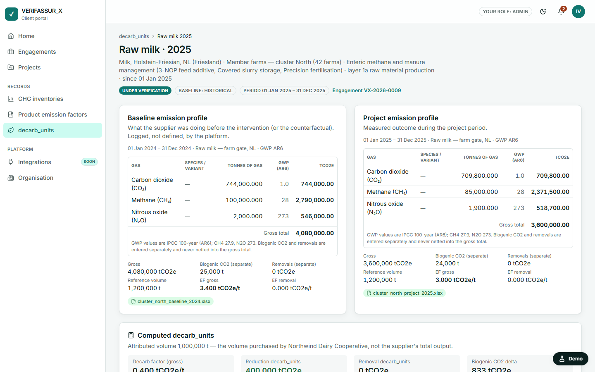
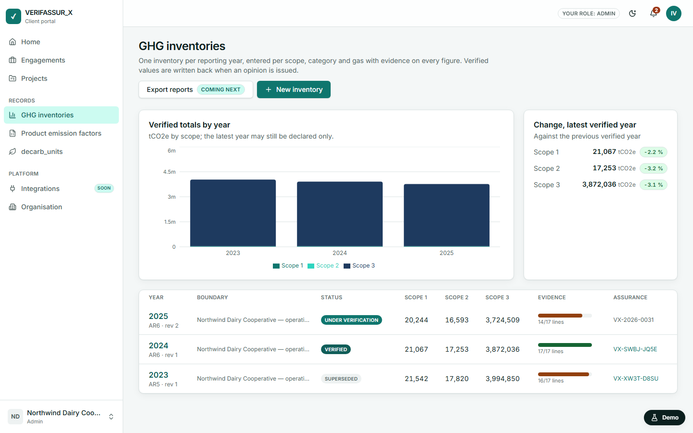
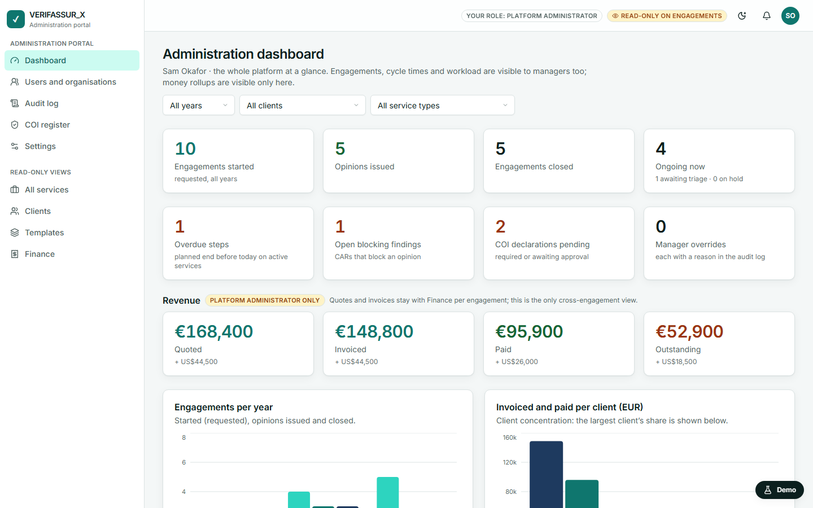
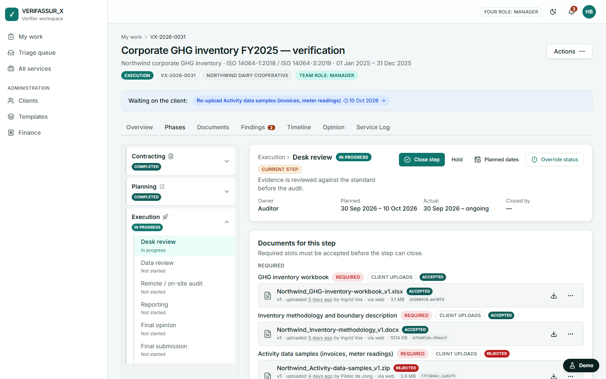

# VERIFASSUR_X — digital assurance platform

VERIFASSUR_X is the client portal of a third-party assurance company (validation and verification body) in the carbon market. A client company requests validation or verification work, follows each engagement with full visibility of evidence, findings, timeline and opinions, and keeps its verified GHG inventory, product emission factors and `decarb_units` as structured, assurance-backed records.

This repository holds the product planning and, in `demo/`, a clickable front-end mock of the platform used to show investors what the product looks like.

## Live demo

- **GitHub Pages:** https://rbndchsn.github.io/digital-platform/
- Cloudflare Pages: activates once the `CLOUDFLARE_API_TOKEN` and `CLOUDFLARE_ACCOUNT_ID` repository secrets are set (the workflow already deploys there).

Open the link, pick a persona under **Demo: enter as…**, and follow [`demo/DEMO_SCRIPT.md`](demo/DEMO_SCRIPT.md) — twelve chapters, about twenty-five minutes. The floating **Demo** button (`Ctrl+.`) switches persona, jumps to a chapter, simulates a slow network or a failed call, and resets.

Version **v0.2-demo** adds governance: **Sam Okafor, platform administrator**, who sees the whole platform including money rollups and cannot change any engagement or record data, with an Administration portal (dashboard, users and organisations, audit log, COI register, settings, break-glass); and **manager overrides** (Helena Brandt forces a step or service status, reassigns a team role or replans dates, always with a mandatory reason written to the Service Log).

## What the demo shows

| | |
|---|---|
|  |  |
| Client home: progress, what needs you, verified records | Engagement workspace: phase rail, next action, team, commercial status |
|  |  |
| Evidence slots with versions, hashes and rejection reasons | Team nomination and conflict-of-interest approvals |
|  |  |
| Issued opinion with locked documents and hashes | Public verification page anyone can check |
|  |  |
| decarb_unit record: baseline vs project per gas, 400,000 units | GHG inventories by year, scope and evidence completeness |
|  |  |
| Administration dashboard: rollups and the money only the platform administrator sees | Manager override on a step: force complete, reopen or skip, always with a reason |

More screens in [`assets/demo-screenshots/`](assets/demo-screenshots/), including dark-mode variants.

## Phases

| Phase | What | Where | Status |
|---|---|---|---|
| I — Mock platform | Static React app that looks and behaves like the real platform. Every click does what the real one would, driven by an in-browser mock backend. No persistence beyond the browser tab. | `demo/` | **Done, v0.1-demo** |
| I.5 — ADMIN, overrides, rollups | PRD v0.2: platform administrator persona and Administration portal, manager overrides with mandatory reason, money rollups, portfolios preview. | `demo/` | **Done, v0.2-demo** |
| II — Real platform | Cloudflare implementation (Workers, D1, R2, Better Auth) described in the PRD. | `verifassurx/` (future) | Not started; see [`planning/phase2-handover.md`](planning/phase2-handover.md) |

## How the mock works

- **Real domain, fake persistence.** Workflow templates, state machines, the next-action rule, the role policy, GHG arithmetic and the `decarb_unit` computation are real TypeScript in `demo/src/domain/` with unit tests. Phase II lifts them unchanged.
- **Mock backend.** `demo/src/mock/` seeds four organisations, twelve personas, ten engagements and the records from the storyline, keeps them in memory and in `sessionStorage`, and `demo/src/api/` exposes the same operations the PRD defines as endpoints. Every mutation runs policy → state machine → store → audit event → notification.
- **Roles are enforced, not decorated.** The policy in `demo/src/domain/policy.ts` resolves the platform administrator first (an allow-list of reads and `admin.*` actions, every mutation denied), then org and service roles, the COI gate and separation of duties. Manager overrides are separate actions with their own audit events and a mandatory reason.
- **"Show, don't do."** File pickers, downloads, e-mail, signing and connectors open the real-looking dialog with a **Back to demo** exit and a **Simulate** button that records the outcome in the session.
- **Future features in preview.** API keys, MCP, webhooks, AI assistant, e-signature, exports, registry links and more are visible but inactive, with **I'm interested** capturing demand that VERIFASSUR staff see on the Clients page.

## Known limitations of the demo

- Authentication is decorative: any input is accepted and personas are picked from a list.
- No file bytes are stored; uploads record metadata and a stand-in hash.
- Progress lives in the browser tab only and is lost when the tab closes (use **Reset demo** to start clean at any time).
- The QR on the public statement is a decorative pattern; Phase II renders a real QR.
- English only; desktop first (usable on tablet, read-only on phones).

## Planning documents

- [`planning/plan_v1.md`](planning/plan_v1.md) — execution plan, operating rules, progress log
- [`planning/brainstorming.md`](planning/brainstorming.md) — analysis of a reference platform and the binding product decisions
- [`planning/0001-prd-verifassurx-platform.md`](planning/0001-prd-verifassurx-platform.md) — product requirements document
- [`planning/tasks-0001-prd-verifassurx-platform.md`](planning/tasks-0001-prd-verifassurx-platform.md) — Phase II task list
- [`planning/phase2-handover.md`](planning/phase2-handover.md) — what carries over from the demo into the real platform

## Run locally

```bash
cd demo
npm install
npm run dev          # http://localhost:5173
npm run test         # unit tests (domain, fixtures, api storyline)
npm run test:e2e     # Playwright: chapters, accessibility audit, full storyline
npm run build && node scripts/screenshot.mjs ../assets/demo-screenshots
```

Node 22 and npm 10 are required. The first `npm run test:e2e` needs `npx playwright install chromium`.

## Licence

All rights reserved. No licence is granted for reuse of this code or content.
