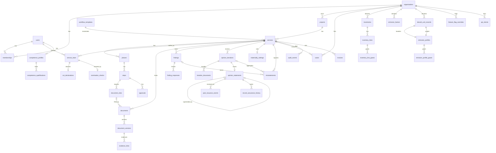

# PRD 0001 — VERIFASSUR_X Assurance Platform

| | |
|---|---|
| Status | Draft v0.3 |
| Date | 2026-10-06 |
| Author | Robin Duchesneau with Claude |
| Source notes | `brainstorming.md` (same folder), 16 reference screenshots in `../assets/sourceimages/` |
| Audience | Developers (junior to senior), designers, VERIFASSUR management |
| Changes in v0.2 | ADMIN defined as the **platform administrator** (sees everything, changes no engagement or record data); manager **overrides** with mandatory reason; **Administration console** (§6.13, §7.1 `/admin/*`) with user, organisation and settings management, global audit, COI register, break-glass, statistics and money rollups; **portfolios** (R2, flag `portfolios`); matching data model, API, RBAC and release-plan updates. Decisions recorded in `plan_v1.md` §8. |
| Changes in v0.3 | Accreditation-grade controls an ISO/IEC 17029 / ISO 14065 assessor would test first. **C1** decision separation: the **involved set** (FR-79) bars anyone who did verification work, including entering or editing a verified figure, from the manager decision; edits after IR approval return the iteration to IR; no verified-value edits after issuance (FR-33, FR-77 modified). **C2** non-overridable steps are a template attribute `non_overridable` (FR-80; FR-73 modified). **C4** `level_of_assurance` is a service attribute fixed at contracting and carried by every written-back record; inventory lines carry a **review status** instead of per-line verified values (FR-81–83; FR-35, FR-40, FR-43, FR-47, FR-52 modified). **C3** materiality setting, **misstatement register**, aggregation panel and consistency warning (FR-84–87; FR-34 modified). **C5** post-issuance **revision and withdrawal** with superseded / withdrawn statements and public-page banners (FR-88–90; FR-36 modified). **C6** **complaints and appeals** register (FR-91–93). **C7** **competence** profiles, template requirements and nomination checks (FR-94–96; FR-16, FR-75 modified). **C8** **rotation** rules as template data (FR-97–98). **C9** custom SVG timeline component replaces the Recharts Gantt claim (§8.2; FR-37 modified). **C10** deferred: governance views for an impartiality-committee role (§16). Matching changes in §2–§5, §7–§16. Decisions recorded in `plan_v1.md` §8 (D11–D24). |

---

## 1. Introduction

VERIFASSUR_X is the client-facing digital platform of VERIFASSUR, a third-party assurance company (validation and verification body, "VVB") working in the carbon market. A client company logs in to **request** assurance work (validation or verification), **follow** ongoing engagements with full visibility of evidence, findings, timeline and opinions, and **keep** its verified GHG inventory, product emission factors and `decarb_units` as structured, assurance-backed records that are reused the following year.

The platform also gives VERIFASSUR staff the internal workflow needed to deliver accreditation-grade work (impartiality checks, team nomination, independent review, iteration approvals, audit trail), because the client experience depends on it.

**Problem it solves.** Today an assurance engagement is email, shared folders and spreadsheets. The client does not know what is missing, what is blocking, or when the opinion will be issued. The outputs are PDFs that cannot be reused. VERIFASSUR_X replaces this with one workspace where every obligation, document, decision and verified number has an owner, a status, a timestamp and a link to evidence.

**Guiding principle** (from brainstorming §3.12): *present-realistic, future-exposed.* Release 1 is simple and complete. Later capabilities are visible in the product as flag-gated previews so clients see the roadmap and we measure demand.

**Decisions already made** (brainstorming §3.10–3.11) and inherited here:
- Verify only. No registry. The platform never issues, transfers, retires or claims units.
- `decarb_unit` = 1 tCO2e of (baseline − project) within a value chain, computed on the client's attributed volume; per-gas profiles; removals and biogenic CO2 separate and never netted.
- The client enters structured data and uploads evidence. The platform logs and checks consistency; it is not a calculation engine.
- Roadmap ingestion: spreadsheet import → REST API → MCP server.

---

## 2. Goals

| # | Goal | Measure |
|---|---|---|
| G1 | A client can request an engagement and reach a signed service agreement entirely in the platform | ≥ 80 % of new engagements requested through the portal within 12 months of launch |
| G2 | A client always knows the single next thing they must do | Every open service shows exactly one "blocking you" action or "nothing needed from you" on the home page |
| G3 | Evidence is complete before the auditor starts | Desk review starts with 0 missing required documents in ≥ 70 % of services |
| G4 | Verified numbers are structured, not trapped in PDFs | 100 % of issued opinions have their verified figures stored as records with an assurance reference, the level of assurance and the statement they belong to; a superseded or withdrawn statement is reflected on every record that relied on it |
| G5 | The engagement is accreditation-grade by construction | Impartiality approval, technical scope approval, agreement acceptance, independent review and the final decision cannot be skipped by the system (template attribute `non_overridable`, FR-80); the final decision is refused to anyone in the involved set (FR-79); materiality, competence and rotation are checked and recorded before the step they gate (FR-84, FR-96, FR-98) |
| G6 | Year two is faster than year one | Renewal requests pre-filled from prior year; median time from request to contract reduced by 30 % |
| G7 | The platform is ready for machine clients | Every client-entered form is backed by a published JSON schema that the future API accepts unchanged |

---

## 3. Users and roles

### 3.1 Organisations

Two organisation types share one platform:

- **Verifier org** — VERIFASSUR itself. One in Release 1; the model allows several later (flag `multi_verifier`).
- **Client org** — a company seeking assurance. Many. A client org sees only its own data.

### 3.2 Roles

**Client org roles**

| Role | Can |
|---|---|
| `client_owner` | Everything below, plus manage billing contacts, delete org data requests, transfer ownership |
| `client_admin` | Invite/remove users, assign roles, create requests, sign agreements, submit inventories and records, respond to findings, manage API keys (when enabled) |
| `client_contributor` | Upload evidence and enter data on services and records they are assigned to; respond to findings assigned to them |
| `client_viewer` | Read-only: dashboards, documents, opinions, history |

**Verifier org roles**

| Role | Can |
|---|---|
| `verifier_manager` | Triage requests, approve technical scope and impartiality, nominate team (with competence and rotation checks, FR-96, FR-98), approve contracts, approve the audit plan and materiality (FR-84), take the **manager decision** on opinion iterations **only when outside the involved set** (FR-79), issue, close services, open post-issuance events and decide revision or withdrawal when outside the involved set (FR-88–90), handle complaints and appeals when outside the involved set (FR-92), maintain competence profiles of other staff (FR-94), manage templates and feature flags for clients. **Overrides (§6.14), each with a mandatory reason:** force a step that is not `non_overridable` to `completed`, `in_progress` (reopen) or `skipped`; force a service status change (hold, resume, cancel, close, return to execution); reassign a team role to another person; change planned dates; edit verified figures before issuance (which places the manager in the involved set, FR-77); override competence and rotation **warnings** (never the IR hard block) |
| `verifier_team_leader` | Run the engagement: plan, set materiality (FR-84), open/close steps, raise findings, register and confirm misstatements (FR-85), enter verified figures and line review statuses, draft opinion iterations, request documents |
| `verifier_auditor` | Work assigned steps, review evidence, raise findings, propose and confirm misstatements on assigned steps |
| `verifier_technical_expert` | Same as auditor, limited to assigned steps |
| `verifier_independent_reviewer` | Review opinion iterations, complete IR checklist, acknowledge the materiality consistency warning (FR-87), approve or request changes. Cannot have any other role on the same service; must hold a valid independent-reviewer qualification (FR-96, hard block) |
| `verifier_coordinator` | Administrative: upload contract documents, schedule, manage invoices references, notifications |
| `verifier_finance` | Quotes, invoice references, paid status |

**ADMIN — platform administrator** (`platform_admin`, held by VERIFASSUR IT / platform operations). ADMIN administers the **digital platform**, not clients, projects or staff work. It is an org-level role on the verifier org (`memberships.role = platform_admin`); there is no separate per-user flag.

ADMIN **can**:
- see everything on the platform: every organisation, user, project, service, step, document (metadata, versions, hashes), finding, iteration, statement, record, invoice, feature flag, interest signal, notification volume and audit event; read the materiality settings and misstatement registers, post-issuance events, the complaints and appeals register (including internal investigation notes), competence profiles, nomination check results and rotation history; see **money rollups** (quoted, invoiced, paid, outstanding by year, client and service type) — the only role that does;
- manage **users**: invite, rename, change e-mail, job title and org role, deactivate and reactivate (never delete), reset password, reset MFA and passkeys, force sign-out, see last sign-in;
- manage **organisations**: create, rename, change legal name and country, suspend and unsuspend;
- manage **platform settings**: feature flag defaults and per-client states, announcement banner, maintenance mode, notification templates, branding;
- read the **global audit log** and the **authentication event log**, export them, and read the **COI register** across engagements;
- open the content of client evidence only through **break-glass** access with a typed reason, which is itself an audit event;
- trigger data operations: export, backup, retention report, anonymisation of deactivated users after the retention period.

ADMIN **cannot** (enforced in policy, and the UI shows no such control to ADMIN):
- open, complete, reopen, skip, hold or plan a step; change a service status; triage, hold, resume, cancel or close a service;
- decide any approval (technical scope, impartiality, contract, audit plan, agreement), nominate or reassign a team, decide a COI declaration;
- upload, replace, accept, reject or delete a document; raise, respond to or transition a finding;
- create, submit, review, approve or issue an opinion iteration; set or approve materiality; register, confirm or dismiss a misstatement; acknowledge a consistency warning;
- create, edit, submit or verify records, or edit declared or verified figures or line review statuses (ADMIN never edits a figure, FR-79);
- open, decide or close a post-issuance event, revise or withdraw a statement;
- receive, handle or decide a complaint or appeal;
- create or edit a competence profile or qualification; override a competence or rotation warning;
- add or change quotes and invoices (finance keeps managing them per engagement).

Rationale: platform administration is separated from assurance decisions (ISO/IEC 17029 impartiality). Every ADMIN action is an audit event with actor, reason where applicable and before/after values, and requires recent re-authentication (§11.3).

### 3.3 Service team

A user is attached to a service with a **service role** (one of the verifier roles above, or `client_contact`). Each verifier team member must complete a **conflict-of-interest (COI) declaration** per service before they can open it. Independent reviewer must not have any other service role on that service (enforced). Nomination and reassignment run the competence check (FR-96) and the rotation check (FR-98); their results are recorded on the team row.

**Involved set** (FR-79). For a service's current issuance cycle (from the last issued statement, or from the service start, to the next issuance), the involved set is everyone who holds or held any verifier service role on the service, everyone who entered or edited a verified value or a line review status on a record attached to the service in that cycle, and whoever decided the independent review. It is derived from `service_team` and `audit_events`, never stored as a list. Anyone in the involved set is refused the manager decision, the issue action, the withdrawal decision and the revision decision for that cycle, and cannot handle a complaint or appeal about the service. The **involved set of a decision** (used by complaints and appeals) is the decision's actor plus the involved set of the service, where one exists.

---

## 4. User stories

**Client**
1. As a client admin, I want to request a verification by picking a service type, standard and period, and attaching what I already have, so that VERIFASSUR can quote within days instead of weeks of email.
2. As a client admin, I want to see on my home page exactly what is blocking each engagement and whether it is on my side or VERIFASSUR's side.
3. As a client contributor, I want a checklist of required documents per step, with upload slots, so I know what is missing without asking.
4. As a client admin, I want to answer a finding in a thread with attachments and see when the auditor closed it.
5. As a client admin, I want to enter my GHG inventory per scope, category and gas, attach evidence to each figure, and submit it for verification.
6. As a client admin, I want to enter the baseline and project emission profiles of an insetting intervention and see the resulting `decarb_units` computed on my purchased volume.
7. As a client viewer (CFO), I want to download the signed opinion and see the verified totals and a short timeline of the engagement.
8. As a client admin, I want next year's request pre-filled from this year's scope, sites and evidence list.
9. As a client admin, I want to see each engagement's quote, invoice reference and paid status.
10. As a client admin, I want to see which future capabilities (API, MCP, AI assistant) are coming and tell VERIFASSUR I am interested.
25. As a client viewer (CFO), I want every verified record and the statement to show the **level of assurance** so that nobody in my reporting chain treats a limited-assurance figure as reasonable assurance, and I want to see which inventory lines were adjusted or not individually tested.
26. As a client admin, I want to **appeal** a decision I disagree with (a declined request, a rejected document, a finding outcome, an opinion) and **raise a complaint** about VERIFASSUR's conduct from inside the platform, see who is handling it and what was decided.
27. As a client admin, I want to be told immediately, with the records marked, if a statement I rely on is **revised or withdrawn**, and I want the public verification page to say so to anyone I already gave the code to.

**Verifier**
11. As a manager, I want new requests in a triage queue with the information needed to decide technical scope and impartiality.
12. As a manager, I want to nominate a team and have each member's COI declaration gate their access.
13. As a team leader, I want to open steps, request documents from the client, raise findings and see the client's responses in one place.
14. As an independent reviewer, I want the opinion iteration bundle, the checklist, and an approve / request-changes decision that is recorded with my name and time.
15. As a manager, I want to approve an iteration and issue the opinion, which locks the documents and writes the verified figures to the client's records.
16. As any verifier, I want a Service Log that shows every status change, upload, approval and decision with who and when.
17. As a manager, I want to **override** a step or service status with a mandatory reason when the normal flow is stuck (a client that cannot supply a document, a step closed by mistake), reassign a team role when someone leaves, change planned dates and correct a verified figure, with every override written to the Service Log, the affected people notified and the next action recomputed.
28. As a team leader, I want to set the **materiality** for the service from the programme default, record the basis, and have the platform aggregate uncorrected **misstatements** against it on every iteration, so that the opinion type I propose has a traceable basis.
29. As an independent reviewer or decision-maker, I want the platform to **warn** me when the draft opinion is inconsistent with the aggregated misstatements, and to record my acknowledgement and comment, because the judgement is mine, not the system's.
30. As a manager, I want the platform to **refuse me the final decision** when I have touched the figures or worked on the service, and tell me why, so that I cannot approve my own work even by mistake.
31. As a manager, I want to **revise or withdraw** an issued statement when facts emerge, with the full chain run again by people outside the involved set, the records re-marked and the public page updated.
32. As a manager, I want nomination to show each candidate's **competence** (qualifications, scopes, expiry) and **rotation** history against the programme rules, warn or block as the rule says, and record my reason when I override a warning.
33. As a manager outside the involved set, I want a **complaints and appeals** queue with acknowledgement and decision targets, internal notes and a recorded outcome that can trigger a revision or withdrawal.

**Platform administrator (ADMIN)**
18. As the platform administrator, I want to **see the whole picture**: every organisation, user, engagement, record and audit event, so I can support users and answer management questions without being able to change any engagement data.
19. As the platform administrator, I want to **manage users and organisations**: invite, rename, change roles, deactivate (never delete) with a summary of the open work to hand to a manager, reset passwords, MFA and passkeys, force sign-out, create and suspend organisations.
20. As the platform administrator, I want **platform settings** in one place: feature flag defaults and per-client states, the announcement banner, maintenance mode, notification templates and branding.
21. As the platform administrator, I want **governance views**: the global audit log and authentication events with filters and export, the register of conflict-of-interest declarations across all engagements, and read-only access to the complaints register, competence profiles and decision-conflict refusals.
22. As the platform administrator, I want **rollups and statistics**: engagements by year, client, service type, standard and staff; revenue quoted, invoiced, paid and outstanding; cycle times; overdue steps; open blocking findings; workload; client concentration.
23. As the platform administrator, I want **data operations**: export, backup status, retention report and anonymisation of deactivated users after the retention period, each with an audit entry; and break-glass access to evidence content with a typed reason when support requires it.

**Machine (future, preview in Release 1)**
24. As a client's carbon-accounting SaaS, I want to push an inventory into a draft request through an API or MCP tool so a human only has to review and submit.

---

## 5. Scope

### 5.1 In scope — Release 1 (live)

- Multi-tenant orgs, users, roles, invitations, MFA, passkeys.
- Projects and Services with the three-phase workflow (Contracting, Planning, Execution) driven by service-type templates.
- Request wizard, pre-engagement form, technical scope and impartiality approvals, team nomination with COI, contract documents and in-platform acceptance of the service agreement.
- Evidence vault: required-document slots per step, versioned uploads, provenance, hash, download-all.
- Findings (CAR, CL, FAR, OBS) with threaded responses.
- Opinion iterations: team leader draft → independent review → manager decision by someone outside the involved set (§3.3, FR-79) → issue. Issued opinion statement page with hash, level of assurance and materiality threshold.
- **Level of assurance** as a service attribute fixed at contracting and carried by every written-back record; inventory lines carry a **review status** rather than individual verified values (§6.17).
- **Materiality and misstatements** (§6.18): materiality setting approved with the audit plan, misstatement register, aggregation panel per iteration, consistency warning acknowledged by IR and decision-maker.
- **Post-issuance revision and withdrawal** (§6.19): superseded and withdrawn statements, record re-marking, public-page banners.
- **Complaints and appeals** register (§6.20) for client users, handled outside the involved set.
- **Competence** profiles, template requirements and nomination checks (§6.21); **rotation** rules as template data (§6.22).
- Timeline (custom read-only component, planned vs actual, milestones, override markers, table view) from planned dates and actual status events.
- Service Log (immutable audit trail) and notifications (in-app + email).
- Client self-entry: GHG inventory (year, scope, category, line, gases), product emission factors, `decarb_unit` records (baseline/project emission profiles, attributed volume). Evidence per figure. Declared vs verified values.
- Home dashboard, past services, documents tab, basic KPI tiles.
- Quotes and invoice references with paid status (no invoicing engine).
- Feature flags with preview state and interest capture.
- **Administration console** (`/admin/*`, §6.13) for the platform administrator: users, organisations, settings, global audit and auth logs, COI register, break-glass, statistics and money rollups, data operations.
- **Manager overrides** (§6.14) with mandatory reason, except on steps the template marks `non_overridable` (§6.16).

### 5.2 In scope — Preview in Release 1, live in Release 2

- **Portfolios** (§6.15): a senior manager owns a handful of clients and their engagements; views and triage scoped by portfolio. Flag `portfolios`.
- **Public complaint form** (FR-93) for external parties, behind Turnstile. Flag `public_complaints`.
- Spreadsheet template import for inventories and `decarb_unit` records.
- REST API with per-org API keys (schemas published from day one; endpoints enabled by flag).
- MCP server exposing the same operations as tools.
- AI evidence assistant (classify uploads into required slots, completeness check, figure extraction, draft findings for auditor review).
- Legal e-signature integration for service agreements and opinions.
- CSRD/ESRS E1 and ISO 14064-1 report exports from verified data.
- Registry links (Verra Project Hub, Gold Standard) beyond a reference ID.

### 5.3 Preview in Release 2, live in Release 3+

Continuous assurance, dMRV connectors, verifiable credentials for opinions, digital product passport export, agent-to-agent verification, multi-verifier recognition.

### 5.4 Non-goals

- Issuing, serialising, transferring, retiring or claiming carbon units. No registry.
- GHG calculation engine (activity data × factors). The client declares figures; we log, check consistency and verify.
- Accounting and invoicing (only references and paid status).
- Native mobile apps (responsive web; mobile is read-only for Release 1).
- Real-time chat. Communication is findings threads and notifications.
- Enforcing double counting across clients (auditor judgement, recorded as findings).
- **Professional judgement.** The platform never chooses the opinion type, the materiality level or whether a misstatement is material. It computes, displays, warns and records who decided what (§7.3 "The platform shows, people decide").
- Notifying programmes, registries or the accreditation body of a revision or withdrawal. That happens outside the platform; the platform records that and when it was done (FR-88).

---

## 6. Functional requirements

Numbered for traceability. "Must" = Release 1. "R2"/"R3" = later releases, shown as preview earlier.

### 6.1 Organisations, users, access

- FR-1 The system must support multiple client orgs and one verifier org, with strict data isolation by `org_id` enforced in the data access layer (every query is scoped; no cross-org reads except through service team membership).
- FR-2 Users must authenticate with email + password or magic link, with TOTP MFA. MFA is mandatory for all verifier roles and for `client_owner`/`client_admin`. Passkeys (WebAuthn) must be supported as a second factor or passwordless login.
- FR-3 Org admins must be able to invite users by email with a role; invitations expire in 7 days and are single-use.
- FR-4 A user may belong to several orgs (e.g. a consultant) and must switch org context explicitly; the active org is part of the session.
- FR-5 The system must record every authentication event (login, failed login, MFA, API key use, role change) in the audit log.
- FR-6 R2: Org admins must be able to create scoped API keys (read, write, submit) that act as a machine user of that org, with rotation and revocation.
- FR-7 R2: Enterprise SSO (OIDC) per client org.

### 6.2 Projects and services

- FR-8 A client admin must be able to create a **Project** (name, description, country, standard/programme, external registry ID optional, owner).
- FR-9 A client admin must be able to create a **Service request** on a project through a wizard: service type (from templates), standard, reporting period, scope summary (sites, boundary, products or interventions), **requested level of assurance (FR-81, shown when the template says it applies, defaulted from the template)**, target dates, attachments, contact person. Submitting creates a Service in status `requested`.
- FR-10 Service types in Release 1 and their templates: `vcs_validation`, `vcs_verification`, `gs_validation`, `gs_verification`, `iso14064_1_inventory_verification`, `iso14067_product_verification`, `decarb_units_verification` (ISO 14064-2 style), `design_change`. Templates are data (JSON), editable by verifier managers without code changes. **(v0.3)** Programme-variable rules live in the template, never in code: `non_overridable` steps (FR-80), `assurance` applicability and default (FR-81), `materiality_defaults` (FR-84), `competence_requirements` (FR-95), `rotation_rules` (FR-97), complaint and appeal targets (FR-91), and `blocking_finding_types` (FR-30). Every template edit is an audit event `template.edited` with before/after and a reason; edits never change running services (§8.5).
- FR-11 Each Service must have phases and steps instantiated from its template, each with status, owner role, planned dates, required document slots and approvals.
- FR-12 Phase gating: a phase cannot start until the previous phase is completed, unless the template marks a step as `parallel_allowed`.
- FR-13 Step status transitions must be validated server-side against the state machine (§8.5) and recorded as status events with actor and timestamp.
- FR-14 The pre-engagement form (CPF) must be generated from the request data and editable by the client until submitted; the verifier reviews it in the Contracting phase. **(v0.3)** The CPF carries the requested level of assurance; the verifier confirms or changes it (with a comment) when reviewing the CPF, and the agreed value is printed in the contract and the service agreement (FR-18, FR-81).
- FR-15 Technical scope and impartiality approvals must be explicit records with approver, decision, date and comment. The service cannot move to team nomination without both approved.
- FR-16 Team nomination: manager assigns users with service roles. **(v0.3)** Before a nomination is saved the system runs the competence check (FR-96) and the rotation check (FR-98) for the candidate and for the team as a whole, shows the results in the team panel, blocks where a rule blocks, and otherwise records the warnings and the manager's override reason on the team row (`service_team.check_result_json`, audit event `team.nominated` with the check result). Each verifier member must submit a COI declaration (clear / potential conflict with description). The manager approves. A member with no approved COI sees the service in a locked state.
- FR-17 Independent reviewer must not hold another role on the same service (validation error).
- FR-18 Contracting documents (quote, contract, service agreement) are document slots; the client admin must be able to **accept** the service agreement in-platform (click-to-accept with name, time, IP, document hash recorded). R2: legal e-signature provider. **(v0.3)** Acceptance records the level of assurance shown in the accepted agreement and **locks** `services.level_of_assurance` (`assurance_level_locked_at`, FR-81). The agreement-acceptance step is `non_overridable` (FR-80).
- FR-19 Renewal: a client admin must be able to create a new request "from" a closed service, pre-filling project, scope, sites and the list of previously supplied document types.
- FR-20 Managers must be able to put a service on hold with a reason, resume, or cancel it.

### 6.3 Evidence vault

- FR-21 Each step has required and optional **document slots** defined by the template (e.g. PDD, ERCS, Monitoring Plan, inventory workbook). The client sees missing required slots as a checklist.
- FR-22 Uploads go directly to object storage via short-lived signed URLs; max 500 MB per file; allowed types: pdf, docx, xlsx, csv, pptx, png, jpg, zip, json, xml. Type is verified by content sniffing, not extension only.
- FR-23 Every upload creates an immutable **document version** with uploader, time, size, SHA-256 hash and source (`manual | import | api | mcp`). Previous versions remain downloadable. Deleting hides a version (soft delete) and is logged; nothing is physically deleted during the retention period.
- FR-24 Verifier users must be able to mark a version `accepted` or `rejected` with a reason; rejection notifies the client and re-opens the slot.
- FR-25 Any document can be linked as evidence to inventory lines, emission profile gases, emission factors and `decarb_unit` records (polymorphic evidence links).
- FR-26 "Download all" per step, per phase and per service produces a zip with a manifest (file list and hashes).
- FR-27 R2: AI assistant proposes the slot for an unassigned upload and flags missing items; a human confirms.

### 6.4 Findings

- FR-28 Verifier users must be able to raise findings of type `CAR` (corrective action request), `CL` (clarification), `FAR` (forward action request), `OBS` (observation), with severity, description, affected step, affected record or line, due date, assignee on client side.
- FR-29 Client users must be able to respond in a thread with text and attachments. Status flow: `open → responded → under_review → closed` or `withdrawn`. Only verifier users close.
- FR-30 Open CARs must block the opinion iteration from reaching manager approval (configurable per template; default blocking for CAR, non-blocking for CL/FAR/OBS).

### 6.5 Opinion iterations and issuance

- FR-31 A team leader must be able to create an **opinion iteration** containing the final service documents (verification/validation report, findings report, opinion statement, calculation checks) and a summary of verified figures.
- FR-32 The iteration moves `draft → independent_review`. The independent reviewer completes the IR checklist (template-driven), uploads the IR report and decides `approve` or `request_changes` (with comments). Request changes returns to draft and increments the iteration number on the next submission.
- FR-33 After IR approval the manager completes the manager checklist and decides `approve` or `request_changes`. **(v0.3)** The decision is refused with the typed error `decision_maker_conflict` to any user in the service's involved set (FR-79), regardless of org role; the UI disables the decision button and names the reason (for example "You edited verified values on this service on 12 Mar 2027"). The manager checklist includes the materiality consistency item (FR-87); if the consistency warning is raised, the decision requires an explicit acknowledgement with a comment. The refusal is itself an audit event (`iteration.decision_refused`, actor, reason code) so the Service Log and the ADMIN statistics show attempts.
- FR-34 **Issue**: on manager approval the system locks the iteration's documents (no further versions), generates the **opinion statement page** (HTML + PDF) with service details, verified figures, opinion type, **level of assurance, materiality threshold and basis (FR-84), a summary of uncorrected misstatements (gross and net, FR-86)**, signatories and the hash of each document, assigns a public verification code, and marks the service `issued`. **(v0.3)** The issue action is subject to the same involved-set refusal as the decision (FR-79).
- FR-35 Issuing writes the verified figures to the client's records **(v0.3) at assertion level**: inventory `verified_totals_json` (totals per scope and the gross total; lines keep their review status and adjusted value, FR-82), emission factor `verified_value`, `decarb_unit_record` verified reduction and removal units. Each record receives `assurance_ref = opinion_statement_id`, `level_of_assurance` copied from the service (FR-81) and a row in `record_assurance_history` (FR-83). Previously verified records for the same scope and period become `superseded`.
- FR-36 A public page `/verify/{code}` must show the opinion summary, the level of assurance, the materiality threshold and document hashes without login (flag `public_statement`, default on after issuance; client can opt out). **(v0.3)** The page never disappears once a code has been issued. For a `superseded` statement it shows a banner with the supersession date and a link to the replacement code; for a `withdrawn` statement it shows a withdrawal banner with the date and the public reason category (FR-90) and hides the verified figures. A client opt-out from public display hides the figures and hashes but never the superseded or withdrawn banner.

### 6.6 Timeline and Service Log

- FR-37 The Timeline must show phases and steps as bars using planned start/end (from template defaults adjusted by the team leader) and actual start/end (from status events), with hover showing every transition and timestamp. **(v0.3)** It is a **read-only** view (planned dates change only through FR-76). Requirements: rows grouped by phase with collapsible steps; planned bars drawn as outlines and actual bars filled; a transition tick on the actual bar for every status event, whose tooltip lists actor and time (UTC, local time on hover); a today line; milestone markers for agreement acceptance, issuance, revision and withdrawal; a distinct marker for every override (`step.overridden`, `service.overridden`, `step.replanned`); a month axis with a week sub-axis when the range is under 120 days; full keyboard navigation (row and marker focus with the same tooltip content) and an equivalent **table view** toggle with the same data, so the screen meets WCAG 2.1 AA. The component is custom (SVG or CSS grid, §8.2), not a charting-library Gantt.
- FR-38 The Service Log must list all events of a service (status changes, uploads, approvals, findings, decisions, team changes, agreement acceptance) in reverse chronological order with actor, time (UTC) and before/after values, filterable by type. It is append-only.

### 6.7 Ledger: GHG inventory

- FR-39 A client admin must be able to create an **Inventory** for an organisation boundary and reporting year, choosing GWP set (AR5 or AR6, 100-year) and consolidation approach (operational control, financial control, equity share).
- FR-40 Inventory lines are entered per scope (1, 2, 3), category (Scope 3 categories 1–15; Scope 2 location- and market-based), activity description, optional quantity and unit, and **gases** (CO2, CH4, N2O, HFCs, PFCs, SF6, NF3, other) in tonnes of gas. The system computes tCO2e per gas using the inventory's GWP set and the line's gross total. Biogenic CO2 and removals are separate fields on the line and never included in the gross total. **(v0.3)** On the verifier side each line carries a **review status** `not_reviewed | accepted | adjusted | not_individually_tested` and, when `adjusted`, the adjusted gross, biogenic and removals values with a comment (FR-82). Lines have no `verified_*` columns; the verified figures of an inventory are its assertion-level totals (FR-35).
- FR-41 Each line and each figure can have evidence links. The inventory shows a completeness indicator (lines with evidence / total lines).
- FR-42 Submitting an inventory for verification attaches it to a service (existing or new request) and freezes the declared values; edits after submission create a new revision with a change log.
- FR-43 **(v0.3, reworded)** Verifier users must be able to set the **review status** of each line and, for `adjusted` lines, the adjusted values with a comment (FR-82), and to record the **verified totals** per scope and gross for the inventory (may equal declared). Declared and adjusted values, and declared and verified totals, are displayed side by side. Every line adjustment and every total edit is an audit event (`record.verified_value_edited`, before/after) attributed to the service's current issuance cycle, which places the editor in the involved set (FR-79). When an adjusted value differs from the declared value, the system proposes a misstatement (FR-85). No edit is possible after issuance (FR-77).
- FR-44 The inventory page must show year-over-year comparison of verified totals by scope.
- FR-45 R2: import from the platform's spreadsheet template; R2: export ISO 14064-1 report and ESRS E1 datapoints.

### 6.8 Ledger: product emission factors

- FR-46 A client admin must be able to create a **product emission factor** record: product/good, functional unit (e.g. per kg, per unit), system boundary (cradle-to-gate, cradle-to-grave), reference year, declared value (kgCO2e per unit), method/standard (ISO 14067, PEF, other), evidence links.
- FR-47 Verified value and assurance reference are set on issuance; history by year is visible. **(v0.3)** The record also stores `level_of_assurance` and `assurance_ref` points to the opinion statement (FR-83); the history shows superseded and withdrawn references with their dates. Pre-issuance edits of the verified value follow FR-43's audit and involved-set rules.

### 6.9 Ledger: `decarb_unit` records

- FR-48 A client admin must be able to create a **`decarb_unit` record** with: good, supply shed (good, variety or system, country, region), supplier or facility, intervention (type, activities, value-chain layer, start date), baseline method (`historical | counterfactual | other`, declared not computed), **baseline emission profile**, **project emission profile**, attributed volume and unit.
- FR-49 An **emission profile** holds period, boundary, GWP set, gases in tonnes with computed tCO2e, gross total, biogenic CO2 (separate), removals (separate), reference volume and unit, derived EF gross and EF removal per unit of good, and evidence links.
- FR-50 The system computes and displays: `decarb_factor_gross = EF_gross(baseline) − EF_gross(project)`, `decarb_factor_removal = EF_removal(project) − EF_removal(baseline)`, `reduction_units = decarb_factor_gross × attributed_volume`, `removal_units = decarb_factor_removal × attributed_volume`, `biogenic_delta` (reported only). All unit conversions (kg↔t, per kg↔per t) are explicit; mismatched units are an error, not a silent conversion.
- FR-51 Negative reduction units (project worse than baseline) must be allowed and clearly flagged; the record cannot be submitted for verification without a justification note.
- FR-52 Records are submitted for verification through a service of type `decarb_units_verification`; issuance sets verified reduction and removal units, `level_of_assurance`, `assurance_ref` (statement) and status `verified`; a later record for the same good, supply shed and period supersedes the earlier one. **(v0.3)** The verified units are assertion-level figures for the record; the baseline and project profiles are not individually marked as verified. A withdrawn statement returns the record to declared-only with status `withdrawn` (FR-90); a revision replaces `assurance_ref` and keeps the old one in `record_assurance_history` (FR-83). The absolute materiality equivalent for these services is expressed in units (FR-84).
- FR-53 The `decarb_units` portfolio page must show, per year and good: declared and verified reduction and removal units, status, and the assurance reference. No "available / claimed" split (verify-only).

### 6.10 Dashboard, notifications, past services

- FR-54 Client home must show: progress counters (ongoing / completed services this year), "needs your action" list (one action per service, ranked by due date), latest notifications, and quick links to records. Verifier home shows "My Work" by service role with the blocking pill (COI pending, review pending, step open).
- FR-55 Notifications must be generated for: request received/triaged, document requested/rejected, finding raised/responded/closed, step opened/closed, iteration decision, opinion issued, agreement accepted, invoice reference added, team assignment, COI required. **(v0.3)** Also for: iteration returned to IR after a verified-value edit (IR, team leader); manager decision refused for conflict (the refused user, and the other decision-capable managers so one of them can act); materiality set or changed (manager), materiality warning raised (IR, managers); misstatement proposed (team leader) and confirmed (client contact, as part of the finding or iteration it belongs to); post-issuance event opened, statement revised or withdrawn (client admins, team, decision-maker); complaint or appeal received, acknowledged, decided, closed (complainant, handler, managers); competence qualification expiring in 90 / 30 / 7 days and expired (the person, managers); competence or rotation warning overridden (managers); appeal or complaint overdue against its target (handler, managers). Delivered in-app and by email digest (immediate for blocking items, daily digest for the rest; user-configurable).
- FR-56 Past services table: project, service name, type, standard, period, team leader, contract date, issued date, opinion type, paid status, with filters and "download all".
- FR-57 Quotes and invoices: verifier finance adds quote amount, currency, invoice reference, due date and paid status to a service; client admins see them.

### 6.11 Feature flags and previews

- FR-58 Each feature has a platform default state and per-org override: `hidden | preview | enabled`. Preview renders the real navigation entry and page in a disabled state with a "Coming" badge, a short description and an "I'm interested" button that stores an interest record (org, user, feature, time, optional note).
- FR-59 Verifier managers must be able to see interest counts per feature and per org.

### 6.12 Integrations and machine access (R2)

- FR-60 R2: Public REST API `v1` over the same schemas as the web forms (requests, services, documents, findings, inventories, emission factors, `decarb_unit` records, opinions). Writes land as drafts; a human submits (default; flag `api_direct_submit` per org).
- FR-61 R2: MCP server exposing tools `list_services`, `get_service`, `create_request`, `upload_evidence`, `submit_inventory`, `submit_decarb_unit_record`, `list_findings`, `respond_to_finding`, `get_opinion`. Authenticated by API key; every call logged as a submission with source `mcp`.
- FR-62 R2: Outbound webhooks for service status, finding and opinion events.

### 6.13 Administration (ADMIN console)

All FR-63 to FR-72 are Release 1, available only to `platform_admin`. Every action in this block writes an `audit_events` row with `actor_user_id`, `event_type` (`admin.*`), `reason` where the action takes one, and `before_json` / `after_json`.

- FR-63 **User management.** ADMIN must be able to list every user across organisations (name, e-mail, organisation, role, status, MFA enabled, last sign-in, open work count) with filters by organisation, role and status, and to: invite a user to an organisation with a role; rename; change e-mail and job title; change org role; **deactivate** and **reactivate**; reset password (sends a reset link); reset MFA and passkeys (next sign-in re-enrols); force sign-out (revokes all sessions); see last sign-in and active sessions. Users are **never deleted**.
- FR-64 **Deactivation.** Deactivating a user sets `users.status = disabled`, records `deactivated_at`, `deactivated_by` and `deactivation_reason`, disables every membership, revokes sessions, removes the user from active service teams (`service_team.status = removed`), and returns a **reassignment summary**: services and roles held, open findings assigned, COI declarations pending, draft requests owned. The summary is shown to ADMIN and sent as a notification to the verifier managers (and to the client admins for a client user), who reassign the work through the normal team and finding tools (or the manager override §6.14). Reactivation restores the memberships but not the team roles.
- FR-65 **Anonymisation.** After the retention period (§9.5) ADMIN may anonymise a deactivated user: name and e-mail replaced by a pseudonym, audit events keep the user id. Requires a typed confirmation and a reason; irreversible; logged.
- FR-66 **Organisation management.** ADMIN must be able to create a client organisation (name, legal name, country, registration number, first admin invitation), rename it, change legal name and country, **suspend** and unsuspend it (suspended: members cannot sign in, data retained, services shown as frozen to staff), and see per-organisation counts (users, ongoing and closed services, verified records) and its feature flag states.
- FR-67 **Platform settings.** Feature flag defaults and per-client states (FR-58/59, editable by ADMIN as well as by managers); **announcement banner** (title, body, tone, audience `all | clients | staff`, start and end) shown in the app shell to everyone in the audience; **maintenance mode** (message, scheduled window; the app shows a banner and blocks mutations for non-ADMIN users during the window); notification templates (subject and body per notification type); branding (product name, logo, primary colour used on the statement page and e-mails).
- FR-68 **Global audit log and authentication log.** ADMIN must be able to read every `audit_events` row across organisations, filtered by organisation, actor, event type, entity, date range and free text, and export the filtered result as CSV. Authentication events (`auth.*`: sign-in, failed sign-in, MFA, password reset, role change, API key use) are shown as a separate view of the same log.
- FR-69 **COI register.** ADMIN must be able to list every conflict-of-interest declaration across engagements: person, service, service role, declaration (clear / potential conflict), details, status, decided by, dates; filters by status, person and client; export CSV.
- FR-70 **Break-glass evidence access.** ADMIN sees document metadata (title, versions, hashes, status) everywhere but may open or download evidence content only after a **break-glass** request with a typed reason, valid for the current session and that service. The request and each subsequent content access are audit events (`admin.break_glass`, `admin.break_glass_read`) and notify the verifier managers.
- FR-71 **Rollups and statistics.** ADMIN must see, with filters by year, client and service type, computed from the live data (never stored):
  - engagements **started** (requested), **issued** and **closed** per year; per client; per service type and standard; per staff member and service role (team rows on those services);
  - **revenue** quoted, invoiced, paid and **outstanding** (invoiced − paid) per year and per client, and per service type; the only place money is aggregated across engagements;
  - **cycle times**: median days request→contract (`requested_at` → `contracted_at`) and contract→issue (`contracted_at` → `issued_at`), per year and per service type;
  - **overdue steps**: steps not completed or skipped whose `planned_end` is before today, on active services, with service and owner role;
  - **open blocking findings** across services; **COI declarations pending** (required or declared, not yet approved);
  - **workload per staff member**: active team rows on active services, by role;
  - **client concentration**: share of engagements and of invoiced revenue by client, and the largest client's share;
  - **(v0.3) override statistics** including competence and rotation warning overrides (FR-96, FR-98) and non-overridable refusals; **decision refusals** for `decision_maker_conflict` (FR-79); **materiality warnings** raised and acknowledged per iteration (FR-87); **statements revised and withdrawn** per year and trigger (FR-88); **complaints and appeals** received, acknowledged and decided within target, open and overdue (FR-91); **competence** qualifications expiring within 90 days and expired on active teams (FR-94).
- FR-72 **Data operations.** ADMIN must be able to request a full data export of an organisation (zip of records, documents manifest and audit log) and of the platform audit log; see backup status (last D1 export, last R2 replication); run a **retention report** (services past the retention period and what would be purged); and trigger anonymisation (FR-65). Each is an asynchronous job with an audit event; exports are delivered as signed links that expire.

### 6.14 Manager overrides

- FR-73 A `verifier_manager` must be able to **override a step status** to `completed`, `in_progress` (reopen) or `skipped` from any state, bypassing the required-slot and approval checks of the normal transition, with a **mandatory reason** (minimum 10 characters). The override is a distinct audit event `step.overridden` (before/after status, reason) so it is distinguishable from a normal transition in the Service Log, notifies the step owner party and the client contact, and the next action is recomputed. **(v0.3)** A step whose copied template definition has `non_overridable: true` (FR-80) cannot be overridden to `completed` or `skipped`; the API returns the typed error `step_non_overridable` and the UI shows the lock with the step name. Reopening (`in_progress`) remains allowed on every step. The former hard-coded keys `team_nomination` and `final_opinion` are replaced by the attribute, which every shipped template sets on team nomination, impartiality approval, technical scope approval, contract and agreement acceptance, independent review and final opinion (G5).
- FR-74 A manager must be able to **override a service status** (hold, resume, cancel, close, return to execution from opinion review) with a mandatory reason; audit event `service.overridden`; both parties notified.
- FR-75 A manager must be able to **reassign a team role** from one person to another (same service role, independent-reviewer exclusivity still enforced) with a reason; the new member receives the COI requirement; audit event `team.reassigned`. **(v0.3)** Reassignment runs the same competence and rotation checks as nomination (FR-16, FR-96, FR-98) against the planned execution dates; blocks apply, warnings need an override reason that is counted in the override statistics (FR-71). The outgoing member stays in the involved set for the current cycle (FR-79).
- FR-76 A manager (and the team leader) must be able to **change the planned start and end** of a step; the Timeline shows the latest plan and the change is logged (`step.replanned`).
- FR-77 A manager must be able to **edit verified figures** (inventory totals and line review statuses, emission factors, `decarb_unit` records) through the same verified-value dialogs as the team; each edit is logged with before/after (`record.verified_value_edited`). **(v0.3)** Consequences of an edit: (a) the editor joins the service's involved set for the current issuance cycle and can no longer take the manager decision, issue, or decide a revision or withdrawal for that cycle (FR-79); (b) an edit while an iteration is `ir_approved` or `manager_review` returns the iteration to `independent_review`, clears the IR decision, checklist and acknowledgement, and notifies the IR and the team leader (`iteration.returned_to_ir`, reason = the edit event); (c) **after issuance no verified figure can be edited at all**, by anyone; corrections go through a post-issuance revision or withdrawal (FR-88–90). ADMIN never edits figures.

### 6.15 Portfolios (R2, flag `portfolios`)

- FR-78 R2: An organisation may have a **portfolio manager** (`organisations.portfolio_manager_user_id`, a `verifier_manager`). A senior manager owns a handful of clients and their auditors; My Work, triage and the Clients page can be scoped to "my portfolio"; ADMIN rollups can be grouped by portfolio. In Release 1 the field exists, is shown read-only on the staff Clients page under the "Coming" badge, and has no effect on access.

### 6.16 Decision separation and non-overridable steps (v0.3, C1 and C2)

- FR-79 **Involved set and decision separation.** The system must derive, for every service and its current issuance cycle (§3.3), the **involved set**: (a) every user who holds or held a verifier service role on the service in that cycle (`service_team`, any status); (b) every user with an audit event `record.verified_value_edited` on a record attached to the service in that cycle; (c) the user who decided the independent review of any iteration in that cycle. The set is computed in `packages/workflow` from `service_team` and `audit_events`, cached per request, and **never stored** as a list. `can()` must refuse `iteration.manager_decide`, `iteration.issue`, `statement.withdraw_decide` and `statement.revise_decide` to any user in the set with the typed error `decision_maker_conflict {user_id, reasons[]}`; the API returns it as a problem detail and the UI disables the control and shows the reasons. The policy ignores org role here: a `verifier_manager` who edited a figure is refused like anyone else. ADMIN is never in the set because ADMIN never edits figures or holds service roles; ADMIN is refused by its own allow-list. A refusal attempt is an audit event `iteration.decision_refused`. Approving the audit plan and materiality (FR-84) does **not** place a manager in the involved set (oversight, not verification work; §16).
- FR-80 **Non-overridable steps as template data.** Each step in a template definition carries `non_overridable: boolean` (default `false`), copied to `steps.non_overridable` at instantiation. When `true`, `step.override` to `completed` or `skipped` is refused with `step_non_overridable`; override to `in_progress` (reopen) remains allowed. Every shipped template must set it on the steps that hold team nomination, impartiality approval, technical scope approval, contract and agreement acceptance, independent review and final opinion; template validation rejects a template where an approval of kind `technical_scope`, `impartiality`, `contract`, `agreement_acceptance`, `iteration_ir` or `iteration_manager` sits in a step that is not `non_overridable`. Changing the attribute in the template editor requires a reason (minimum 10 characters) and writes `template.edited` with before/after; running services keep their copied value. The template editor shows a lock indicator on protected steps and the step detail shows "Cannot be completed or skipped by override".

### 6.17 Level of assurance and record status (v0.3, C4)

- FR-81 **Level of assurance on the service.** `services.level_of_assurance` (`limited | reasonable | not_applicable`) is a required attribute. The template declares `assurance.applies` (true for verification service types, false for `vcs_validation`, `gs_validation` and `design_change`, where the value is `not_applicable`) and `assurance.default`. The value is captured in the request wizard (FR-9), carried on the CPF (FR-14), printed in the contract and agreement, and **locked** when the agreement is accepted (FR-18). After the lock it can change only through a manager `service.override` with action `change_assurance_level` and a reason, which (a) writes `service.assurance_level_changed`, (b) reopens the agreement-acceptance slot for an amended agreement that the client must accept again (the agreement step itself is not overridden), and (c) resets the materiality approval to `draft` (FR-84), because materiality depends on the level. The level is shown as a badge on the service overview, the Opinion tab and the statement.
- FR-82 **Line-level review status.** Inventory lines carry `review_status` (`not_reviewed | accepted | adjusted | not_individually_tested`), `adjusted_gross_tco2e`, `adjusted_biogenic_co2_t`, `adjusted_removals_tco2e` (set only when `adjusted`) and `verifier_comment`. Verified figures exist only at assertion level: `inventories.verified_totals_json`, `emission_factors.verified_value`, `decarb_unit_records.verified_reduction_units` / `verified_removal_units`. The inventory editor, exports and the future API label each line with its review status and never present a line as individually assured. A difference between an adjusted value and the declared value proposes a misstatement (FR-85). Status and adjusted values are set by the team (FR-43) and the manager (FR-77) before issuance only.
- FR-83 **Assurance reference and history on records.** Every record with an assurance reference stores `assurance_ref` (the `opinion_statements.id`), `level_of_assurance` (copied at write-back), and `assurance_status` (`verified | superseded | withdrawn`). The table `record_assurance_history` keeps one row per write-back, revision or withdrawal (record, statement, level, event, occurred_at). The records portfolio cards, the record pages, the statement page, exports and the R2 API show the level of assurance as a visible badge next to the status chip, and show "assurance withdrawn" or "superseded by …" from the history.

### 6.18 Materiality and misstatements (v0.3, C3)

- FR-84 **Materiality setting.** Each service with `assurance.applies` has one materiality setting, created by the team leader in Planning from the template `materiality_defaults` and **approved together with the audit plan** (approval kind `audit_plan`). It records: level of assurance (read from FR-81); `assertion_base` (template default, e.g. `total_gross_tco2e`, `per_scope`, `scope2_market`, `ef_value`, `reduction_units`); `threshold_pct`; the computed `threshold_abs` with unit (tCO2e, kgCO2e per unit, or units) from the declared assertion; `basis` (`programme_rule | verifier_judgement`) with a note; `qualitative_considerations`. Changing any value requires a reason and an audit event `materiality.changed` (before/after); a change after approval returns the setting to `draft` and requires re-approval. The IR checklist and manager checklist show the setting. The platform never chooses the level: it proposes the template default and records who set and approved it.
- FR-85 **Misstatement register.** Each service has a register of misstatements. Entries are created by the team (team leader, auditor on assigned steps, manager before issuance) in three ways: **proposed by the system** when an adjusted value differs from a declared value (FR-82) or a verified total differs from a declared total, pending human confirmation; **raised from a finding** (type CAR or OBS) with the finding linked; **entered directly**. Each entry records `direction` (`overstatement | understatement`), `amount` with unit, `nature` (`quantitative | qualitative`), `description`, `status` (`proposed | confirmed | dismissed`), `corrected` (0/1, set when the client corrects the declared value in a new revision, FR-42, with the correcting revision linked), links to service, iteration (the iteration it was aggregated on), finding, record and record line. Confirming, dismissing and marking corrected are audit events (`misstatement.*`, actor, reason for dismissal). ADMIN reads the register and changes nothing.
- FR-86 **Aggregation panel.** Every opinion iteration shows an aggregation panel computed from the confirmed, uncorrected misstatements of the service: **gross** (sum of absolute amounts) and **net** (signed sum), each as an amount and as a percentage of the assertion base, against `threshold_abs` and `threshold_pct`; the count of corrected misstatements; and a separate list of qualitative misstatements. The panel is snapshotted into `opinion_iterations.aggregation_json` when the iteration is submitted for IR, and into the statement on issuance (FR-34). The panel is displayed, not decided: it carries no opinion recommendation.
- FR-87 **Consistency check.** If the gross or the net uncorrected aggregate meets or exceeds materiality, or any qualitative misstatement is marked `material_candidate`, and the iteration's `draft_opinion_type` is `unqualified`, the system raises an **inconsistency warning** on the iteration (`materiality.warning_raised`). The IR checklist and the manager checklist each contain the item "Aggregated uncorrected misstatements are consistent with the draft opinion type"; when the warning is raised, that item cannot be ticked without an acknowledgement comment, stored in `materiality_ack_ir_json` / `materiality_ack_manager_json` with actor and time (`materiality.warning_acknowledged`). The warning is **never a block**: the IR may approve and the decision-maker may approve with the acknowledgement recorded, because the judgement stays human. The Service Log, the ADMIN statistics (FR-71) and the statement's misstatement summary show the warning and the acknowledgements.

### 6.19 Post-issuance: revision and withdrawal (v0.3, C5)

- FR-88 **Post-issuance event.** A `verifier_manager` must be able to open a **post-issuance event** on an issued statement with `trigger` (`verifier | client | complaint | appeal | programme | other`), description, evidence links, and optionally the complaint or appeal that caused it (FR-92). Opening writes `statement.post_issuance_opened`, notifies the client admins, the team and the other managers, and shows the event on the Opinion tab and the client's records portfolio as "under review". The event records its outcome (`no_action | revise | withdraw`), the decision-maker, and a field `external_notification_json` where the manager records that the programme, registry or accreditation body was informed outside the platform (who, when, how); the platform does not send that notification.
- FR-89 **Revision.** When the outcome is `revise`, the decision-maker (outside the involved set, FR-79) confirms with a reason; the system sets the service to `in_revision` (§8.5), creates a new opinion iteration with `revision_of_statement_id`, requires every team member to re-confirm their COI declaration (status back to `declared`, manager approves again), and lets the team reopen Execution steps through normal transitions. The full chain runs again: team work, independent review, and a manager decision under FR-79 by someone outside the involved set of the revision cycle (which includes everyone involved in the original cycle). Issuance follows §8.6 and produces a new statement with a new public code; the old statement becomes `superseded` with `superseded_by_id`, its public page shows the banner (FR-36), the records are re-written with the new `assurance_ref` and `level_of_assurance`, and the old reference stays in `record_assurance_history`. Notifications: client admins, team, decision-maker.
- FR-90 **Withdrawal.** When the outcome is `withdraw`, the decision requires a decision-maker outside the involved set (FR-79) and a reason, plus a public reason category (`error_in_statement | misrepresentation_by_client | programme_decision | other`). The statement becomes `withdrawn` (`withdrawn_at`, `withdrawn_by`, `withdrawal_reason`); every record that relied on it gets `assurance_status = withdrawn`, keeps its verified figures read-only for the history but is shown as declared-only with an "assurance withdrawn" state; nothing is deleted. The service returns to `closed` (or stays `issued` → `closed`), the public page shows the withdrawal banner (FR-36), and the client admins and the team are notified. A withdrawal may be followed by a new post-issuance event with outcome `revise` on the same service.

### 6.20 Complaints and appeals (v0.3, C6)

- FR-91 **Register and lifecycle.** The platform keeps a register of **complaints** (about VERIFASSUR's conduct, from a client user or, R2, an external party) and **appeals** (a client's request to reconsider a decision: a declined request, a rejected document version, a finding outcome, an iteration or statement). Each case records `kind`, `subject` (free text), `org_id`, `complainant_user_id` (nullable for external), optional links to a service, a decision (`approvals`, `document_versions`, `findings`, `opinion_iterations` or `opinion_statements`), `status` (`received → acknowledged → under_investigation → decided → closed`, side state `withdrawn_by_complainant`), the dates of each stage, `handler_user_id`, `outcome` (`upheld | partly_upheld | not_upheld | withdrawn`), `outcome_summary` (visible to the complainant), and internal investigation notes (staff only). Acknowledgement and decision **targets** (working days) come from the template of the linked service, or from `platform_settings.complaint_targets_json` when there is no service, and are editable by managers; overdue cases are flagged. Every transition is an audit event `case.*` with actor and, for decision and closure, a reason.
- FR-92 **Handling.** A `verifier_manager` outside the involved set of the decision (§3.3) assigns a handler, who may be any verifier user outside that involved set; the decision is taken by a manager outside it. `can()` enforces this with `decision_maker_conflict`. The outcome may trigger actions recorded on the case: reopen a finding, re-check a document version, open a post-issuance event (FR-88) with `trigger = complaint | appeal`. An appeal does not suspend the decision appealed against; the case shows that explicitly. The complainant sees status, stage dates, handler name and outcome summary; investigation notes are never shown to the client. Client entry points: "Appeal this decision" on the triage decision, document rejection, finding closure and opinion screens; "Raise a complaint" on the Organisation page. Staff entry point: the Complaints and appeals register in the verifier portal. ADMIN reads the register, including notes, and changes nothing.
- FR-93 R2 (flag `public_complaints`): a public form `/complaints` behind Turnstile lets an external party file a complaint with contact details and an optional public verification code; it creates a case with `complainant_user_id = null` and a case token for status lookup. In Release 1 the entry is a preview page.

### 6.21 Competence (v0.3, C7)

- FR-94 **Competence profiles.** Every verifier user has a competence profile: `qualifications[]` (`kind`: `lead_verifier | verifier | independent_reviewer | technical_expert | lead_validator | validator`, `sector_scopes[]`, `technical_areas[]`, `programmes[]`, `valid_from`, `valid_until`, evidence `document_id`, `status` computed `valid | expiring | expired`), `languages[]` and a summary. Verifier managers create and edit profiles; **a user cannot edit their own profile** (policy rule; with two managers each maintains the other's). Every edit is an audit event `competence.edited` with before/after. ADMIN reads profiles and edits nothing. A Cron Trigger sends expiry reminders at 90, 30 and 7 days and on expiry (FR-55). Profiles are visible on the staff "Competence" page and summarised in the team panel.
- FR-95 **Template competence requirements.** A template declares `competence_requirements`: per service role (e.g. `team_leader` requires a valid `lead_verifier` qualification for the template's programme; `independent_reviewer` requires a valid `independent_reviewer` qualification) and per team (the team as a whole must cover the service's `sector_scopes` and `technical_areas`, taken from the project and the scope summary). Requirements are template data, edited with a reason and audited (FR-10).
- FR-96 **Check at nomination and reassignment.** When a member is nominated or reassigned (FR-16, FR-75), the system evaluates the requirements against the planned Execution dates of the service: a missing or expired qualification, or a gap in team coverage, is a **warning** the manager can override with a reason (counted in the override statistics, FR-71); a missing or expired `independent_reviewer` qualification for the IR role is a **hard block** (`competence_block`) that no override lifts. The result (`check_result_json`: items, severity, overridden, reason) is stored on the team row, shown in the team panel with a competence summary per member, and written to the audit event. A qualification that expires during Execution after nomination raises a warning notification to the managers; it does not remove the member.

### 6.22 Rotation (v0.3, C8)

- FR-97 **Rotation rules in templates.** A template may declare `rotation_rules[]`: `role` (a service role, or `vvb` for the verifier organisation), `scope` (`same_project | same_client`), `max_consecutive` engagements, `cooling_off_periods` (number of reporting periods before the person or body may return), and `on_breach` (`warn | block`). Rules are template data, edited with a reason and audited (FR-10).
- FR-98 **History and check.** The system computes a person's and the organisation's engagement history for a project and a client from services with status `issued` or `closed` (cancelled services excluded), following `renewed_from_service_id` and same-project and same-client links, ordered by reporting period. **Role-level rules** are checked at nomination and reassignment (FR-16, FR-75): the team panel shows the history ("Lead on 3 consecutive verifications of this project: 2024, 2025, 2026"); a breach blocks or warns per the rule; a warning override needs a reason and is counted in the override statistics. The **`vvb` rule** is checked at triage (FR-15), where it can only warn: the manager sees the history and decides to decline or to accept with a reason; the check result is stored on the triage decision. Both checks write their result to the audit event (`team.nominated`, `team.reassigned`, `service.triaged`). History from before the platform can be entered as `legacy_engagements` rows by a manager (audited) so the count is complete (§16).

---

## 7. User experience

### 7.1 Information architecture

```
Client portal (app.verifassurx.com)
├── Home                          progress, needs-your-action, notifications
├── Engagements
│   ├── Requests (new, drafts)    wizard
│   ├── Ongoing                   list → Service workspace
│   └── Past                      table, download-all
├── Service workspace (one service)
│   ├── Overview                  phase rail, next action, team, key dates, quote/paid
│   ├── Phases                    step detail: slots, approvals, forms
│   ├── Documents                 all documents grouped by category, versions
│   ├── Findings                  list + thread view
│   ├── Timeline                  custom timeline (planned vs actual, milestones, overrides) + table view
│   ├── Opinion                   iterations, materiality & misstatement summary, issued statement (level of assurance badge, status), post-issuance events, "Appeal this decision"
│   └── Service Log               audit trail
├── Records                       every card carries the level-of-assurance badge and assurance status
│   ├── GHG Inventories           per year; lines with review status; evidence; YoY
│   ├── Product Emission Factors  per product; history incl. superseded / withdrawn references
│   └── decarb_units              records; portfolio
├── Projects                      list and detail
├── Integrations (preview)        API keys, MCP, webhooks, imports
├── Organisation                  users, roles, invitations, settings, API keys (R2), Complaints and appeals (raise, follow)
└── Account                       profile, MFA, passkeys, notification preferences

Verifier portal (same app, verifier org context; optional Cloudflare Access in front)
├── My Work                       by service role, blocking pill, phase | step
├── Triage queue                  new requests → scope & impartiality decisions, VVB rotation history
├── Services                      all, filters (standard, type, country, status, team)
├── Service workspace             same tabs as client, plus: team & COI with competence and rotation checks, approvals, materiality setting, misstatement register, raise finding, iteration actions with aggregation panel and decision eligibility, verified values entry, post-issuance events
├── Complaints and appeals        register queue, targets, handler assignment, decisions
├── Competence                    staff profiles, qualifications, expiry, evidence
├── Templates                     service-type workflow templates, document slots, checklists, non_overridable locks, materiality defaults, competence requirements, rotation rules
├── Clients                       orgs, flags, interest signals, portfolio manager (R2)
└── Finance                       quotes, invoice refs, paid status

Administration portal (same app, platform_admin only; /admin/*)
├── Dashboard                     KPI tiles, charts, money rollups, override and refusal statistics, filters by year/client/type
├── Users and organisations       every user across orgs; organisations tab
├── Audit log                     global audit events and auth events, filters, CSV export
├── COI register                  every COI declaration across engagements
└── Settings                      flag defaults, announcement banner, maintenance, templates, branding, complaint targets, data operations
ADMIN also reaches the verifier read-only pages (All services, Clients, Templates, Finance, Complaints and appeals, Competence) and any engagement, with no action controls.

Public (no login)
├── /verify/{code}                statement summary, level of assurance, materiality, hashes; superseded / withdrawn banner
└── /complaints (R2, flag)        external complaint form
```

### 7.2 Key screens (Release 1)

| Screen | Purpose | Main elements (patterns borrowed from the reference screenshots) |
|---|---|---|
| Client Home | Orientation | "My Progress" bars (ongoing vs completed), "Needs your action" cards with orange blocking pill, "Latest notifications", records shortcuts |
| New Request wizard | Create service | 5 steps: Project → Service type & standard → Scope & period → Attachments → Review & submit. Autosave as draft |
| Service Overview | Single-service status | Left **phase rail** (Contracting / Planning / Execution with status chips, expandable steps), right: current step card, "next action" banner, team contacts with roles, key dates, quote/paid, "Download all" |
| Step detail | Do the work of a step | Header with phase › step, status chip, Team Role badge; **required slots** with Upload / Status / Submitted by / Date / download icon; **approvals** rows (Status, Approved by, Date, tick); supporting documents; Close step (verifier) |
| Documents tab | Find any file | Grouped: Service Reporting, Phase Documents, Supporting; counts; (Required) flags; row actions view / download / replace / delete; version history drawer |
| Findings | Resolve issues | Table (type, severity, step, due, status) → thread with attachments; "Respond" for client; "Close / Reopen" for verifier |
| Timeline | Plan vs actual | Custom read-only timeline (FR-37): phase rows collapsible to steps, month axis with week sub-axis on short ranges, planned (outline) vs actual (filled), transition ticks with actor/time tooltips, today line, milestone markers (agreement, issuance, revision, withdrawal), override markers, legend, keyboard focus on rows and markers, "Table view" toggle with the same data |
| Opinion | The deliverable | Iteration accordions (Iteration 1, 2…), each with document bundle, draft opinion type, **aggregation panel** (gross / net uncorrected misstatements vs materiality, qualitative list, warning banner when inconsistent), IR decision with acknowledgement, manager decision with **eligibility notice** ("You cannot decide this iteration: you edited verified values on 12 Mar" when in the involved set), banner ("Iteration has been approved"); issued statement card with status chip (Issued / Superseded / Withdrawn), level-of-assurance badge, materiality line, verification code, hash list, verified figures tiles (tCO2e donut, big numbers); **post-issuance events** list with trigger, outcome and link to the replacement statement; client "Appeal this decision" |
| Materiality panel (verifier) | Set the yardstick | On the Planning audit-plan step: level of assurance (read-only badge), assertion base, threshold % and computed absolute equivalent with unit, basis (programme rule / verifier judgement) and note, qualitative considerations, template default shown as a hint, change-reason dialog, approval row shared with the audit plan |
| Misstatement register (verifier) | Track what was wrong | Table per service: direction, amount, % of base, nature, source (proposed / finding / manual), record line link, status (Proposed / Confirmed / Dismissed), corrected tick with revision link; "Confirm" / "Dismiss (reason)" actions; proposals appear as a banner on the inventory editor when an adjusted value differs from declared |
| Post-issuance event dialog (manager) | Act on new facts | Trigger, description, evidence links, linked complaint/appeal; outcome radio (no action / revise / withdraw); withdrawal adds reason and public reason category; decision button disabled with eligibility notice when the manager is in the involved set; external notification record (who, when, how) |
| Public statement page | Third-party check | Statement summary, opinion type, level-of-assurance badge, materiality threshold, document hashes, QR; status banner for superseded (date, link to replacement) or withdrawn (date, public reason); figures hidden when withdrawn or when the client opted out, banner never hidden |
| Complaints and appeals (client) | Formal route | Organisation page tab: "Raise a complaint" form; list of own cases with stage chips (Received / Acknowledged / Under investigation / Decided / Closed), stage dates, handler, outcome summary; "Appeal this decision" buttons on triage decline, document rejection, finding closure and opinion screens pre-fill the linked decision |
| Complaints and appeals register (staff) | Handle fairly | Queue with kind, client, linked service and decision, stage, target dates with overdue pill, handler; assign handler (candidates outside the involved set only), internal notes thread, decision dialog (outcome, summary, actions incl. "Open post-issuance event"), close |
| Competence (staff) | Prove competence | Per-person profile: qualifications table (kind, scopes, technical areas, programmes, valid from / until, status chip Valid / Expiring / Expired, evidence link), languages, last edited by; edit disabled on own profile with explanation; firm-wide view filtered by expiring within 90 days |
| Team panel (nomination) | Nominate with evidence | Candidate picker with competence summary (qualification status for the role, scope coverage), rotation history line, check result list (blocks in red, warnings in amber with "Override with reason"), team coverage summary against the service's sector scopes, COI column |
| Template editor (manager) | Rules as data | Step list with lock toggle (`non_overridable`, reason dialog, protected approvals validation message), materiality defaults, competence requirements per role and team, rotation rules table, complaint targets; every save asks for a reason |
| Service Log | Audit trail | Reverse-chronological event list, filter by type and actor, export CSV |
| Inventory editor | Enter GHG inventory | Year header (GWP set, consolidation), tabs Scope 1 / 2 / 3, line table with gas sub-rows, computed tCO2e, evidence chips, completeness bar, declared vs verified columns, submit for verification |
| `decarb_unit` record editor | Enter intervention delta | Two-column **Baseline / Project** emission profiles (gas rows, biogenic, removals, reference volume), attributed volume, computed factor and units panel with unit checks, evidence per figure, submit |
| Records portfolio | Reuse verified data | Per-year cards and table, status chips Verified / Superseded / Declared / **Assurance withdrawn**, **level-of-assurance badge** (Limited / Reasonable) on every verified card, assurance link opens the statement, "under review" marker while a post-issuance event is open, assurance history drawer |
| Preview page | Future features | Greyed real layout, "Coming" badge, 2-line explainer, "I'm interested" |
| Admin dashboard | Whole-platform picture | KPI tiles (engagements started / issued / closed, outstanding revenue, overdue steps, open blocking findings, COI pending), bar charts by year, client and service type, cycle-time tiles, workload table, client concentration; year / client / type filters; money only here |
| Admin users and organisations | Manage people and tenants | Users table across orgs (name, e-mail, org, role, status, MFA, last sign-in, open work), filters, row menu (edit, change role, deactivate with typed confirm → reassignment summary, reactivate, reset password, reset MFA, force sign-out, anonymise); Organisations tab (create, rename, suspend; portfolio manager column under "Coming") |
| Admin audit log | Governance | Global event table with org / actor / type / date / text filters, auth-events view, CSV export |
| Admin COI register | Impartiality evidence | Table of every declaration with status chips, filters, export |
| Admin settings | Platform configuration | Flag defaults editor, announcement banner editor (live preview in the shell), maintenance mode, notification templates, branding, data operations (export, backup status, retention report) |
| Manager override menu | Unblock a stuck engagement | "Override status" menu on the step detail (complete / reopen / skip) with a reason dialog; "Reassign" on the team panel; editable planned dates; override rows highlighted in the Service Log |

### 7.3 Interaction rules

- **One next action.** Every service computes a single "next action" (who, what, due) from workflow state. Shown on home, overview and in email.
- **Blocking vs informational.** Orange pill = blocks the viewer; blue pill = status for information. Same colour semantics everywhere.
- **Role badge** on every service screen ("Team Role: Team Leader" / "Your role: Client admin").
- **Provenance line** under every file and figure: "v3 · uploaded 04 Feb 2026 14:02 UTC by H. Morgan · via web".
- **Declared vs verified** side by side; verified values are read-only for clients.
- **Empty states** explain what will appear and the action to make it appear.
- **Preview states** are never dead links; they explain and collect interest.
- **Destructive actions** (delete version, cancel service, revoke key, deactivate user, suspend organisation, anonymise) require typed confirmation and are logged.
- **ADMIN is read-only on engagement data.** When the viewer is `platform_admin`, service, step, document, finding, opinion and record screens render without any action control (no upload, accept, approve, transition, respond, verify, issue, invoice buttons); a banner states "Platform administrator: read-only view". Evidence content needs break-glass (FR-70).
- **Overrides are visibly different.** An override requires a reason dialog, is labelled "Override" in the Service Log with the reason, and the step shows "Completed by override" (or reopened / skipped) with the manager's name. Protected steps show a lock and the override menu offers only "Reopen".
- **The platform shows, people decide.** Materiality, misstatement aggregation, competence and rotation checks are computed and displayed with the rule they come from; the opinion type, the materiality level and whether a misstatement is material are entered by a named person. Warnings ask for an acknowledgement comment; they never pick the answer.
- **Conflicts are shown, not hidden.** A user in the involved set sees the decision control disabled with the reasons listed, not removed, so they understand why and can hand over.
- **Assurance is always qualified.** Every verified figure, card, statement and export shows the level of assurance next to the status chip; lines show their review status; nothing presents a line as individually assured.
- **Times** stored and shown in UTC with the user's local time on hover.
- Desktop-first (1280+), usable on tablet (≥ 768), read-only on phones.
- Accessibility: WCAG 2.1 AA; all status conveyed by text plus colour; keyboard-complete; focus visible.

### 7.4 Design system

- Visual language from the reference screenshots: calm teal/green primary, white cards on light grey, status chips (COMPLETED dark teal, IN PROGRESS teal, PENDING grey, ON HOLD amber, BLOCKED orange, REJECTED red), orange for "needs you", blue for information.
- Components: phase rail, status chip, action pill, document row, approval row, iteration accordion, timeline (custom SVG/CSS-grid, with table view), KPI tile (donut, big number), evidence chip, declared/verified pair, review-status chip, assurance badge, materiality gauge (aggregate vs threshold), check-result list, eligibility notice, preview overlay.
- Implementation: Tailwind CSS + shadcn/ui components (Radix primitives), lucide icons, Inter font. Tokens in CSS variables; dark mode supported from day one.

---

## 8. Architecture

### 8.1 Decision: Cloudflare, single Worker, monorepo

All runtime on Cloudflare. One Worker serves the web app (static assets) and the API (`/api/v1/*`). This keeps one deploy, one domain, no CORS, and Cloudflare's edge for auth and WAF.

```
Browser ── HTTPS ──> Cloudflare (WAF, Turnstile, Rate Limiting, optional Access for staff)
                        │
                        ▼
                 Worker "verifassurx-app" (Hono)
                 ├── /            static assets (Vite build of the React app)
                 ├── /api/v1/*    REST API (Hono + zod-openapi)
                 ├── /auth/*      Better Auth handlers
                 ├── /verify/:code public opinion statement
                 └── /mcp         (R2) MCP server, separate Worker "verifassurx-mcp"
                        │
        ┌───────────────┼───────────────┬──────────────┬─────────────┐
        ▼               ▼               ▼              ▼             ▼
      D1 (SQLite)     R2 (objects)     KV (cache)     Queues       Cron Triggers
      app data,       documents,       session        async jobs   reminders, digests,
      audit log       exports, PDFs    cache, flags   (email, hash, retention
                                                      zip, pdf)
                                                        │
                                           ┌────────────┴────────────┐
                                           ▼                         ▼
                                  Browser Rendering            Workers AI / Anthropic API
                                  (opinion PDF)                (R2: evidence assistant)
                                           │
                                     Resend (email)
```

### 8.2 Tech stack (decided)

| Layer | Choice | Why |
|---|---|---|
| Language | TypeScript end to end | one schema package shared by web, API, MCP |
| Monorepo | pnpm workspaces + Turborepo | `apps/app` (Worker + web), `apps/mcp` (R2), `packages/schema` (zod + types), `packages/db` (Drizzle), `packages/ui`, `packages/workflow` (state machines, templates) |
| Web | React 19 + Vite, TanStack Router, TanStack Query, react-hook-form + zod, Tailwind + shadcn/ui, Recharts for KPI charts only; the **timeline is a custom read-only component** in `packages/ui` (SVG rows with a `timeScale(rangeStart, rangeEnd, width)` utility, or CSS grid columns per day) with a table-view twin | mature, fast, static-deployable. Recharts has no Gantt; FR-37 needs planned and actual bars on one row, transition ticks, milestones, override markers, collapsible phases and keyboard access, which neither stacked bars nor drag-to-edit Gantt libraries give; a small custom component keeps the design system, WCAG and licensing under control |
| API | Hono on Workers with `@hono/zod-openapi` → OpenAPI 3.1 generated from the same zod schemas | tiny, Workers-native, typed |
| Auth | **Better Auth** with Drizzle/D1 adapter; plugins: organization, two-factor (TOTP), passkey, magic-link, api-key (R2), sso/OIDC (R2) | self-hosted on Workers, data stays in our D1, has every needed plugin |
| Database | **Cloudflare D1** (SQLite) with Drizzle ORM and Drizzle Kit migrations | zero ops, Time Travel point-in-time restore (30 days), fits the data volume for years; migration path to Postgres via Hyperdrive if ever needed (Drizzle keeps schema portable) |
| Files | **R2**, direct browser upload with presigned PUT (S3 API via `aws4fetch`), immutable object keys per version, lifecycle rules for exports | no Worker body limits, cheap, S3-compatible |
| Cache | KV for session lookups, feature flags, template JSON | edge reads |
| Async | **Queues** (email, hashing, zip, PDF, notifications), **Cron Triggers** (due-date reminders, daily digests, retention jobs, competence expiry reminders, complaint target checks), **Cloudflare Workflows** for the multi-step "issue opinion", "revise opinion" and "withdraw opinion" processes (§8.6, durable and retryable) | reliability without servers |
| PDF | Browser Rendering API renders the statement page to PDF | same HTML as the web page |
| Email | Resend (transactional); swap to Cloudflare Email Service when GA | reliable deliverability, templates |
| Bot/abuse | Turnstile on public forms, Rate Limiting binding on auth and API routes, WAF managed rules | included |
| Staff hardening | Cloudflare Access policy on `/staff/*` routes (verifier portal) with VERIFASSUR identity provider | second gate for auditor accounts |
| AI (R2) | Workers AI for classification; Anthropic API (Claude) for extraction and drafting with human review | best quality for document reasoning |
| Observability | Workers Logs + Analytics Engine for product metrics; Sentry for errors; Logpush later | |
| Testing | Vitest with `@cloudflare/vitest-pool-workers` (runs against real bindings), Playwright e2e, schema contract tests | |
| CI/CD | GitHub Actions: lint, typecheck, test, `drizzle-kit` migrate, `wrangler deploy` to `dev` → `staging` → `prod` environments | |
| Data region | R2 location hint and D1 placement: **EU** by default (CSRD clients); jurisdiction flag per deployment | |

### 8.3 Monorepo layout

```
verifassurx/
├── apps/
│   ├── app/                 # Worker: Hono API + static web (Vite) + auth
│   │   ├── src/api/         # routes per resource (services.ts, documents.ts, …)
│   │   ├── src/web/         # React app
│   │   ├── src/jobs/        # queue consumers, cron handlers, workflows
│   │   └── wrangler.toml
│   └── mcp/                 # R2: MCP server Worker (thin wrapper over API client)
├── packages/
│   ├── schema/              # zod schemas = API contract = form validation = MCP tool inputs
│   ├── db/                  # Drizzle schema, migrations, repository layer (org scoping)
│   ├── workflow/            # state machines, template loader, next-action computation
│   └── ui/                  # shared components and tokens
└── docs/                    # this PRD, ADRs, OpenAPI output
```

### 8.4 Multi-tenancy and data isolation

- Every table that holds client data has `org_id`. The repository layer takes an `AuthContext {userId, orgId, roles, serviceRoles}` and injects `org_id` into every query. Raw queries outside the repository layer are forbidden by lint rule.
- Verifier users reach client data only through `service_team` membership (or `verifier_manager` for triage/overview). Access checks: `can(ctx, action, resource)` central policy function with unit tests per role.
- Release 1 is one D1 database. The `org_id` design allows a later move to one D1 per large client if required.

### 8.5 Workflow engine

- Templates are JSON documents (`workflow_templates.definition`): `{assurance: {applies, default}, materiality_defaults: {assertion_base, threshold_pct, basis, qualitative[]}, competence_requirements: {roles: {<service_role>: {qualification, programme?}}, team_coverage: [sector_scopes, technical_areas]}, rotation_rules: [{role, scope, max_consecutive, cooling_off_periods, on_breach}], complaint_targets: {acknowledge_days, decide_days}, blocking_finding_types[], phases → steps → {key, name, owner_role, planned_duration_days, required_slots[], optional_slots[], approvals[], gating, parallel_allowed, non_overridable, checklist?}}`. Template validation: every approval of a protected kind (FR-80) sits in a `non_overridable` step.
- Instantiation copies the template into `phases` and `steps` rows for the service (so later template edits do not change running services), including `steps.non_overridable`, the service's `level_of_assurance` default and the materiality defaults into the service's `materiality_settings` draft.
- **Service status**: `draft → requested → triage → contracting → planning → execution → opinion_review → issued → closed`; side states `on_hold`, `cancelled`; **(v0.3)** `issued | closed → in_revision → opinion_review → issued` (FR-89). A `vvb` rotation breach at triage can only warn (FR-98).
- **Step status**: `not_started → planned → in_progress → (on_hold | blocked) → completed`; `skipped` allowed only if template flag. **(v0.3)** `step.override` to `completed | skipped` refused when `steps.non_overridable` (`step_non_overridable`); reopen always allowed.
- **Finding**: `open → responded → under_review → closed | withdrawn`.
- **Opinion iteration**: `draft → independent_review → (changes_requested → draft) | ir_approved → manager_review → (changes_requested → draft) | approved → issued`. `ir_approved → manager_review` is automatic on IR approval. **(v0.3)** `ir_approved | manager_review → independent_review` on any `record.verified_value_edited` event in the service's cycle (FR-77 (b); IR decision and acknowledgement cleared). `manager_review → approved` and `approved → issued` are refused with `decision_maker_conflict` for the involved set (FR-79). Submitting for IR snapshots the aggregation panel and raises the consistency warning when due (FR-86, FR-87).
- **Opinion statement (v0.3)**: `issued → superseded` (by a revision's issuance, `superseded_by_id`) `| withdrawn` (FR-90). Terminal; a withdrawn statement is never reinstated.
- **Post-issuance event (v0.3)**: `open → decided (no_action | revise | withdraw) → closed`; `revise` closes when the replacement statement is issued, `withdraw` when the records are re-marked.
- **Materiality setting (v0.3)**: `draft → approved` (with the audit plan); any change, or a change of level of assurance, returns it to `draft`.
- **Misstatement (v0.3)**: `proposed → confirmed | dismissed`; `corrected` is a flag set from a correcting record revision.
- **Case, complaint or appeal (v0.3)**: `received → acknowledged → under_investigation → decided → closed`; side state `withdrawn_by_complainant`. Handler and decision-maker must be outside the involved set of the decision.
- **Competence qualification (v0.3)**: computed `valid → expiring (≤ 90 days) → expired` from `valid_until`; no manual state.
- **COI**: `required → declared → approved | rejected`; **(v0.3)** `approved → declared` on revision (re-confirmation, FR-89).
- **Document version**: `uploaded → checked → accepted | rejected`.
- **Record (inventory, EF, decarb_unit)**: `draft → submitted → under_verification → verified | superseded | withdrawn`. **(v0.3)** `withdrawn` means the statement it relied on was withdrawn (FR-90): the record shows declared-only with "assurance withdrawn"; `verified → verified` with a new `assurance_ref` on revision (FR-89), history in `record_assurance_history`.
- Transitions are functions in `packages/workflow` returning either the new state and the events to emit, or a typed error (`decision_maker_conflict`, `step_non_overridable`, `competence_block`, `rotation_block`, …). Every transition emits an `audit_events` row and zero or more `notifications`.
- **Involved set** (FR-79) is computed in `packages/workflow/involved-set.ts` from `service_team` and `audit_events`, cached per request; `can()` consults it after the service-role step and before resource state (§11.2).
- **Next action** is computed, not stored: given service state, return `{party: client|verifier, role, action, entity, due}`. **(v0.3)** When the manager decision is pending and the only eligible decision-makers are in the involved set, the next action names "a manager outside the involved set" and the notification goes to every decision-capable manager not in the set.

### 8.6 Issuance workflow (Cloudflare Workflows)

```
issueOpinion(iterationId)
 1. verify preconditions (manager approved, no blocking findings)      — compensable
 2. lock document versions (set locked_at)
 3. compute/refresh SHA-256 for each document (Queue fan-out, wait)
 4. render statement HTML → PDF (Browser Rendering) → R2
 5. create opinion_statement row with public code, level_of_assurance, materiality_json, misstatement summary (v0.3)
 6. write-back assertion-level verified figures to records (transaction batch): assurance_ref = statement id,
    level_of_assurance, assurance_status = verified, record_assurance_history rows; supersede older (v0.3)
 7. set service.status = issued, emit audit events
 8. notify client admins and team (Queue → email)
```
Each step is retried by Workflows; failure after step 2 unlocks and alerts. Step 1 also re-checks that the caller is outside the involved set (FR-79) and that any materiality warning carries both acknowledgements (FR-87).

**Revision and withdrawal workflows (v0.3, FR-89, FR-90)** mirror issuance:

```
reviseOpinion(postIssuanceEventId)                   withdrawOpinion(postIssuanceEventId)
 1. verify decision by non-involved manager           1. verify decision by non-involved manager, reason
 2. service.status = in_revision; new iteration        2. statement.status = withdrawn (date, by, reason, public category)
    (revision_of_statement_id); COI → declared         3. records: assurance_status = withdrawn, history rows
 3. … normal chain (team, IR, decision) …              4. public page re-rendered with banner (R2 object replaced,
 4. issueOpinion(newIteration) as above, plus:            hashes of the original kept)
    old statement.status = superseded,                 5. post-issuance event closed; audit events
    superseded_by_id; records re-pointed; history      6. notify client admins, team, decision-maker
 5. public pages re-rendered (old: banner + link)
 6. notify
```
Failure after the statement status change re-runs idempotently; no step deletes anything.

---

## 9. Data model

### 9.1 Conventions

- IDs: ULID strings (`text` PK). Timestamps: ISO 8601 UTC `text`. Money: integer minor units + currency code. Booleans: integer 0/1 (SQLite).
- Soft delete via `deleted_at`. Audit via `audit_events`. Every mutable row has `created_at, created_by, updated_at, updated_by, version` (optimistic concurrency).
- Enumerations stored as text and validated in `packages/schema`.

### 9.2 Entity relationship diagram



### 9.3 Tables

Columns listed as `name type [constraints]`. Common audit columns omitted for brevity (`created_at, created_by, updated_at, updated_by, version, deleted_at`).

**Identity and tenancy**

| Table | Columns |
|---|---|
| `organisations` | `id`, `type` (`verifier`\|`client`), `name`, `legal_name`, `country`, `registration_no`, `settings_json`, `status` (`active`\|`suspended`), `suspended_at`, `suspended_reason`, `portfolio_manager_user_id` (R2, nullable, FK users) |
| `users` | `id`, `email` [unique], `name`, `email_verified` int, `mfa_enabled` int, `locale`, `timezone`, `status` (`active`\|`disabled`), `job_title`, `last_sign_in_at`, `deactivated_at`, `deactivated_by`, `deactivation_reason`, `anonymised_at`. Better Auth owns `accounts`, `sessions`, `verifications`, `passkeys`, `two_factor` tables |
| `memberships` | `id`, `org_id` FK, `user_id` FK, `role` (enum §3.2 incl. `platform_admin` on the verifier org), `status` (`invited`\|`active`\|`disabled`); unique (`org_id`,`user_id`) |
| `invitations` | `id`, `org_id`, `email`, `role`, `token_hash`, `expires_at`, `accepted_at`, `invited_by` |
| `api_clients` (R2) | `id`, `org_id`, `name`, `key_prefix`, `key_hash`, `scopes_json`, `last_used_at`, `revoked_at`, `created_by` |

**Engagement**

| Table | Columns |
|---|---|
| `projects` | `id`, `org_id`, `name`, `description`, `country`, `region`, `programme` (`verra_vcs`\|`gold_standard`\|`iso14064`\|`iso14067`\|`insetting`\|`other`), `external_registry_id`, `owner_user_id`, `status` |
| `workflow_templates` | `id`, `verifier_org_id`, `service_type` (enum FR-10), `name`, `version` int, `definition_json` (§8.5 schema incl. `assurance`, `materiality_defaults`, `competence_requirements`, `rotation_rules`, `complaint_targets`, per-step `non_overridable`), `is_active` int |
| `services` | `id`, `org_id` (client), `verifier_org_id`, `project_id`, `template_id`, `template_version`, `service_type`, `standard`, `name`, `status` (§8.5), `period_start`, `period_end`, `scope_json` (sites, boundary, products, interventions, `sector_scopes[]`, `technical_areas[]`), **`level_of_assurance`** (`limited`\|`reasonable`\|`not_applicable`), **`assurance_level_locked_at`**, `requested_at`, `contracted_at`, `issued_at`, `closed_at`, `on_hold_reason`, `renewed_from_service_id`, `client_contact_user_id`, `team_leader_user_id`, **`triage_check_json`** (vvb rotation result, FR-98) |
| `phases` | `id`, `service_id`, `key`, `name`, `order_no`, `status`, `planned_start`, `planned_end`, `actual_start`, `actual_end` |
| `steps` | `id`, `service_id`, `phase_id`, `key`, `name`, `order_no`, `owner_role`, `status`, `planned_start`, `planned_end`, `actual_start`, `actual_end`, `parallel_allowed` int, **`non_overridable`** int (copied from template, FR-80), `checklist_json`, `closed_by`, `closed_at` |
| `document_slots` | `id`, `service_id`, `step_id`, `key`, `name`, `category` (`contract`\|`phase`\|`supporting`\|`reporting`\|`ir`\|`checklist`), `required` int, `uploader_party` (`client`\|`verifier`), `current_document_id`, `status` (`empty`\|`submitted`\|`accepted`\|`rejected`) |
| `approvals` | `id`, `service_id`, `step_id`, `kind` (`technical_scope`\|`impartiality`\|`audit_plan`\|`contract`\|`agreement_acceptance`\|`iteration_ir`\|`iteration_manager`), `status` (`pending`\|`approved`\|`rejected`), `decided_by`, `decided_at`, `comment`, `evidence_json` (name, ip, doc hash for acceptance) |
| `service_team` | `id`, `service_id`, `user_id`, `service_role` (§3.2 + `client_contact`), `status` (`nominated`\|`active`\|`removed`), `nominated_by`, `nominated_at`, `removed_at` (kept for the involved set, FR-79); unique (`service_id`,`user_id`) |
| `nomination_checks` | `id`, `service_team_id`, `kind` (`nomination`\|`reassignment`), `competence_json` (items: requirement, result `ok`\|`warning`\|`block`, detail), `rotation_json` (rule, history[], result), `overridden` int, `override_reason`, `checked_by`, `checked_at` (FR-96, FR-98) |
| `legacy_engagements` | `id`, `verifier_org_id`, `client_org_id`, `project_id` (nullable), `user_id` (nullable for vvb-level rows), `service_role`, `service_type`, `period_start`, `period_end`, `entered_by`, `note` — pre-platform history for rotation counts (FR-98) |
| `coi_declarations` | `id`, `service_team_id`, `declaration` (`clear`\|`potential_conflict`), `details`, `declared_at`, `status` (`required`\|`declared`\|`approved`\|`rejected`), `decided_by`, `decided_at`, `reconfirmed_for_iteration_id` (revision, FR-89) |
| `materiality_settings` | `id`, `service_id` [unique], `level_of_assurance` (copied, read-only), `assertion_base`, `assertion_declared_value` real, `assertion_unit`, `threshold_pct` real, `threshold_abs` real, `basis` (`programme_rule`\|`verifier_judgement`), `basis_note`, `qualitative_json`, `template_defaults_json` (what the template proposed), `status` (`draft`\|`approved`), `set_by`, `approved_by`, `approved_at` (shares the `audit_plan` approval row) |
| `misstatements` | `id`, `service_id`, `org_id`, `iteration_id` (nullable), `finding_id` (nullable), `record_type` (`inventory`\|`emission_factor`\|`decarb_unit_record`, nullable), `record_id`, `record_line_id` (nullable), `source` (`system`\|`finding`\|`manual`), `direction` (`overstatement`\|`understatement`), `amount` real, `amount_unit`, `nature` (`quantitative`\|`qualitative`), `material_candidate` int (qualitative only), `description`, `status` (`proposed`\|`confirmed`\|`dismissed`), `dismiss_reason`, `corrected` int, `corrected_revision_ref`, `confirmed_by`, `confirmed_at` |
| `invoices` | `id`, `service_id`, `kind` (`quote`\|`invoice`), `reference`, `amount_minor` int, `currency`, `issued_at`, `due_at`, `paid_at`, `status` (`draft`\|`sent`\|`paid`\|`overdue`\|`void`), `document_id` |

**Evidence**

| Table | Columns |
|---|---|
| `documents` | `id`, `org_id`, `service_id` (nullable for record-only evidence), `slot_id` (nullable), `title`, `category`, `current_version_id`, `locked_at` |
| `document_versions` | `id`, `document_id`, `version_no` int, `r2_key` [unique, immutable], `filename`, `mime_type`, `size_bytes`, `sha256`, `uploaded_by`, `uploaded_at`, `source` (`manual`\|`import`\|`api`\|`mcp`), `check_status` (`uploaded`\|`checked`\|`accepted`\|`rejected`), `checked_by`, `checked_at`, `reject_reason` |
| `evidence_links` | `id`, `org_id`, `document_version_id`, `entity_type` (`inventory_line`\|`inventory_line_gas`\|`emission_factor`\|`decarb_unit_record`\|`emission_profile`\|`emission_profile_gas`\|`finding_response`\|`misstatement`\|`post_issuance_event`\|`case_note`\|`competence_qualification`), `entity_id`, `note` |

**Findings and opinions**

| Table | Columns |
|---|---|
| `findings` | `id`, `service_id`, `number` int (per service), `type` (`CAR`\|`CL`\|`FAR`\|`OBS`), `severity` (`major`\|`minor`\|`info`), `title`, `description`, `step_id`, `entity_type`, `entity_id`, `raised_by`, `raised_at`, `assigned_user_id`, `due_at`, `status` (§8.5), `closed_by`, `closed_at`, `blocking` int |
| `finding_responses` | `id`, `finding_id`, `author_user_id`, `party` (`client`\|`verifier`), `body`, `created_at` (attachments via `evidence_links`) |
| `opinion_iterations` | `id`, `service_id`, `iteration_no` int, `status` (§8.5), `created_by`, `summary_json` (verified figures summary), **`draft_opinion_type`**, **`aggregation_json`** (snapshot at submit-for-IR, FR-86), **`materiality_warning`** int, **`materiality_ack_ir_json`**, **`materiality_ack_manager_json`** (actor, time, comment, FR-87), **`revision_of_statement_id`** (nullable, FR-89), `ir_user_id`, `ir_decision`, `ir_comment`, `ir_decided_at`, `manager_user_id`, `manager_decision`, `manager_comment`, `manager_decided_at`, `checklist_ir_json`, `checklist_manager_json`, **`returned_to_ir_count`** int |
| `iteration_documents` | `id`, `iteration_id`, `document_version_id`, `role` (`report`\|`findings_report`\|`opinion`\|`calc_check`\|`ir_report`\|`ir_checklist`\|`manager_checklist`) |
| `opinion_statements` | `id`, `service_id`, `iteration_id`, `public_code` [unique], `opinion_type` (`unqualified`\|`qualified`\|`adverse`\|`disclaimer`\|`validation_positive`\|`validation_negative`), `level_of_assurance` (`limited`\|`reasonable`\|`not_applicable`, copied from the service), **`materiality_json`** (threshold, base, basis), **`misstatement_summary_json`** (gross, net, qualitative count, warning, acknowledgements), `statement_html_r2_key`, `statement_pdf_r2_key`, `figures_json`, `hashes_json`, `issued_at`, `issued_by`, `public_enabled` int, **`status`** (`issued`\|`superseded`\|`withdrawn`), **`superseded_by_id`**, **`superseded_at`**, **`withdrawn_at`**, **`withdrawn_by`**, **`withdrawal_reason`**, **`withdrawal_public_category`** |
| `post_issuance_events` | `id`, `service_id`, `statement_id`, `trigger` (`verifier`\|`client`\|`complaint`\|`appeal`\|`programme`\|`other`), `case_id` (nullable), `description`, `evidence_json` (document version ids), `status` (`open`\|`decided`\|`closed`), `outcome` (`no_action`\|`revise`\|`withdraw`), `decision_reason`, `opened_by`, `opened_at`, `decided_by`, `decided_at`, `closed_at`, `replacement_iteration_id` (nullable), `external_notification_json` (to whom, when, how, by) |
| `record_assurance_history` | `id`, `org_id`, `record_type` (`inventory`\|`emission_factor`\|`decarb_unit_record`), `record_id`, `statement_id`, `level_of_assurance`, `event` (`written_back`\|`superseded`\|`withdrawn`), `occurred_at`, `workflow_run_id` |
| `cases` | `id`, `org_id` (complainant org; verifier org for external), `kind` (`complaint`\|`appeal`), `subject`, `description`, `complainant_user_id` (nullable), `external_contact_json` (R2), `case_token_hash` (R2), `service_id` (nullable), `decision_entity_type` (`approval`\|`document_version`\|`finding`\|`opinion_iteration`\|`opinion_statement`, nullable), `decision_entity_id`, `status` (§8.5), `received_at`, `acknowledged_at`, `investigation_started_at`, `decided_at`, `closed_at`, `acknowledge_target_at`, `decide_target_at`, `handler_user_id`, `assigned_by`, `outcome`, `outcome_summary` (client-visible), `decided_by`, `actions_json` (finding reopened, document re-check, post_issuance_event_id) |
| `case_notes` | `id`, `case_id`, `author_user_id`, `body`, `internal` int (1 = staff only), `created_at` (attachments via `evidence_links` with `entity_type = case_note`) |

**Ledger (client records)**

| Table | Columns |
|---|---|
| `inventories` | `id`, `org_id`, `year` int, `boundary_name`, `consolidation` (`operational_control`\|`financial_control`\|`equity_share`), `gwp_set` (`AR5`\|`AR6`), `status` (§8.5), `revision` int, `service_id`, `declared_totals_json`, `verified_totals_json` (per scope and gross; the assertion-level verified figures, FR-82), **`assurance_ref` (opinion_statement_id, v0.3)**, **`level_of_assurance`**, **`assurance_status`** (`verified`\|`superseded`\|`withdrawn`, nullable until issuance), `superseded_by_id`, `submitted_at`, `verified_at` |
| `inventory_lines` | `id`, `inventory_id`, `org_id`, `scope` (1\|2\|3), `category` (text code, e.g. `s3_c1_purchased_goods`, `s2_location`, `s2_market`), `site`, `activity`, `quantity` real, `unit`, `declared_gross_tco2e` real, `declared_biogenic_co2_t` real, `declared_removals_tco2e` real, **`review_status`** (`not_reviewed`\|`accepted`\|`adjusted`\|`not_individually_tested`), **`adjusted_gross_tco2e`** real, **`adjusted_biogenic_co2_t`** real, **`adjusted_removals_tco2e`** real (v0.3: replace the former `verified_*` line columns), `verifier_comment`, `reviewed_by`, `reviewed_at`, `source`, `order_no` |
| `inventory_line_gases` | `id`, `line_id`, `gas` (`CO2`\|`CH4`\|`N2O`\|`HFC`\|`PFC`\|`SF6`\|`NF3`\|`other`), `gas_detail` (e.g. HFC-134a), `tonnes_gas` real, `gwp` real, `tco2e` real (computed, stored for audit) |
| `emission_factors` | `id`, `org_id`, `product_name`, `product_code`, `functional_unit`, `boundary` (`cradle_to_gate`\|`cradle_to_grave`\|`gate_to_gate`), `method` (`iso14067`\|`pef`\|`ghgp_product`\|`other`), `year` int, `declared_value` real, `value_unit` (e.g. `kgCO2e/kg`), `verified_value` real, `status`, `service_id`, `assurance_ref` (opinion_statement_id), `level_of_assurance`, `assurance_status`, `superseded_by_id`, `notes` |
| `decarb_unit_records` | `id`, `org_id`, `good`, `supply_shed_json` (good, variety, country, region), `supplier_name`, `facility_id`, `intervention_json` (type, activities[], layer, start_date), `baseline_method` (`historical`\|`counterfactual`\|`other`), `baseline_profile_id`, `project_profile_id`, `attributed_volume` real, `volume_unit`, `decarb_factor_gross` real, `decarb_factor_removal` real, `factor_unit`, `declared_reduction_units` real, `declared_removal_units` real, `biogenic_delta_tco2e` real, `verified_reduction_units` real, `verified_removal_units` real, `justification`, `status`, `service_id`, `assurance_ref` (opinion_statement_id), `level_of_assurance`, `assurance_status`, `superseded_by_id`, `period_start`, `period_end` |
| `emission_profiles` | `id`, `org_id`, `kind` (`baseline`\|`project`), `period_start`, `period_end`, `boundary`, `gwp_set`, `gross_tco2e` real, `biogenic_co2_t` real, `removals_tco2e` real, `reference_volume` real, `volume_unit`, `ef_gross` real, `ef_removal` real, `ef_unit`, `notes` |
| `emission_profile_gases` | `id`, `profile_id`, `gas`, `gas_detail`, `tonnes_gas` real, `gwp` real, `tco2e` real |

**Platform**

| Table | Columns |
|---|---|
| `audit_events` | `id`, `org_id`, `service_id` (nullable), `actor_user_id` (nullable), `actor_api_client_id` (nullable), `actor_type` (`user`\|`api`\|`mcp`\|`system`), `event_type` (e.g. `step.status_changed`, `step.overridden`, `service.overridden`, `team.reassigned`, `admin.user_deactivated`, `admin.break_glass`, `auth.signed_in`; **v0.3**: `record.verified_value_edited`, `iteration.returned_to_ir`, `iteration.decision_refused`, `template.edited`, `service.assurance_level_changed`, `materiality.changed`, `materiality.approved`, `materiality.warning_raised`, `materiality.warning_acknowledged`, `misstatement.proposed|confirmed|dismissed|corrected`, `statement.post_issuance_opened|decided`, `statement.superseded`, `statement.withdrawn`, `record.assurance_withdrawn`, `case.received|acknowledged|assigned|investigation_started|decided|closed|withdrawn`, `competence.edited`, `team.nominated`, `team.check_overridden`, `service.triaged`), `entity_type`, `entity_id`, **`iteration_cycle_id`** (nullable; the statement id the cycle ends with, filled at issuance, used to scope the involved set), `summary`, `reason` (nullable; mandatory for overrides, dismissals, decisions and ADMIN actions that take one), `before_json`, `after_json`, `ip`, `user_agent`, `occurred_at`. **Append-only**: no UPDATE/DELETE grants in the repository layer |
| `competence_profiles` | `id`, `user_id` [unique], `verifier_org_id`, `languages_json`, `summary`, `last_edited_by`, `last_edited_at` |
| `competence_qualifications` | `id`, `profile_id`, `kind` (`lead_verifier`\|`verifier`\|`independent_reviewer`\|`technical_expert`\|`lead_validator`\|`validator`), `sector_scopes_json`, `technical_areas_json`, `programmes_json`, `valid_from`, `valid_until`, `evidence_document_id` (nullable), `note` (status `valid`\|`expiring`\|`expired` is computed) |
| `platform_settings` | single row `id = 'platform'`: `maintenance_mode` int, `maintenance_message`, `maintenance_from`, `maintenance_until`, `branding_json` (product_name, primary_colour, logo_r2_key), `notification_templates_json` ([{type, subject, body}]), `retention_years` int (default 10), **`complaint_targets_json`** (`acknowledge_days`, `decide_days`, used when a case has no service; editable by managers as well, FR-91), `updated_by`, `updated_at` |
| `announcements` | `id`, `title`, `body`, `tone` (`info`\|`warning`\|`success`), `audience` (`all`\|`clients`\|`staff`), `starts_at`, `ends_at` (nullable), `active` int, `created_by` |
| `notifications` | `id`, `org_id`, `user_id`, `type`, `title`, `body`, `entity_type`, `entity_id`, `read_at`, `emailed_at`, `created_at` |
| `notification_preferences` | `user_id`, `type`, `in_app` int, `email` (`immediate`\|`digest`\|`off`) |
| `submissions` | `id`, `org_id`, `source`, `api_client_id`, `entity_type`, `entity_id`, `payload_sha256`, `received_at` |
| `feature_flags` | `key`, `default_state` (`hidden`\|`preview`\|`enabled`), `title`, `description`, `horizon` (`now`\|`next`\|`later`) |
| `feature_flag_overrides` | `org_id`, `flag_key`, `state` |
| `feature_interest` | `id`, `org_id`, `user_id`, `flag_key`, `note`, `created_at` |

### 9.4 Indexes (minimum)

`memberships(org_id,user_id)`, `services(org_id,status)`, `services(verifier_org_id,status)`, `services(project_id,period_start)` and `services(org_id,service_type,period_start)` (rotation history, FR-98), `steps(service_id,phase_id,order_no)`, `document_versions(document_id,version_no)`, `evidence_links(entity_type,entity_id)`, `findings(service_id,status)`, `audit_events(service_id,occurred_at)`, `audit_events(org_id,occurred_at)`, `audit_events(service_id,event_type,actor_user_id)` (involved set, FR-79), `inventory_lines(inventory_id,scope,category)`, `decarb_unit_records(org_id,good,period_start)`, `notifications(user_id,read_at)`, `opinion_statements(public_code)`, `opinion_statements(service_id,status)`, `misstatements(service_id,status)`, `record_assurance_history(record_type,record_id,occurred_at)`, `cases(org_id,status)`, `cases(handler_user_id,status)`, `cases(decide_target_at)` (overdue cron), `competence_qualifications(valid_until)` (expiry cron), `nomination_checks(service_team_id)`.

### 9.5 Retention and backups

- Engagement data and evidence retained **10 years** after service closure (assurance record-keeping), then purged by cron with an audit event. **(v0.3)** The retention clock of a service restarts at the closure of its last revision or withdrawal; complaints and appeals follow the retention of the service they concern, or 10 years from closure when standalone; competence records are retained 10 years after the qualification expires. Programme-specific retention periods are template data (`retention_years` override per template, falling back to `platform_settings.retention_years`).
- D1 Time Travel (30 days) plus nightly export of D1 to R2 (`wrangler d1 export`) kept 1 year. R2 bucket replicated to a second bucket daily. Restore procedure documented and tested quarterly.

---

## 10. API

### 10.1 Principles

- Base path `/api/v1`. JSON only. All schemas in `packages/schema` (zod) and published as OpenAPI 3.1 at `/api/v1/openapi.json` with Swagger UI at `/api/docs` (verifier and R2 API-key users).
- Authentication: session cookie (web) or `Authorization: Bearer vx_live_…` API key (R2). Active org via `X-Org-Id` header (must match a membership) or implied by the API key.
- Pagination: cursor-based `?limit=50&cursor=…` → `{items, next_cursor}`.
- Errors: RFC 9457 problem details `{type, title, status, detail, errors[]}`; validation errors list field paths.
- Idempotency: `Idempotency-Key` header honoured on all POSTs that create resources (stored 24 h in KV).
- Rate limits: 600 req/min per session, 300 req/min per API key, 10 req/min on auth endpoints per IP.
- Every mutating call emits an `audit_events` row.

### 10.2 Endpoints (Release 1 unless marked R2)

**Auth** (Better Auth handlers under `/auth/*`): sign-up by invitation, sign-in, magic link, MFA enrol/verify, passkey register/authenticate, sign-out, session; `POST /api/v1/me/org` switch active org.

**Organisation**
- `GET /orgs/me` · `PATCH /orgs/me`
- `GET /orgs/me/members` · `POST /orgs/me/invitations` · `DELETE /orgs/me/invitations/:id` · `PATCH /orgs/me/members/:id` (role, status)
- R2: `GET|POST /orgs/me/api-clients` · `DELETE /orgs/me/api-clients/:id`

**Projects**
- `GET /projects` · `POST /projects` · `GET /projects/:id` · `PATCH /projects/:id`

**Services**
- `GET /services?status=&type=&project_id=&role=` · `POST /services` (creates draft request) · `GET /services/:id` (includes phases, steps, slots, team, next_action) · `PATCH /services/:id` (draft fields) · `POST /services/:id/submit` (draft → requested) · `POST /services/:id/renew` (new draft prefilled)
- Verifier: `POST /services/:id/triage` (accept with template, or decline) · `POST /services/:id/hold` · `POST /services/:id/resume` · `POST /services/:id/cancel` · `POST /services/:id/close`
- `GET /services/:id/next-action` · `GET /services/:id/timeline` · `GET /services/:id/log?type=&cursor=`
- Steps: `POST /services/:id/steps/:stepId/transition` `{to, reason?, planned_start?, planned_end?}` · manager `POST /services/:id/steps/:stepId/override` `{action: complete|reopen|skip, reason}` · manager or team leader `PATCH /services/:id/steps/:stepId/plan` `{planned_start, planned_end, reason?}`
- Manager: `POST /services/:id/override` `{action: hold|resume|cancel|close|return_to_execution|change_assurance_level, reason, level_of_assurance?}` · `POST /services/:id/team/:memberId/reassign` `{to_user_id, reason, override_reason?}` (returns the check result; 409 `competence_block` / `rotation_block` when blocked, 422 with `warnings[]` when an override reason is required and missing)
- Approvals: `GET /services/:id/approvals` · `POST /services/:id/approvals/:approvalId/decide` `{decision, comment}` (the `audit_plan` approval also approves the materiality setting) · `POST /services/:id/agreement/accept` (client click-to-accept; locks the level of assurance)
- Team: `GET|POST /services/:id/team` `{user_id, service_role, override_reason?}` (runs the checks; same error contract as reassign) · `GET /services/:id/team/check?user_id=&service_role=` (dry run: competence summary, rotation history, check result, for the candidate picker) · `DELETE /services/:id/team/:memberId` · `POST /services/:id/team/:memberId/coi` (declare) · `POST /services/:id/team/:memberId/coi/decide`
- Decision eligibility: `GET /services/:id/involved-set` (verifier) → `{users: [{user_id, reasons[]}], cycle_started_at}`; `GET /services/:id/eligibility?action=` → `{allowed, reasons[]}` for the current user (drives the disabled control, FR-79)
- Materiality (v0.3): `GET /services/:id/materiality` · team leader `PUT /services/:id/materiality` `{assertion_base, threshold_pct, basis, basis_note, qualitative[], reason?}` (reason required after approval; returns to draft)
- Misstatements (v0.3): `GET /services/:id/misstatements?status=` · `POST /services/:id/misstatements` (manual or from finding `{finding_id}`) · `POST /misstatements/:id/confirm` · `POST /misstatements/:id/dismiss` `{reason}` · `POST /misstatements/:id/corrected` `{revision_ref}` · `GET /services/:id/misstatements/aggregate?iteration_id=` (gross, net, pct, threshold, qualitative[], warning)
- Invoices: `GET /services/:id/invoices` · verifier finance `POST|PATCH /services/:id/invoices[/:invId]`

**Documents**
- `GET /services/:id/documents?category=` · `GET /documents/:id` (versions) 
- Upload handshake: `POST /documents/uploads` `{service_id?, slot_id?, filename, mime_type, size_bytes, sha256}` → `{upload_url, r2_key, expires_at}`; then `POST /documents/uploads/:r2_key/complete` → creates document + version, enqueues hash check and sniffing
- `POST /documents/:id/versions` (new version handshake) · `GET /document-versions/:id/download` → short-lived signed GET · `DELETE /document-versions/:id` (soft)
- Verifier: `POST /document-versions/:id/check` `{status: accepted|rejected, reason?}`
- `POST /services/:id/download-all` → job id · `GET /jobs/:id` → zip download URL when ready
- Evidence: `POST /evidence-links` `{document_version_id, entity_type, entity_id, note}` · `DELETE /evidence-links/:id`

**Findings**
- `GET /services/:id/findings?status=&type=` · verifier `POST /services/:id/findings` · `GET /findings/:id` · `PATCH /findings/:id` (verifier) · `POST /findings/:id/responses` (either party) · verifier `POST /findings/:id/transition` `{to}`

**Opinion**
- `GET /services/:id/iterations` · team leader `POST /services/:id/iterations` · `PATCH /iterations/:id` `{draft_opinion_type}` · `POST /iterations/:id/documents` · `POST /iterations/:id/submit-for-ir` (snapshots aggregation, raises warning) · IR `POST /iterations/:id/ir-decision` `{decision, comment, checklist, materiality_ack?: {comment}}` (422 `acknowledgement_required` when the warning is raised and no ack) · manager `POST /iterations/:id/manager-decision` `{decision, comment, checklist, materiality_ack?}` (403 `decision_maker_conflict {reasons[]}` for the involved set) · manager `POST /iterations/:id/issue` (starts Workflow; same 403) · `GET /services/:id/statement` · `GET /services/:id/statements` (all, with status) · public `GET /verify/:code` (status, banners, replacement code)
- Post-issuance (v0.3): `GET /services/:id/post-issuance-events` · manager `POST /statements/:id/post-issuance-events` `{trigger, description, evidence[], case_id?}` · `POST /post-issuance-events/:id/decide` `{outcome: no_action|revise|withdraw, reason, public_category?, external_notification?}` (403 `decision_maker_conflict` for the involved set; `revise` and `withdraw` start the Workflows of §8.6) · `PATCH /post-issuance-events/:id/external-notification` `{to, when, how}`
- Records assurance (v0.3): `GET /records/:type/:id/assurance-history`

**Records**
- Inventories: `GET /inventories?year=` · `POST /inventories` · `GET /inventories/:id` (lines + gases + evidence + totals + review statuses + level of assurance) · `PATCH /inventories/:id` · `PUT /inventories/:id/lines` (bulk replace in draft) · `POST /inventories/:id/lines` · `PATCH /inventory-lines/:id` · `DELETE /inventory-lines/:id` · `POST /inventories/:id/submit` `{service_id | new_request:{…}}` · verifier `PATCH /inventory-lines/:id/review` `{review_status, adjusted_gross_tco2e?, adjusted_biogenic_co2_t?, adjusted_removals_tco2e?, comment}` (v0.3, replaces `/verified`; proposes a misstatement when adjusted ≠ declared; 409 `issued_immutable` after issuance) · verifier `PATCH /inventories/:id/verified-totals` `{totals, comment}` (same rules) · `GET /inventories/compare?years=2024,2025`
- Emission factors: `GET|POST /emission-factors` · `GET|PATCH /emission-factors/:id` · `POST /emission-factors/:id/submit` · verifier `PATCH /emission-factors/:id/verified` (409 `issued_immutable` after issuance)
- `decarb_unit` records: `GET|POST /decarb-unit-records` · `GET|PATCH /decarb-unit-records/:id` · `PUT /decarb-unit-records/:id/profiles/:kind` (baseline\|project, with gases) · `GET /decarb-unit-records/:id/compute` (returns factors and units with unit-check diagnostics; also computed on every save) · `POST /decarb-unit-records/:id/submit` · verifier `PATCH /decarb-unit-records/:id/verified` (409 `issued_immutable` after issuance) · `GET /decarb-unit-records/portfolio?year=` (includes `level_of_assurance`, `assurance_status`)
- Every verified-value mutation above writes `record.verified_value_edited` and may return the iteration to IR (FR-77); the response carries `{involved_set_joined: true, iteration_returned_to_ir?: id}` so the UI can tell the editor.
- R2: `POST /imports` (xlsx/csv against template) → job → preview → `POST /imports/:id/apply`

**Dashboard and notifications**
- `GET /dashboard` (counters, needs-action list, latest notifications) · `GET /notifications?unread=` · `POST /notifications/:id/read` · `GET|PUT /me/notification-preferences`

**Verifier**
- `GET /staff/triage` (each request includes the `vvb` rotation history and check, FR-98) · `GET /staff/my-work` · `GET /staff/services?…` · `GET|POST|PATCH /staff/templates[/:id]` `{definition, reason}` (reason mandatory; validation of protected approvals, FR-80) · `GET /staff/clients` · `GET|PUT /staff/clients/:orgId/flags` · `GET /staff/feature-interest`
- Competence (v0.3): `GET /staff/competence?expiring_within=` · `GET /staff/competence/:userId` · manager `PUT /staff/competence/:userId` `{languages, summary}` · `POST|PATCH|DELETE /staff/competence/:userId/qualifications[/:qid]` (403 `own_profile` when `userId` is the caller)
- Rotation history (v0.3): `GET /staff/rotation-history?user_id=&project_id=&org_id=` · manager `GET|POST|DELETE /staff/legacy-engagements[/:id]`

**Complaints and appeals** (v0.3)
- Client: `GET /cases` (own org) · `POST /cases` `{kind, subject, description, service_id?, decision_entity_type?, decision_entity_id?}` · `GET /cases/:id` (client view: status, dates, handler, outcome summary) · `POST /cases/:id/notes` (non-internal) · `POST /cases/:id/withdraw`
- Staff: `GET /staff/cases?status=&kind=&overdue=` · `POST /cases/:id/acknowledge` · `POST /cases/:id/assign` `{handler_user_id}` (403 `decision_maker_conflict` if the handler is in the involved set of the decision) · `POST /cases/:id/start-investigation` · `POST /cases/:id/notes` `{body, internal}` · `POST /cases/:id/decide` `{outcome, outcome_summary, reason, actions: {reopen_finding_id?, recheck_document_version_id?, open_post_issuance_event?: {trigger, description}}}` (same 403) · `POST /cases/:id/close` · `PATCH /cases/:id/targets` `{acknowledge_target_at, decide_target_at, reason}`
- R2 (flag `public_complaints`): public `POST /complaints` (Turnstile) · `GET /complaints/:token`

**Flags**
- `GET /features` (effective state for active org) · `POST /features/:key/interest` `{note?}`

**Administration** (`platform_admin` only; every mutation requires recent re-authentication, §11.3)
- Users: `GET /admin/users?org=&role=&status=&q=` · `POST /admin/users/invite` · `PATCH /admin/users/:id` (name, email, job_title) · `PATCH /admin/users/:id/role` `{org_id, role}` · `POST /admin/users/:id/deactivate` `{reason}` → reassignment summary · `POST /admin/users/:id/reactivate` · `POST /admin/users/:id/reset-password` · `POST /admin/users/:id/reset-mfa` · `POST /admin/users/:id/force-sign-out` · `POST /admin/users/:id/anonymise` `{reason}`
- Organisations: `GET /admin/orgs` · `POST /admin/orgs` · `PATCH /admin/orgs/:id` · `POST /admin/orgs/:id/suspend` `{reason}` · `POST /admin/orgs/:id/unsuspend`
- Settings: `GET|PATCH /admin/settings` · `GET|PUT /admin/flags/defaults` · `GET|POST /admin/announcements` · `PATCH|DELETE /admin/announcements/:id`
- Governance: `GET /admin/audit?org=&actor=&type=&from=&to=&q=&cursor=` · `GET /admin/audit/export.csv` · `GET /admin/auth-events` · `GET /admin/coi-register?status=&user=&org=` · `POST /admin/break-glass` `{service_id, reason}` · read-only (v0.3): `GET /admin/cases` (incl. internal notes), `GET /admin/competence`, `GET /admin/decision-refusals`
- Statistics: `GET /admin/stats?year=&org=&type=` (every KPI of FR-71, including money and the v0.3 override, refusal, materiality, revision, case and competence statistics)
- Settings (v0.3): `complaint_targets_json` is part of `GET|PATCH /admin/settings`
- Data operations: `POST /admin/exports` `{scope: org|audit, org_id?}` → job · `GET /admin/backups` · `GET /admin/retention-report` · jobs via `GET /jobs/:id`

**R2 machine access**
- Same resources with API key; `POST /webhooks` subscriptions; MCP server at `mcp.verifassurx.com` with tools listed in FR-61, each tool input = the corresponding zod schema.

### 10.3 Front-end to API mapping (Release 1)

| Screen | Calls |
|---|---|
| Client Home | `GET /dashboard`, `GET /features` |
| New Request wizard | `GET /projects`, `POST /projects`, `POST /services`, `PATCH /services/:id` (autosave), `POST /documents/uploads` + complete, `POST /services/:id/submit` |
| Service Overview | `GET /services/:id`, `GET /services/:id/next-action`, `GET /services/:id/invoices`, `GET /services/:id/team` |
| Step detail | `GET /services/:id` (step subset), upload handshake, `GET /services/:id/approvals`, `POST …/agreement/accept`; verifier: `POST …/steps/:stepId/transition`, `POST …/approvals/:id/decide`, `POST /document-versions/:id/check` |
| Documents | `GET /services/:id/documents`, `GET /documents/:id`, `GET /document-versions/:id/download`, `POST /services/:id/download-all`, `GET /jobs/:id` |
| Findings | `GET /services/:id/findings`, `GET /findings/:id`, `POST /findings/:id/responses`, verifier create/transition |
| Timeline | `GET /services/:id/timeline` (rows, status events, milestones incl. revision and withdrawal, override events; the same payload feeds the table view) |
| Opinion | `GET /services/:id/iterations`, `GET /services/:id/statements`, `GET /services/:id/misstatements/aggregate`, `GET /services/:id/eligibility?action=iteration.manager_decide`, `GET /services/:id/post-issuance-events`; verifier iteration actions (`PATCH /iterations/:id`, submit, ir-decision, manager-decision, issue); manager post-issuance create/decide; client `POST /cases` (appeal) |
| Materiality panel | `GET|PUT /services/:id/materiality`, `POST …/approvals/:id/decide` (audit_plan) |
| Misstatement register | `GET /services/:id/misstatements`, create / confirm / dismiss / corrected, `GET …/aggregate` |
| Public statement page | `GET /verify/:code` |
| Service Log | `GET /services/:id/log` |
| Inventory editor | `GET /inventories/:id`, line CRUD, `POST /evidence-links`, `POST /inventories/:id/submit`, `GET /inventories/compare`; verifier `PATCH /inventory-lines/:id/review`, `PATCH /inventories/:id/verified-totals` |
| `decarb_unit` editor | `GET /decarb-unit-records/:id`, `PUT …/profiles/:kind`, `GET …/compute`, `POST …/submit`; verifier `PATCH …/verified` |
| Portfolio | `GET /decarb-unit-records/portfolio`, `GET /emission-factors`, `GET /inventories`, `GET /records/:type/:id/assurance-history` |
| Org settings | members, invitations, (R2) api-clients; Complaints and appeals tab: `GET|POST /cases`, `GET /cases/:id`, notes, withdraw |
| Team panel (nomination) | `GET /services/:id/team/check`, `POST /services/:id/team`, `POST …/team/:memberId/reassign`, `GET /staff/rotation-history`, COI endpoints |
| Complaints and appeals register (staff) | `GET /staff/cases`, acknowledge / assign / start-investigation / notes / decide / close / targets |
| Competence (staff) | `GET /staff/competence`, `GET|PUT /staff/competence/:userId`, qualification CRUD |
| Template editor | `GET|POST|PATCH /staff/templates[/:id]` |
| Triage queue | `GET /staff/triage` (with vvb rotation check), `POST /services/:id/triage` |
| Preview pages | `GET /features`, `POST /features/:key/interest` |
| Verifier My Work / Triage | `GET /staff/my-work`, `GET /staff/triage`, `POST /services/:id/triage` |
| Step detail (manager) | `POST …/steps/:stepId/override`, `PATCH …/steps/:stepId/plan`, `POST …/team/:memberId/reassign`, `POST /services/:id/override` |
| Admin dashboard | `GET /admin/stats` |
| Admin users and organisations | `GET /admin/users`, user mutations, `GET /admin/orgs`, org mutations |
| Admin audit log / COI register | `GET /admin/audit`, `GET /admin/auth-events`, `GET /admin/coi-register`, `GET /admin/decision-refusals`, CSV exports; read-only `GET /admin/cases`, `GET /admin/competence` |
| Admin settings | `GET|PATCH /admin/settings`, `PUT /admin/flags/defaults`, announcements, `POST /admin/exports`, `GET /admin/backups`, `GET /admin/retention-report` |

---

## 11. Authentication and authorisation

### 11.1 Authentication

- **Provider**: Better Auth running inside the Worker, tables in D1 via Drizzle. Session cookie `__Host-vx_session`, HttpOnly, Secure, SameSite=Lax, path `/`. Session record in D1, cached in KV (TTL 5 min) for edge-fast checks.
- **Methods**: email + password (min 12 chars, breached-password check via k-anonymity API), magic link (15 min, single use), passkeys (WebAuthn, resident keys allowed), TOTP MFA with recovery codes.
- **MFA policy**: enforced at sign-in for verifier roles and client owner/admin; others prompted, can defer 14 days.
- **Session lifetime**: client users 12 h idle / 30 days absolute; verifier users 8 h idle / 24 h absolute; re-authentication required for: accepting an agreement, issuing an opinion, approving an iteration, revoking keys, changing MFA.
- **Sign-up** is by invitation only (no self-serve org creation in Release 1); the first client admin is invited by VERIFASSUR after the commercial contact.
- **Staff second gate**: verifier portal routes `/staff/*` are also behind a Cloudflare Access policy bound to VERIFASSUR's identity provider (Google Workspace or Microsoft Entra). Access JWT is validated in the Worker in addition to the app session.
- **Bot protection**: Turnstile on sign-in, magic link request and the public `/verify/:code` page; Rate Limiting binding on `/auth/*`.
- **CSRF**: SameSite cookie + Origin header check on mutating requests; API keys are exempt from CSRF since they are not cookies.
- **Email verification** required before any data access.
- **Account recovery**: magic link + recovery code; admin-initiated reset creates an audit event.

### 11.2 Authorisation

- Central policy `can(ctx, action, resource)` in `packages/workflow/policy.ts`. Actions are explicit strings (`service.read`, `service.submit`, `step.transition`, `step.override`, `service.override`, `team.reassign`, `step.plan_dates`, `approval.decide:impartiality`, `iteration.ir_decide`, `iteration.manager_decide`, `iteration.issue`, `document.check`, `record.verify`, `admin.users`, `admin.orgs`, `admin.settings`, `admin.audit`, `admin.coi_register`, `admin.stats`, `admin.break_glass`; **v0.3**: `materiality.set`, `materiality.approve`, `misstatement.manage`, `misstatement.confirm`, `materiality.acknowledge`, `statement.post_issuance_open`, `statement.revise_decide`, `statement.withdraw_decide`, `case.create`, `case.read_own`, `case.handle`, `case.decide`, `case.assign`, `competence.read`, `competence.edit`, `team.check_override`, `template.edit`, …).
- Resolution order: platform role (ADMIN: allow-list of read and `admin.*` actions, deny everything else, no org restriction) → org role → service role → COI gate → **involved set** (FR-79: `iteration.manager_decide`, `iteration.issue`, `statement.revise_decide`, `statement.withdraw_decide`, `case.handle`, `case.decide`, `case.assign` (for the assignee) are refused with `decision_maker_conflict` to users in the involved set of the service or decision) → other separation-of-duties rules → template attributes (`step_non_overridable`, `competence_block`, `rotation_block`) → resource state (e.g. cannot upload to a locked slot; `issued_immutable` for verified values after issuance).
- **RBAC matrix (excerpt)**

| Action | client_owner/admin | client_contributor | client_viewer | verifier_manager | team_leader | auditor/expert | independent_reviewer | coordinator | finance | **ADMIN** |
|---|---|---|---|---|---|---|---|---|---|---|
| Create/submit request | ✓ | | | | | | | | | |
| Upload to client slots | ✓ | ✓ (assigned) | | | | | | | | |
| Accept service agreement | ✓ | | | | | | | | | |
| Enter/submit records | ✓ | ✓ (assigned) | | | | | | | | |
| Respond to finding | ✓ | ✓ (assigned) | | | | | | | | |
| Read service, documents, opinion | ✓ | ✓ (assigned) | ✓ | ✓ | ✓ (team) | ✓ (team) | ✓ (team) | ✓ (team) | read only | ✓ all orgs (evidence content: break-glass) |
| Triage, scope and impartiality approval (triage shows vvb rotation check) | | | | ✓ | | | | | | |
| Nominate team, decide COI (competence and rotation checks run; warnings overridable with reason, blocks not) | | | | ✓ | | | | | | |
| Approve audit plan and materiality | | | | ✓ | | | | | | |
| Set / change materiality (reason after approval) | | | | ✓ | ✓ | | | | | |
| Register, confirm, dismiss misstatements | | | | ✓ (before issuance) | ✓ | ✓ (assigned steps) | | | | read |
| Acknowledge materiality warning (comment) | | | | ✓ (as decision-maker) | | | ✓ (as IR) | | | |
| Transition steps, request docs, raise findings | | | | ✓ | ✓ | ✓ (assigned steps) | | | | |
| **Override step / service status (reason)** | | | | ✓ (not to `completed`/`skipped` on `non_overridable` steps; reopen always) | | | | | | |
| **Reassign team role (reason)** | | | | ✓ (checks re-run) | | | | | | |
| **Change planned dates** | | | | ✓ | ✓ | | | | | |
| **Change level of assurance after lock (override + amended agreement)** | ✓ accepts amendment | | | ✓ | | | | | | |
| Accept/reject document versions | | | | ✓ | ✓ | ✓ | | | | |
| Create iteration, set draft opinion type, submit for IR | | | | | ✓ | | | | | |
| IR decision | | | | | | | ✓ | | | |
| Manager decision, issue | | | | ✓ **only outside the involved set** (`decision_maker_conflict` otherwise) | | | | | | |
| Close service | | | | ✓ | | | | | | |
| Enter / edit verified values and line review statuses (before issuance only; places the editor in the involved set) | | | | ✓ | ✓ | ✓ (assigned) | | | | |
| Open post-issuance event | | | | ✓ | | | | | | read |
| Decide revision / withdrawal | | | | ✓ **only outside the involved set** | | | | | | |
| Raise complaint / appeal, follow own cases | ✓ | ✓ (own) | ✓ (own org, read) | | | | | | | read all |
| Handle a case (notes, investigation) | | | | ✓ (outside involved set) | ✓ (outside involved set) | ✓ (outside involved set) | ✓ (outside involved set) | ✓ (outside involved set) | | read incl. notes |
| Assign handler, decide and close a case | | | | ✓ (outside involved set) | | | | | | |
| Read competence profiles | | | | ✓ | ✓ (team candidates) | | | ✓ | | ✓ |
| Edit competence profiles (never own) | | | | ✓ | | | | | | |
| Edit templates (reason; `non_overridable`, materiality defaults, competence, rotation, targets) | | | | ✓ | | | | | | read |
| Enter legacy engagements (rotation history) | | | | ✓ | | | | | | read |
| Quotes/invoices | | | | ✓ | | | | ✓ (refs) | ✓ | read |
| Money rollups across engagements | | | | | | | | | | ✓ |
| Manage members, API keys | ✓ | | | ✓ (verifier org) | | | | | | ✓ all orgs (users, roles, deactivate, resets) |
| Create / suspend organisations | | | | | | | | | | ✓ |
| Feature flags, templates | | | | ✓ | | | | | | ✓ flags (defaults and per client); templates read |
| Platform settings, announcements, maintenance | | | | | | | | | | ✓ |
| Global audit log, auth log, COI register | | | | | | | | | | ✓ |
| Any engagement or record mutation | | | | | | | | | | **never** |

- **COI gate**: any verifier service role with `coi_declarations.status != approved` → all `service.*` actions denied except `coi.declare`.
- **Separation of duties** (v0.3, supersedes the v0.2 "manager cannot be team leader" rule): IR cannot be team leader/auditor on the same service (DB check + policy) and must hold a valid IR qualification (hard block, FR-96); the manager decision, the issue action and the revision and withdrawal decisions are refused to anyone in the **involved set** of the service's current cycle (FR-79: team roles, verified-value or review-status editors, the IR); complaint and appeal handlers and deciders must be outside the involved set of the decision concerned (FR-92); a user cannot edit their own competence profile (FR-94); ADMIN holds no engagement power at all (a person who needs both roles uses two accounts). The involved set is computed from `service_team` and `audit_events`, never from a stored list, so it cannot drift. Approving the audit plan and materiality does not join the involved set (§16).
- **Overrides**: `step.override`, `service.override`, `team.reassign` and `team.check_override` require a non-empty reason at the API boundary (validation error otherwise). `step.override` to `completed` or `skipped` is rejected with `step_non_overridable` when `steps.non_overridable` is set (FR-80; the attribute replaces the v0.2 named keys). Competence and rotation **warnings** are overridable with a reason; the IR qualification block and `on_breach = block` rotation rules are not. No override lifts `decision_maker_conflict` or `issued_immutable`.
- **API keys (R2)**: scopes `read`, `write`, `submit`; keys act as a virtual member with `client_admin` powers limited by scope; never allowed to accept agreements or decide approvals.

### 11.3 Security and compliance

- All data encrypted at rest (D1, R2, KV default) and in transit (TLS 1.3). Secrets in Worker secrets, never in code.
- Signed URLs: upload 15 min, download 5 min, single object.
- Document hashes stored at upload and recomputed at issuance; the statement page lists them for third-party verification.
- GDPR: user data export and deletion requests handled by platform admin with audit; client data processor terms; EU region default. Users are deactivated, never deleted; anonymisation after the retention period (FR-65).
- **ADMIN actions require recent re-authentication** (`requireRecentAuth(15)`): every `admin.*` mutation and every break-glass request. Break-glass access (FR-70) is logged with the reason and notifies the verifier managers; ADMIN sessions are limited to 4 h idle / 12 h absolute and ADMIN accounts must use a passkey or TOTP.
- Logging excludes document content and personal data beyond user id and email.
- Dependency scanning and secret scanning in CI; quarterly external penetration test before Release 2 (API exposure).
- Accreditation support (ISO/IEC 17029, ISO 14065, ISO 14064-3, ISO 14066): impartiality records (COI, involved set, rotation), competence (profiles, qualifications, nomination checks), materiality and misstatements, independent review, decision separation, post-issuance revision and withdrawal, complaints and appeals, records retention, and traceability are all first-class records in the system, each with audit events.
- Re-authentication (§11.1) also covers: deciding a post-issuance event, deciding a case, changing a template's `non_overridable` attribute, and changing the level of assurance after lock.

---

## 12. Non-functional requirements

| Area | Requirement |
|---|---|
| Performance | p95 API < 300 ms for reads at the edge; service page first render < 2 s on 10 Mbps; uploads limited only by client bandwidth |
| Availability | 99.9 % monthly for the app; scheduled maintenance announced in-app |
| Scale (3 years) | 300 client orgs, 2,000 users, 3,000 services, 150,000 documents, 2 TB in R2, 1 M audit events — within D1 and R2 limits |
| Data integrity | Optimistic concurrency on all mutable rows; append-only audit; immutable object keys; verified values immutable after issuance (`issued_immutable`); statements never deleted, only superseded or withdrawn |
| Policy latency (v0.3) | Involved-set computation ≤ 20 ms p95 (two indexed queries, cached per request); eligibility shown on the Opinion tab without a visible delay |
| Public verification (v0.3) | `/verify/{code}` served from R2-rendered HTML with the status banner; 99.95 % availability target; a superseded or withdrawn status is reflected within 60 s of the Workflow step |
| Accessibility (v0.3) | Timeline keyboard-complete with a table view; every warning and status conveyed by text plus colour (WCAG 2.1 AA, as §7.3) |
| Localisation | English first; i18n framework in place; French second (R2); all dates UTC with local display |
| Browser support | Last 2 versions of Chrome, Edge, Firefox, Safari |
| Observability | Request logs with request id; error tracking; product events (request submitted, step closed, opinion issued, interest clicked) in Analytics Engine |

---

## 13. Release plan

| Release | Content | Flags live | Flags preview |
|---|---|---|---|
| **R1 — Foundation** (target 2027 Q1) | §5.1 in full, incl. the ADMIN console (§6.13), manager overrides (§6.14) and the v0.3 accreditation-grade controls (§6.16–§6.22) | engagements, evidence, findings, opinions, timeline, log, records, dashboard, invoices refs, public statement, administration console, decision separation, materiality, revision and withdrawal, complaints and appeals, competence, rotation (not flagged) | spreadsheet_import, api, mcp, ai_assistant, esign, reports_export, registry_links, portfolios, public_complaints, continuous_assurance, dmrv, verifiable_credentials, dpp_export, agent_verification, multi_verifier |
| **R2 — Open platform** (2027 H2) | §5.2 | spreadsheet_import, api, mcp, ai_assistant, esign, reports_export, registry_links, sso, portfolios, public_complaints | remaining |
| **R3 — Continuous assurance** (2028+) | §5.3 | continuous_assurance, dmrv, verifiable_credentials, dpp_export | agent_verification, multi_verifier |

R1 internal milestones: M1 auth + orgs + projects + request wizard; M2 workflow engine + step UI + evidence vault; M3 findings + opinion iterations + issuance workflow + statement page; M4 records (inventory, EF, decarb_units) + write-back; M5 timeline, log, dashboard, notifications, flags and previews; M6 hardening, pen test, pilot with two clients; **M6b Administration console** (users, organisations, settings, audit and COI register, break-glass, statistics and rollups, data operations) and manager overrides; **M7 Accreditation-grade controls (v0.3)**: involved set and decision separation, `non_overridable` template attribute, level of assurance and line review status, materiality and misstatements, revision and withdrawal Workflows, complaints and appeals, competence and rotation, custom timeline. M7 lands before M6's pilot because the pilot must be run on accreditation-grade procedure; the template schema extensions of M7 are built in M2 so that M3–M4 use them.

---

## 14. Success metrics

| Metric | Target 12 months after R1 |
|---|---|
| Share of engagements requested through the portal | ≥ 80 % |
| Services with zero missing required documents at desk review start | ≥ 70 % |
| Median days from request to signed agreement | −30 % vs pre-platform baseline |
| Median days from execution start to opinion issued | −20 % |
| Client users logging in at least monthly during an active service | ≥ 75 % |
| Issued opinions with structured verified figures | 100 % |
| Renewal requests created with "renew" | ≥ 50 % of eligible |
| Preview "I'm interested" clicks | tracked per feature; used to order R2 |
| Audit findings by the accreditation body against record-keeping | 0 |
| Manager overrides per 100 engagements (each with a reason, reviewed quarterly) | ≤ 5; trend used to fix templates |
| Support requests answered from the ADMIN console without engineering help | ≥ 90 % |
| Break-glass accesses | all with reason; reviewed monthly by the impartiality committee |
| Issued statements whose decision-maker was outside the involved set (v0.3) | 100 % (enforced; the metric proves the enforcement held) |
| Decision refusals for `decision_maker_conflict` per 100 iterations (v0.3) | tracked; trend used to plan manager capacity |
| Issued verification statements with an approved materiality setting and an aggregation snapshot (v0.3) | 100 % |
| Materiality warnings issued without both acknowledgements (v0.3) | 0 |
| Verified records carrying level of assurance and statement reference (v0.3) | 100 % |
| Statements revised or withdrawn, with records re-marked within 60 s (v0.3) | tracked; 100 % re-marked |
| Complaints and appeals acknowledged within target / decided within target (v0.3) | ≥ 95 % / ≥ 90 % |
| Nominations with a competence or rotation warning overridden (v0.3) | ≤ 10 %; each with a reason, reviewed quarterly |
| Independent reviewers nominated without a valid IR qualification (v0.3) | 0 (hard block) |

---

## 15. Risks and mitigations

| Risk | Mitigation |
|---|---|
| D1 limits (10 GB per database, batch-only transactions) | Volumes are far below; evidence lives in R2; Drizzle schema portable to Postgres via Hyperdrive; one-DB-per-large-client option |
| Auditors keep working by email | Verifier portal is minimal but mandatory for approvals and issuance; findings only exist in the platform |
| Clients find structured data entry heavy | Required fields minimal; spreadsheet import in R2; evidence can be attached at line level later; autosave everywhere |
| Impartiality or review rules too rigid for edge cases | Manager override with mandatory reason (§6.14), logged as a distinct event and reported in the ADMIN statistics; steps marked `non_overridable` in the template (team nomination, impartiality, technical scope, agreement, independent review, final opinion) cannot be completed or skipped by override |
| Only one decision-capable manager available (v0.3) | The involved-set rule needs at least two managers (§16 operating assumption); next action and notifications name every eligible manager; the ADMIN dashboard shows pending decisions with no eligible decision-maker; staffing, not a system bypass, resolves it |
| Warning fatigue: materiality, competence and rotation warnings acknowledged without thought (v0.3) | Warnings require a typed comment, are counted per person in the statistics and reviewed quarterly; blocks are reserved for the few rules that admit no judgement (IR qualification, `on_breach = block`) |
| Downstream users treat line-level figures as individually assured (v0.3) | No per-line verified value exists; lines carry a review status and every verified figure carries the level of assurance and the statement; exports and the API repeat the badge |
| A withdrawn or revised statement keeps circulating (v0.3) | The public page never disappears and always shows the status banner, even after a client opt-out; records show "assurance withdrawn"; client admins are notified immediately |
| Rotation counts incomplete because pre-platform history is missing (v0.3) | `legacy_engagements` entered by managers (audited); the nomination panel states when history is platform-only |
| A manager edits their own competence record to pass a check (v0.3) | Own-profile edits are refused by policy; every edit is audited with before/after and shown in the nomination panel ("last edited by") |
| Platform administrator misuses global visibility | ADMIN holds no engagement power; evidence content needs break-glass with reason; every ADMIN action is logged and the log is reviewed |
| Wrong units inflate `decarb_units` by 1000× | Explicit units with conversion table; mismatches are errors; computed values displayed with units |
| Presigned upload complexity | Single helper in `packages/schema` client; fallback Worker-proxied upload for files < 100 MB |

---

## 16. Open questions and assumptions

Assumptions made (change if wrong):
1. Domain `verifassurx.com`, app at `app.`, MCP at `mcp.`, public statement on `app.…/verify/{code}`.
2. VERIFASSUR identity provider for staff is Google Workspace or Microsoft Entra (either works with Cloudflare Access).
3. EU data region by default.
4. First pilot clients are corporates with ISO 14064-1 inventories and insetting `decarb_unit` records; Verra/Gold Standard templates ship in R1 but are exercised second.
5. English UI first; French in R2.
6. Opinion statements are signed by click-to-accept inside the platform in R1 (manager identity, MFA re-auth, hash); legal e-signature provider in R2.
7. **(v0.3) Operating assumption: at least two decision-capable `verifier_manager` users exist at all times.** The involved-set rule (FR-79) refuses the manager decision to anyone who worked on the service, so a second manager outside the involved set must be available for every issuance, revision and withdrawal. The demo seed data must include a second decision-capable manager alongside Helena Brandt, and the ADMIN dashboard shows pending decisions with no eligible decision-maker.
8. **(v0.3) Approving the audit plan and the materiality setting does not place a manager in the involved set.** Plan approval is management oversight under ISO/IEC 17029, not validation or verification work; the opposite reading would require a third manager on every service. Recorded here so an assessor sees the position was taken deliberately.
9. **(v0.3) Level of assurance applies to verification service types; validation templates set `assurance.applies = false`** and the service stores `not_applicable`. Change the template if a programme requires a level on validation.
10. **(v0.3) The involved set is scoped per issuance cycle (service-level), not per iteration**, so an edit under iteration 1 still bars the editor from deciding iteration 2 after a request-changes loop.

Open:
- Branding (name, logo, colours) for the statement page and emails.
- Whether `client_contributor` assignment is per service or per record type (default: per service and per record).
- Retention period confirmation (10 years assumed) and any country-specific rules; programme-specific retention is template data (§9.5).
- Which carbon-accounting SaaS the first clients use, to shape the R2 import template and MCP tool tests.
- **(v0.3, C10, deferred)** Governance views — the COI register, override and refusal statistics, the break-glass log and client concentration — should eventually be readable by an **impartiality-committee role** rather than only by ADMIN, so the committee's monthly and quarterly reviews (§14) run inside the platform. Not designed in v0.3; no role, screen or RBAC row is added for it.
- **(v0.3)** Default `assertion_base` per service type for materiality (FR-84): total gross tCO2e for inventories is assumed; per-scope bases for programmes that require them to be confirmed with the technical lead.
- **(v0.3)** The list of appealable decision types (FR-91) is fixed in R1 (triage decline, document rejection, finding closure, iteration and statement); confirm whether COI decisions or planned-date changes should be appealable.
- **(v0.3)** Default complaint targets (`acknowledge_days`, `decide_days`) per programme; 5 and 30 working days assumed in `platform_settings`.
- **(v0.3)** How much pre-platform engagement history to load into `legacy_engagements` for rotation counts (FR-98): three reporting periods assumed.
- **(v0.3)** Whether the original decision-maker of a statement may decide its own withdrawal. The brief allows it (they are outside the involved set by construction); confirm with the impartiality committee.
