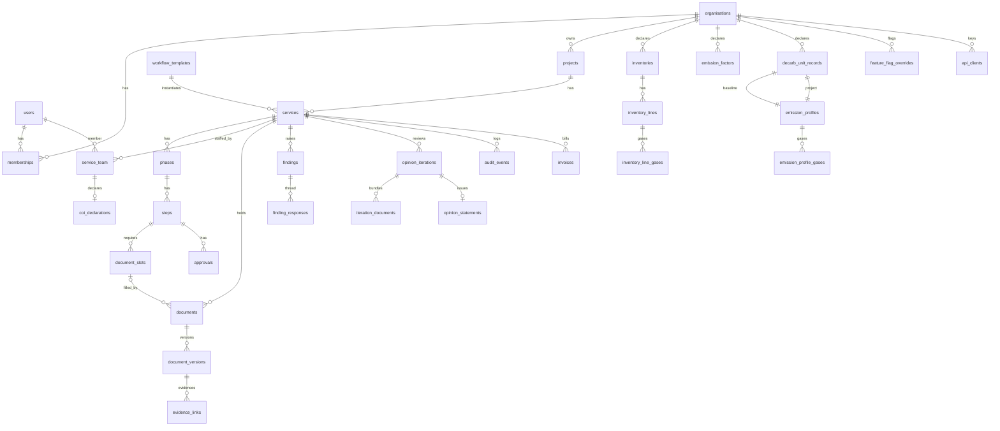

# PRD 0001 — VERIFASSUR_X Assurance Platform

| | |
|---|---|
| Status | Draft v0.1 |
| Date | 2026-10-05 |
| Author | Robin Duchesneau with Claude |
| Source notes | `brainstorming.md` (same folder), 16 reference screenshots in `../assets/sourceimages/` |
| Audience | Developers (junior to senior), designers, VERIFASSUR management |

---

## 1. Introduction

VERIFASSUR_X is the client-facing digital platform of VERIFASSUR, a third-party assurance company (validation and verification body, "VVB") working in the carbon market. A client company logs in to **request** assurance work (validation or verification), **follow** ongoing engagements with full visibility of evidence, findings, timeline and opinions, and **keep** its verified GHG inventory, product emission factors and `decarb_units` as structured, assurance-backed records that are reused the following year.

The platform also gives VERIFASSUR staff the internal workflow needed to deliver accreditation-grade work (impartiality checks, team nomination, independent review, iteration approvals, audit trail), because the client experience depends on it.

**Problem it solves.** Today an assurance engagement is email, shared folders and spreadsheets. The client does not know what is missing, what is blocking, or when the opinion will be issued. The outputs are PDFs that cannot be reused. VERIFASSUR_X replaces this with one workspace where every obligation, document, decision and verified number has an owner, a status, a timestamp and a link to evidence.

**Guiding principle** (from brainstorming §3.12): *present-realistic, future-exposed.* Release 1 is simple and complete. Later capabilities are visible in the product as flag-gated previews so clients see the roadmap and we measure demand.

**Decisions already made** (brainstorming §3.10–3.11) and inherited here:
- Verify only. No registry. The platform never issues, transfers, retires or claims units.
- `decarb_unit` = 1 tCO2e of (baseline − project) within a value chain, computed on the client's attributed volume; per-gas profiles; removals and biogenic CO2 separate and never netted.
- The client enters structured data and uploads evidence. The platform logs and checks consistency; it is not a calculation engine.
- Roadmap ingestion: spreadsheet import → REST API → MCP server.

---

## 2. Goals

| # | Goal | Measure |
|---|---|---|
| G1 | A client can request an engagement and reach a signed service agreement entirely in the platform | ≥ 80 % of new engagements requested through the portal within 12 months of launch |
| G2 | A client always knows the single next thing they must do | Every open service shows exactly one "blocking you" action or "nothing needed from you" on the home page |
| G3 | Evidence is complete before the auditor starts | Desk review starts with 0 missing required documents in ≥ 70 % of services |
| G4 | Verified numbers are structured, not trapped in PDFs | 100 % of issued opinions have their verified figures stored as records with an assurance reference |
| G5 | The engagement is accreditation-grade by construction | Impartiality approval, independent review and manager approval cannot be skipped by the system |
| G6 | Year two is faster than year one | Renewal requests pre-filled from prior year; median time from request to contract reduced by 30 % |
| G7 | The platform is ready for machine clients | Every client-entered form is backed by a published JSON schema that the future API accepts unchanged |

---

## 3. Users and roles

### 3.1 Organisations

Two organisation types share one platform:

- **Verifier org** — VERIFASSUR itself. One in Release 1; the model allows several later (flag `multi_verifier`).
- **Client org** — a company seeking assurance. Many. A client org sees only its own data.

### 3.2 Roles

**Client org roles**

| Role | Can |
|---|---|
| `client_owner` | Everything below, plus manage billing contacts, delete org data requests, transfer ownership |
| `client_admin` | Invite/remove users, assign roles, create requests, sign agreements, submit inventories and records, respond to findings, manage API keys (when enabled) |
| `client_contributor` | Upload evidence and enter data on services and records they are assigned to; respond to findings assigned to them |
| `client_viewer` | Read-only: dashboards, documents, opinions, history |

**Verifier org roles**

| Role | Can |
|---|---|
| `verifier_manager` | Triage requests, approve technical scope and impartiality, nominate team, approve contracts, approve opinion iterations, close services, manage templates and feature flags for clients |
| `verifier_team_leader` | Run the engagement: plan, open/close steps, raise findings, draft opinion iterations, request documents |
| `verifier_auditor` | Work assigned steps, review evidence, raise findings |
| `verifier_technical_expert` | Same as auditor, limited to assigned steps |
| `verifier_independent_reviewer` | Review opinion iterations, complete IR checklist, approve or request changes. Cannot have any other role on the same service |
| `verifier_coordinator` | Administrative: upload contract documents, schedule, manage invoices references, notifications |
| `verifier_finance` | Quotes, invoice references, paid status |

**Platform role**: `platform_admin` (VERIFASSUR IT) — tenant management, flags, system health. No access to client evidence content by default (break-glass with audit entry).

### 3.3 Service team

A user is attached to a service with a **service role** (one of the verifier roles above, or `client_contact`). Each verifier team member must complete a **conflict-of-interest (COI) declaration** per service before they can open it. Independent reviewer must not have any other service role on that service (enforced).

---

## 4. User stories

**Client**
1. As a client admin, I want to request a verification by picking a service type, standard and period, and attaching what I already have, so that VERIFASSUR can quote within days instead of weeks of email.
2. As a client admin, I want to see on my home page exactly what is blocking each engagement and whether it is on my side or VERIFASSUR's side.
3. As a client contributor, I want a checklist of required documents per step, with upload slots, so I know what is missing without asking.
4. As a client admin, I want to answer a finding in a thread with attachments and see when the auditor closed it.
5. As a client admin, I want to enter my GHG inventory per scope, category and gas, attach evidence to each figure, and submit it for verification.
6. As a client admin, I want to enter the baseline and project emission profiles of an insetting intervention and see the resulting `decarb_units` computed on my purchased volume.
7. As a client viewer (CFO), I want to download the signed opinion and see the verified totals and a short timeline of the engagement.
8. As a client admin, I want next year's request pre-filled from this year's scope, sites and evidence list.
9. As a client admin, I want to see each engagement's quote, invoice reference and paid status.
10. As a client admin, I want to see which future capabilities (API, MCP, AI assistant) are coming and tell VERIFASSUR I am interested.

**Verifier**
11. As a manager, I want new requests in a triage queue with the information needed to decide technical scope and impartiality.
12. As a manager, I want to nominate a team and have each member's COI declaration gate their access.
13. As a team leader, I want to open steps, request documents from the client, raise findings and see the client's responses in one place.
14. As an independent reviewer, I want the opinion iteration bundle, the checklist, and an approve / request-changes decision that is recorded with my name and time.
15. As a manager, I want to approve an iteration and issue the opinion, which locks the documents and writes the verified figures to the client's records.
16. As any verifier, I want a Service Log that shows every status change, upload, approval and decision with who and when.

**Machine (future, preview in Release 1)**
17. As a client's carbon-accounting SaaS, I want to push an inventory into a draft request through an API or MCP tool so a human only has to review and submit.

---

## 5. Scope

### 5.1 In scope — Release 1 (live)

- Multi-tenant orgs, users, roles, invitations, MFA, passkeys.
- Projects and Services with the three-phase workflow (Contracting, Planning, Execution) driven by service-type templates.
- Request wizard, pre-engagement form, technical scope and impartiality approvals, team nomination with COI, contract documents and in-platform acceptance of the service agreement.
- Evidence vault: required-document slots per step, versioned uploads, provenance, hash, download-all.
- Findings (CAR, CL, FAR, OBS) with threaded responses.
- Opinion iterations: team leader draft → independent review → manager approval → issue. Issued opinion statement page with hash.
- Timeline (Gantt) from planned dates and actual status events.
- Service Log (immutable audit trail) and notifications (in-app + email).
- Client self-entry: GHG inventory (year, scope, category, line, gases), product emission factors, `decarb_unit` records (baseline/project emission profiles, attributed volume). Evidence per figure. Declared vs verified values.
- Home dashboard, past services, documents tab, basic KPI tiles.
- Quotes and invoice references with paid status (no invoicing engine).
- Feature flags with preview state and interest capture.

### 5.2 In scope — Preview in Release 1, live in Release 2

- Spreadsheet template import for inventories and `decarb_unit` records.
- REST API with per-org API keys (schemas published from day one; endpoints enabled by flag).
- MCP server exposing the same operations as tools.
- AI evidence assistant (classify uploads into required slots, completeness check, figure extraction, draft findings for auditor review).
- Legal e-signature integration for service agreements and opinions.
- CSRD/ESRS E1 and ISO 14064-1 report exports from verified data.
- Registry links (Verra Project Hub, Gold Standard) beyond a reference ID.

### 5.3 Preview in Release 2, live in Release 3+

Continuous assurance, dMRV connectors, verifiable credentials for opinions, digital product passport export, agent-to-agent verification, multi-verifier recognition.

### 5.4 Non-goals

- Issuing, serialising, transferring, retiring or claiming carbon units. No registry.
- GHG calculation engine (activity data × factors). The client declares figures; we log, check consistency and verify.
- Accounting and invoicing (only references and paid status).
- Native mobile apps (responsive web; mobile is read-only for Release 1).
- Real-time chat. Communication is findings threads and notifications.
- Enforcing double counting across clients (auditor judgement, recorded as findings).

---

## 6. Functional requirements

Numbered for traceability. "Must" = Release 1. "R2"/"R3" = later releases, shown as preview earlier.

### 6.1 Organisations, users, access

- FR-1 The system must support multiple client orgs and one verifier org, with strict data isolation by `org_id` enforced in the data access layer (every query is scoped; no cross-org reads except through service team membership).
- FR-2 Users must authenticate with email + password or magic link, with TOTP MFA. MFA is mandatory for all verifier roles and for `client_owner`/`client_admin`. Passkeys (WebAuthn) must be supported as a second factor or passwordless login.
- FR-3 Org admins must be able to invite users by email with a role; invitations expire in 7 days and are single-use.
- FR-4 A user may belong to several orgs (e.g. a consultant) and must switch org context explicitly; the active org is part of the session.
- FR-5 The system must record every authentication event (login, failed login, MFA, API key use, role change) in the audit log.
- FR-6 R2: Org admins must be able to create scoped API keys (read, write, submit) that act as a machine user of that org, with rotation and revocation.
- FR-7 R2: Enterprise SSO (OIDC) per client org.

### 6.2 Projects and services

- FR-8 A client admin must be able to create a **Project** (name, description, country, standard/programme, external registry ID optional, owner).
- FR-9 A client admin must be able to create a **Service request** on a project through a wizard: service type (from templates), standard, reporting period, scope summary (sites, boundary, products or interventions), target dates, attachments, contact person. Submitting creates a Service in status `requested`.
- FR-10 Service types in Release 1 and their templates: `vcs_validation`, `vcs_verification`, `gs_validation`, `gs_verification`, `iso14064_1_inventory_verification`, `iso14067_product_verification`, `decarb_units_verification` (ISO 14064-2 style), `design_change`. Templates are data (JSON), editable by verifier managers without code changes.
- FR-11 Each Service must have phases and steps instantiated from its template, each with status, owner role, planned dates, required document slots and approvals.
- FR-12 Phase gating: a phase cannot start until the previous phase is completed, unless the template marks a step as `parallel_allowed`.
- FR-13 Step status transitions must be validated server-side against the state machine (§8.5) and recorded as status events with actor and timestamp.
- FR-14 The pre-engagement form (CPF) must be generated from the request data and editable by the client until submitted; the verifier reviews it in the Contracting phase.
- FR-15 Technical scope and impartiality approvals must be explicit records with approver, decision, date and comment. The service cannot move to team nomination without both approved.
- FR-16 Team nomination: manager assigns users with service roles. Each verifier member must submit a COI declaration (clear / potential conflict with description). The manager approves. A member with no approved COI sees the service in a locked state.
- FR-17 Independent reviewer must not hold another role on the same service (validation error).
- FR-18 Contracting documents (quote, contract, service agreement) are document slots; the client admin must be able to **accept** the service agreement in-platform (click-to-accept with name, time, IP, document hash recorded). R2: legal e-signature provider.
- FR-19 Renewal: a client admin must be able to create a new request "from" a closed service, pre-filling project, scope, sites and the list of previously supplied document types.
- FR-20 Managers must be able to put a service on hold with a reason, resume, or cancel it.

### 6.3 Evidence vault

- FR-21 Each step has required and optional **document slots** defined by the template (e.g. PDD, ERCS, Monitoring Plan, inventory workbook). The client sees missing required slots as a checklist.
- FR-22 Uploads go directly to object storage via short-lived signed URLs; max 500 MB per file; allowed types: pdf, docx, xlsx, csv, pptx, png, jpg, zip, json, xml. Type is verified by content sniffing, not extension only.
- FR-23 Every upload creates an immutable **document version** with uploader, time, size, SHA-256 hash and source (`manual | import | api | mcp`). Previous versions remain downloadable. Deleting hides a version (soft delete) and is logged; nothing is physically deleted during the retention period.
- FR-24 Verifier users must be able to mark a version `accepted` or `rejected` with a reason; rejection notifies the client and re-opens the slot.
- FR-25 Any document can be linked as evidence to inventory lines, emission profile gases, emission factors and `decarb_unit` records (polymorphic evidence links).
- FR-26 "Download all" per step, per phase and per service produces a zip with a manifest (file list and hashes).
- FR-27 R2: AI assistant proposes the slot for an unassigned upload and flags missing items; a human confirms.

### 6.4 Findings

- FR-28 Verifier users must be able to raise findings of type `CAR` (corrective action request), `CL` (clarification), `FAR` (forward action request), `OBS` (observation), with severity, description, affected step, affected record or line, due date, assignee on client side.
- FR-29 Client users must be able to respond in a thread with text and attachments. Status flow: `open → responded → under_review → closed` or `withdrawn`. Only verifier users close.
- FR-30 Open CARs must block the opinion iteration from reaching manager approval (configurable per template; default blocking for CAR, non-blocking for CL/FAR/OBS).

### 6.5 Opinion iterations and issuance

- FR-31 A team leader must be able to create an **opinion iteration** containing the final service documents (verification/validation report, findings report, opinion statement, calculation checks) and a summary of verified figures.
- FR-32 The iteration moves `draft → independent_review`. The independent reviewer completes the IR checklist (template-driven), uploads the IR report and decides `approve` or `request_changes` (with comments). Request changes returns to draft and increments the iteration number on the next submission.
- FR-33 After IR approval the manager completes the manager checklist and decides `approve` or `request_changes`.
- FR-34 **Issue**: on manager approval the system locks the iteration's documents (no further versions), generates the **opinion statement page** (HTML + PDF) with service details, verified figures, opinion type, signatories and the hash of each document, assigns a public verification code, and marks the service `issued`.
- FR-35 Issuing writes the verified figures to the client's records: inventory `verified_*` columns, emission factor `verified_value`, `decarb_unit_record` verified units, each with `assurance_ref = opinion_iteration_id`. Previously verified records for the same scope and period become `superseded`.
- FR-36 A public page `/verify/{code}` must show the opinion summary and document hashes without login (flag `public_statement`, default on after issuance; client can opt out).

### 6.6 Timeline and Service Log

- FR-37 The Timeline must show phases and steps as bars using planned start/end (from template defaults adjusted by the team leader) and actual start/end (from status events), with hover showing every transition and timestamp.
- FR-38 The Service Log must list all events of a service (status changes, uploads, approvals, findings, decisions, team changes, agreement acceptance) in reverse chronological order with actor, time (UTC) and before/after values, filterable by type. It is append-only.

### 6.7 Ledger: GHG inventory

- FR-39 A client admin must be able to create an **Inventory** for an organisation boundary and reporting year, choosing GWP set (AR5 or AR6, 100-year) and consolidation approach (operational control, financial control, equity share).
- FR-40 Inventory lines are entered per scope (1, 2, 3), category (Scope 3 categories 1–15; Scope 2 location- and market-based), activity description, optional quantity and unit, and **gases** (CO2, CH4, N2O, HFCs, PFCs, SF6, NF3, other) in tonnes of gas. The system computes tCO2e per gas using the inventory's GWP set and the line's gross total. Biogenic CO2 and removals are separate fields on the line and never included in the gross total.
- FR-41 Each line and each figure can have evidence links. The inventory shows a completeness indicator (lines with evidence / total lines).
- FR-42 Submitting an inventory for verification attaches it to a service (existing or new request) and freezes the declared values; edits after submission create a new revision with a change log.
- FR-43 Verifier users must be able to record verified values per line and totals (may equal declared), with comments; differences are displayed side by side.
- FR-44 The inventory page must show year-over-year comparison of verified totals by scope.
- FR-45 R2: import from the platform's spreadsheet template; R2: export ISO 14064-1 report and ESRS E1 datapoints.

### 6.8 Ledger: product emission factors

- FR-46 A client admin must be able to create a **product emission factor** record: product/good, functional unit (e.g. per kg, per unit), system boundary (cradle-to-gate, cradle-to-grave), reference year, declared value (kgCO2e per unit), method/standard (ISO 14067, PEF, other), evidence links.
- FR-47 Verified value and assurance reference are set on issuance; history by year is visible.

### 6.9 Ledger: `decarb_unit` records

- FR-48 A client admin must be able to create a **`decarb_unit` record** with: good, supply shed (good, variety or system, country, region), supplier or facility, intervention (type, activities, value-chain layer, start date), baseline method (`historical | counterfactual | other`, declared not computed), **baseline emission profile**, **project emission profile**, attributed volume and unit.
- FR-49 An **emission profile** holds period, boundary, GWP set, gases in tonnes with computed tCO2e, gross total, biogenic CO2 (separate), removals (separate), reference volume and unit, derived EF gross and EF removal per unit of good, and evidence links.
- FR-50 The system computes and displays: `decarb_factor_gross = EF_gross(baseline) − EF_gross(project)`, `decarb_factor_removal = EF_removal(project) − EF_removal(baseline)`, `reduction_units = decarb_factor_gross × attributed_volume`, `removal_units = decarb_factor_removal × attributed_volume`, `biogenic_delta` (reported only). All unit conversions (kg↔t, per kg↔per t) are explicit; mismatched units are an error, not a silent conversion.
- FR-51 Negative reduction units (project worse than baseline) must be allowed and clearly flagged; the record cannot be submitted for verification without a justification note.
- FR-52 Records are submitted for verification through a service of type `decarb_units_verification`; issuance sets verified units and status `verified`; a later record for the same good, supply shed and period supersedes the earlier one.
- FR-53 The `decarb_units` portfolio page must show, per year and good: declared and verified reduction and removal units, status, and the assurance reference. No "available / claimed" split (verify-only).

### 6.10 Dashboard, notifications, past services

- FR-54 Client home must show: progress counters (ongoing / completed services this year), "needs your action" list (one action per service, ranked by due date), latest notifications, and quick links to records. Verifier home shows "My Work" by service role with the blocking pill (COI pending, review pending, step open).
- FR-55 Notifications must be generated for: request received/triaged, document requested/rejected, finding raised/responded/closed, step opened/closed, iteration decision, opinion issued, agreement accepted, invoice reference added, team assignment, COI required. Delivered in-app and by email digest (immediate for blocking items, daily digest for the rest; user-configurable).
- FR-56 Past services table: project, service name, type, standard, period, team leader, contract date, issued date, opinion type, paid status, with filters and "download all".
- FR-57 Quotes and invoices: verifier finance adds quote amount, currency, invoice reference, due date and paid status to a service; client admins see them.

### 6.11 Feature flags and previews

- FR-58 Each feature has a platform default state and per-org override: `hidden | preview | enabled`. Preview renders the real navigation entry and page in a disabled state with a "Coming" badge, a short description and an "I'm interested" button that stores an interest record (org, user, feature, time, optional note).
- FR-59 Verifier managers must be able to see interest counts per feature and per org.

### 6.12 Integrations and machine access (R2)

- FR-60 R2: Public REST API `v1` over the same schemas as the web forms (requests, services, documents, findings, inventories, emission factors, `decarb_unit` records, opinions). Writes land as drafts; a human submits (default; flag `api_direct_submit` per org).
- FR-61 R2: MCP server exposing tools `list_services`, `get_service`, `create_request`, `upload_evidence`, `submit_inventory`, `submit_decarb_unit_record`, `list_findings`, `respond_to_finding`, `get_opinion`. Authenticated by API key; every call logged as a submission with source `mcp`.
- FR-62 R2: Outbound webhooks for service status, finding and opinion events.

---

## 7. User experience

### 7.1 Information architecture

```
Client portal (app.verifassurx.com)
├── Home                          progress, needs-your-action, notifications
├── Engagements
│   ├── Requests (new, drafts)    wizard
│   ├── Ongoing                   list → Service workspace
│   └── Past                      table, download-all
├── Service workspace (one service)
│   ├── Overview                  phase rail, next action, team, key dates, quote/paid
│   ├── Phases                    step detail: slots, approvals, forms
│   ├── Documents                 all documents grouped by category, versions
│   ├── Findings                  list + thread view
│   ├── Timeline                  Gantt
│   ├── Opinion                   iterations, issued statement, verified figures
│   └── Service Log               audit trail
├── Records
│   ├── GHG Inventories           per year; lines; evidence; YoY
│   ├── Product Emission Factors  per product; history
│   └── decarb_units              records; portfolio
├── Projects                      list and detail
├── Integrations (preview)        API keys, MCP, webhooks, imports
├── Organisation                  users, roles, invitations, settings, API keys (R2)
└── Account                       profile, MFA, passkeys, notification preferences

Verifier portal (same app, verifier org context; optional Cloudflare Access in front)
├── My Work                       by service role, blocking pill, phase | step
├── Triage queue                  new requests → scope & impartiality decisions
├── Services                      all, filters (standard, type, country, status, team)
├── Service workspace             same tabs as client, plus: team & COI, approvals, raise finding, iteration actions, verified values entry
├── Templates                     service-type workflow templates, document slots, checklists
├── Clients                       orgs, flags, interest signals
├── Finance                       quotes, invoice refs, paid status
└── Admin                         users, roles, audit, flags, system
```

### 7.2 Key screens (Release 1)

| Screen | Purpose | Main elements (patterns borrowed from the reference screenshots) |
|---|---|---|
| Client Home | Orientation | "My Progress" bars (ongoing vs completed), "Needs your action" cards with orange blocking pill, "Latest notifications", records shortcuts |
| New Request wizard | Create service | 5 steps: Project → Service type & standard → Scope & period → Attachments → Review & submit. Autosave as draft |
| Service Overview | Single-service status | Left **phase rail** (Contracting / Planning / Execution with status chips, expandable steps), right: current step card, "next action" banner, team contacts with roles, key dates, quote/paid, "Download all" |
| Step detail | Do the work of a step | Header with phase › step, status chip, Team Role badge; **required slots** with Upload / Status / Submitted by / Date / download icon; **approvals** rows (Status, Approved by, Date, tick); supporting documents; Close step (verifier) |
| Documents tab | Find any file | Grouped: Service Reporting, Phase Documents, Supporting; counts; (Required) flags; row actions view / download / replace / delete; version history drawer |
| Findings | Resolve issues | Table (type, severity, step, due, status) → thread with attachments; "Respond" for client; "Close / Reopen" for verifier |
| Timeline | Plan vs actual | Gantt rows per phase and step, months on x-axis, planned (outline) vs actual (filled), milestone ticks, legend, hover with timestamps |
| Opinion | The deliverable | Iteration accordions (Iteration 1, 2…), each with document bundle, IR decision, manager decision, banner ("Iteration has been approved"); issued statement card with verification code, hash list, verified figures tiles (tCO2e donut, big numbers) |
| Service Log | Audit trail | Reverse-chronological event list, filter by type and actor, export CSV |
| Inventory editor | Enter GHG inventory | Year header (GWP set, consolidation), tabs Scope 1 / 2 / 3, line table with gas sub-rows, computed tCO2e, evidence chips, completeness bar, declared vs verified columns, submit for verification |
| `decarb_unit` record editor | Enter intervention delta | Two-column **Baseline / Project** emission profiles (gas rows, biogenic, removals, reference volume), attributed volume, computed factor and units panel with unit checks, evidence per figure, submit |
| Records portfolio | Reuse verified data | Per-year cards and table, status chips Verified / Superseded / Declared, assurance link opens the opinion |
| Preview page | Future features | Greyed real layout, "Coming" badge, 2-line explainer, "I'm interested" |

### 7.3 Interaction rules

- **One next action.** Every service computes a single "next action" (who, what, due) from workflow state. Shown on home, overview and in email.
- **Blocking vs informational.** Orange pill = blocks the viewer; blue pill = status for information. Same colour semantics everywhere.
- **Role badge** on every service screen ("Team Role: Team Leader" / "Your role: Client admin").
- **Provenance line** under every file and figure: "v3 · uploaded 04 Feb 2026 14:02 UTC by H. Morgan · via web".
- **Declared vs verified** side by side; verified values are read-only for clients.
- **Empty states** explain what will appear and the action to make it appear.
- **Preview states** are never dead links; they explain and collect interest.
- **Destructive actions** (delete version, cancel service, revoke key) require typed confirmation and are logged.
- **Times** stored and shown in UTC with the user's local time on hover.
- Desktop-first (1280+), usable on tablet (≥ 768), read-only on phones.
- Accessibility: WCAG 2.1 AA; all status conveyed by text plus colour; keyboard-complete; focus visible.

### 7.4 Design system

- Visual language from the reference screenshots: calm teal/green primary, white cards on light grey, status chips (COMPLETED dark teal, IN PROGRESS teal, PENDING grey, ON HOLD amber, BLOCKED orange, REJECTED red), orange for "needs you", blue for information.
- Components: phase rail, status chip, action pill, document row, approval row, iteration accordion, gantt, KPI tile (donut, big number), evidence chip, declared/verified pair, preview overlay.
- Implementation: Tailwind CSS + shadcn/ui components (Radix primitives), lucide icons, Inter font. Tokens in CSS variables; dark mode supported from day one.

---

## 8. Architecture

### 8.1 Decision: Cloudflare, single Worker, monorepo

All runtime on Cloudflare. One Worker serves the web app (static assets) and the API (`/api/v1/*`). This keeps one deploy, one domain, no CORS, and Cloudflare's edge for auth and WAF.

```
Browser ── HTTPS ──> Cloudflare (WAF, Turnstile, Rate Limiting, optional Access for staff)
                        │
                        ▼
                 Worker "verifassurx-app" (Hono)
                 ├── /            static assets (Vite build of the React app)
                 ├── /api/v1/*    REST API (Hono + zod-openapi)
                 ├── /auth/*      Better Auth handlers
                 ├── /verify/:code public opinion statement
                 └── /mcp         (R2) MCP server, separate Worker "verifassurx-mcp"
                        │
        ┌───────────────┼───────────────┬──────────────┬─────────────┐
        ▼               ▼               ▼              ▼             ▼
      D1 (SQLite)     R2 (objects)     KV (cache)     Queues       Cron Triggers
      app data,       documents,       session        async jobs   reminders, digests,
      audit log       exports, PDFs    cache, flags   (email, hash, retention
                                                      zip, pdf)
                                                        │
                                           ┌────────────┴────────────┐
                                           ▼                         ▼
                                  Browser Rendering            Workers AI / Anthropic API
                                  (opinion PDF)                (R2: evidence assistant)
                                           │
                                     Resend (email)
```

### 8.2 Tech stack (decided)

| Layer | Choice | Why |
|---|---|---|
| Language | TypeScript end to end | one schema package shared by web, API, MCP |
| Monorepo | pnpm workspaces + Turborepo | `apps/app` (Worker + web), `apps/mcp` (R2), `packages/schema` (zod + types), `packages/db` (Drizzle), `packages/ui`, `packages/workflow` (state machines, templates) |
| Web | React 19 + Vite, TanStack Router, TanStack Query, react-hook-form + zod, Tailwind + shadcn/ui, Recharts for Gantt/KPIs | mature, fast, static-deployable |
| API | Hono on Workers with `@hono/zod-openapi` → OpenAPI 3.1 generated from the same zod schemas | tiny, Workers-native, typed |
| Auth | **Better Auth** with Drizzle/D1 adapter; plugins: organization, two-factor (TOTP), passkey, magic-link, api-key (R2), sso/OIDC (R2) | self-hosted on Workers, data stays in our D1, has every needed plugin |
| Database | **Cloudflare D1** (SQLite) with Drizzle ORM and Drizzle Kit migrations | zero ops, Time Travel point-in-time restore (30 days), fits the data volume for years; migration path to Postgres via Hyperdrive if ever needed (Drizzle keeps schema portable) |
| Files | **R2**, direct browser upload with presigned PUT (S3 API via `aws4fetch`), immutable object keys per version, lifecycle rules for exports | no Worker body limits, cheap, S3-compatible |
| Cache | KV for session lookups, feature flags, template JSON | edge reads |
| Async | **Queues** (email, hashing, zip, PDF, notifications), **Cron Triggers** (due-date reminders, daily digests, retention jobs), **Cloudflare Workflows** for the multi-step "issue opinion" process (lock → render → hash → write-back → notify, durable and retryable) | reliability without servers |
| PDF | Browser Rendering API renders the statement page to PDF | same HTML as the web page |
| Email | Resend (transactional); swap to Cloudflare Email Service when GA | reliable deliverability, templates |
| Bot/abuse | Turnstile on public forms, Rate Limiting binding on auth and API routes, WAF managed rules | included |
| Staff hardening | Cloudflare Access policy on `/staff/*` routes (verifier portal) with VERIFASSUR identity provider | second gate for auditor accounts |
| AI (R2) | Workers AI for classification; Anthropic API (Claude) for extraction and drafting with human review | best quality for document reasoning |
| Observability | Workers Logs + Analytics Engine for product metrics; Sentry for errors; Logpush later | |
| Testing | Vitest with `@cloudflare/vitest-pool-workers` (runs against real bindings), Playwright e2e, schema contract tests | |
| CI/CD | GitHub Actions: lint, typecheck, test, `drizzle-kit` migrate, `wrangler deploy` to `dev` → `staging` → `prod` environments | |
| Data region | R2 location hint and D1 placement: **EU** by default (CSRD clients); jurisdiction flag per deployment | |

### 8.3 Monorepo layout

```
verifassurx/
├── apps/
│   ├── app/                 # Worker: Hono API + static web (Vite) + auth
│   │   ├── src/api/         # routes per resource (services.ts, documents.ts, …)
│   │   ├── src/web/         # React app
│   │   ├── src/jobs/        # queue consumers, cron handlers, workflows
│   │   └── wrangler.toml
│   └── mcp/                 # R2: MCP server Worker (thin wrapper over API client)
├── packages/
│   ├── schema/              # zod schemas = API contract = form validation = MCP tool inputs
│   ├── db/                  # Drizzle schema, migrations, repository layer (org scoping)
│   ├── workflow/            # state machines, template loader, next-action computation
│   └── ui/                  # shared components and tokens
└── docs/                    # this PRD, ADRs, OpenAPI output
```

### 8.4 Multi-tenancy and data isolation

- Every table that holds client data has `org_id`. The repository layer takes an `AuthContext {userId, orgId, roles, serviceRoles}` and injects `org_id` into every query. Raw queries outside the repository layer are forbidden by lint rule.
- Verifier users reach client data only through `service_team` membership (or `verifier_manager` for triage/overview). Access checks: `can(ctx, action, resource)` central policy function with unit tests per role.
- Release 1 is one D1 database. The `org_id` design allows a later move to one D1 per large client if required.

### 8.5 Workflow engine

- Templates are JSON documents (`workflow_templates.definition`): phases → steps → `{key, name, owner_role, planned_duration_days, required_slots[], optional_slots[], approvals[], gating, parallel_allowed, checklist?}`.
- Instantiation copies the template into `phases` and `steps` rows for the service (so later template edits do not change running services).
- **Service status**: `draft → requested → triage → contracting → planning → execution → opinion_review → issued → closed`; side states `on_hold`, `cancelled`.
- **Step status**: `not_started → planned → in_progress → (on_hold | blocked) → completed`; `skipped` allowed only if template flag.
- **Finding**: `open → responded → under_review → closed | withdrawn`.
- **Opinion iteration**: `draft → independent_review → (changes_requested → draft) | ir_approved → manager_review → (changes_requested → draft) | approved → issued`.
- **COI**: `required → declared → approved | rejected`.
- **Document version**: `uploaded → checked → accepted | rejected`.
- **Record (inventory, EF, decarb_unit)**: `draft → submitted → under_verification → verified | superseded | withdrawn`.
- Transitions are functions in `packages/workflow` returning either the new state and the events to emit, or a typed error. Every transition emits an `audit_events` row and zero or more `notifications`.
- **Next action** is computed, not stored: given service state, return `{party: client|verifier, role, action, entity, due}`.

### 8.6 Issuance workflow (Cloudflare Workflows)

```
issueOpinion(iterationId)
 1. verify preconditions (manager approved, no blocking findings)      — compensable
 2. lock document versions (set locked_at)
 3. compute/refresh SHA-256 for each document (Queue fan-out, wait)
 4. render statement HTML → PDF (Browser Rendering) → R2
 5. create opinion_statement row with public code
 6. write-back verified figures to records (transaction batch), supersede older
 7. set service.status = issued, emit audit events
 8. notify client admins and team (Queue → email)
```
Each step is retried by Workflows; failure after step 2 unlocks and alerts.

---

## 9. Data model

### 9.1 Conventions

- IDs: ULID strings (`text` PK). Timestamps: ISO 8601 UTC `text`. Money: integer minor units + currency code. Booleans: integer 0/1 (SQLite).
- Soft delete via `deleted_at`. Audit via `audit_events`. Every mutable row has `created_at, created_by, updated_at, updated_by, version` (optimistic concurrency).
- Enumerations stored as text and validated in `packages/schema`.

### 9.2 Entity relationship diagram



### 9.3 Tables

Columns listed as `name type [constraints]`. Common audit columns omitted for brevity (`created_at, created_by, updated_at, updated_by, version, deleted_at`).

**Identity and tenancy**

| Table | Columns |
|---|---|
| `organisations` | `id`, `type` (`verifier`\|`client`), `name`, `legal_name`, `country`, `registration_no`, `settings_json`, `status` (`active`\|`suspended`) |
| `users` | `id`, `email` [unique], `name`, `email_verified` int, `mfa_enabled` int, `locale`, `timezone`, `status`. Better Auth owns `accounts`, `sessions`, `verifications`, `passkeys`, `two_factor` tables |
| `memberships` | `id`, `org_id` FK, `user_id` FK, `role` (enum §3.2), `status` (`invited`\|`active`\|`disabled`); unique (`org_id`,`user_id`) |
| `invitations` | `id`, `org_id`, `email`, `role`, `token_hash`, `expires_at`, `accepted_at`, `invited_by` |
| `api_clients` (R2) | `id`, `org_id`, `name`, `key_prefix`, `key_hash`, `scopes_json`, `last_used_at`, `revoked_at`, `created_by` |

**Engagement**

| Table | Columns |
|---|---|
| `projects` | `id`, `org_id`, `name`, `description`, `country`, `region`, `programme` (`verra_vcs`\|`gold_standard`\|`iso14064`\|`iso14067`\|`insetting`\|`other`), `external_registry_id`, `owner_user_id`, `status` |
| `workflow_templates` | `id`, `verifier_org_id`, `service_type` (enum FR-10), `name`, `version` int, `definition_json`, `is_active` int |
| `services` | `id`, `org_id` (client), `verifier_org_id`, `project_id`, `template_id`, `template_version`, `service_type`, `standard`, `name`, `status` (§8.5), `period_start`, `period_end`, `scope_json` (sites, boundary, products, interventions), `requested_at`, `contracted_at`, `issued_at`, `closed_at`, `on_hold_reason`, `renewed_from_service_id`, `client_contact_user_id`, `team_leader_user_id` |
| `phases` | `id`, `service_id`, `key`, `name`, `order_no`, `status`, `planned_start`, `planned_end`, `actual_start`, `actual_end` |
| `steps` | `id`, `service_id`, `phase_id`, `key`, `name`, `order_no`, `owner_role`, `status`, `planned_start`, `planned_end`, `actual_start`, `actual_end`, `parallel_allowed` int, `checklist_json`, `closed_by`, `closed_at` |
| `document_slots` | `id`, `service_id`, `step_id`, `key`, `name`, `category` (`contract`\|`phase`\|`supporting`\|`reporting`\|`ir`\|`checklist`), `required` int, `uploader_party` (`client`\|`verifier`), `current_document_id`, `status` (`empty`\|`submitted`\|`accepted`\|`rejected`) |
| `approvals` | `id`, `service_id`, `step_id`, `kind` (`technical_scope`\|`impartiality`\|`audit_plan`\|`contract`\|`agreement_acceptance`\|`iteration_ir`\|`iteration_manager`), `status` (`pending`\|`approved`\|`rejected`), `decided_by`, `decided_at`, `comment`, `evidence_json` (name, ip, doc hash for acceptance) |
| `service_team` | `id`, `service_id`, `user_id`, `service_role` (§3.2 + `client_contact`), `status` (`nominated`\|`active`\|`removed`), `nominated_by`, `nominated_at`; unique (`service_id`,`user_id`) |
| `coi_declarations` | `id`, `service_team_id`, `declaration` (`clear`\|`potential_conflict`), `details`, `declared_at`, `status` (`required`\|`declared`\|`approved`\|`rejected`), `decided_by`, `decided_at` |
| `invoices` | `id`, `service_id`, `kind` (`quote`\|`invoice`), `reference`, `amount_minor` int, `currency`, `issued_at`, `due_at`, `paid_at`, `status` (`draft`\|`sent`\|`paid`\|`overdue`\|`void`), `document_id` |

**Evidence**

| Table | Columns |
|---|---|
| `documents` | `id`, `org_id`, `service_id` (nullable for record-only evidence), `slot_id` (nullable), `title`, `category`, `current_version_id`, `locked_at` |
| `document_versions` | `id`, `document_id`, `version_no` int, `r2_key` [unique, immutable], `filename`, `mime_type`, `size_bytes`, `sha256`, `uploaded_by`, `uploaded_at`, `source` (`manual`\|`import`\|`api`\|`mcp`), `check_status` (`uploaded`\|`checked`\|`accepted`\|`rejected`), `checked_by`, `checked_at`, `reject_reason` |
| `evidence_links` | `id`, `org_id`, `document_version_id`, `entity_type` (`inventory_line`\|`inventory_line_gas`\|`emission_factor`\|`decarb_unit_record`\|`emission_profile`\|`emission_profile_gas`\|`finding_response`), `entity_id`, `note` |

**Findings and opinions**

| Table | Columns |
|---|---|
| `findings` | `id`, `service_id`, `number` int (per service), `type` (`CAR`\|`CL`\|`FAR`\|`OBS`), `severity` (`major`\|`minor`\|`info`), `title`, `description`, `step_id`, `entity_type`, `entity_id`, `raised_by`, `raised_at`, `assigned_user_id`, `due_at`, `status` (§8.5), `closed_by`, `closed_at`, `blocking` int |
| `finding_responses` | `id`, `finding_id`, `author_user_id`, `party` (`client`\|`verifier`), `body`, `created_at` (attachments via `evidence_links`) |
| `opinion_iterations` | `id`, `service_id`, `iteration_no` int, `status` (§8.5), `created_by`, `summary_json` (verified figures summary), `ir_user_id`, `ir_decision`, `ir_comment`, `ir_decided_at`, `manager_user_id`, `manager_decision`, `manager_comment`, `manager_decided_at`, `checklist_ir_json`, `checklist_manager_json` |
| `iteration_documents` | `id`, `iteration_id`, `document_version_id`, `role` (`report`\|`findings_report`\|`opinion`\|`calc_check`\|`ir_report`\|`ir_checklist`\|`manager_checklist`) |
| `opinion_statements` | `id`, `service_id`, `iteration_id`, `public_code` [unique], `opinion_type` (`unqualified`\|`qualified`\|`adverse`\|`disclaimer`\|`validation_positive`\|`validation_negative`), `level_of_assurance` (`limited`\|`reasonable`), `statement_html_r2_key`, `statement_pdf_r2_key`, `figures_json`, `hashes_json`, `issued_at`, `issued_by`, `public_enabled` int |

**Ledger (client records)**

| Table | Columns |
|---|---|
| `inventories` | `id`, `org_id`, `year` int, `boundary_name`, `consolidation` (`operational_control`\|`financial_control`\|`equity_share`), `gwp_set` (`AR5`\|`AR6`), `status` (§8.5), `revision` int, `service_id`, `declared_totals_json`, `verified_totals_json`, `assurance_ref` (opinion_iteration_id), `superseded_by_id`, `submitted_at`, `verified_at` |
| `inventory_lines` | `id`, `inventory_id`, `org_id`, `scope` (1\|2\|3), `category` (text code, e.g. `s3_c1_purchased_goods`, `s2_location`, `s2_market`), `site`, `activity`, `quantity` real, `unit`, `declared_gross_tco2e` real, `declared_biogenic_co2_t` real, `declared_removals_tco2e` real, `verified_gross_tco2e` real, `verified_biogenic_co2_t` real, `verified_removals_tco2e` real, `verifier_comment`, `source`, `order_no` |
| `inventory_line_gases` | `id`, `line_id`, `gas` (`CO2`\|`CH4`\|`N2O`\|`HFC`\|`PFC`\|`SF6`\|`NF3`\|`other`), `gas_detail` (e.g. HFC-134a), `tonnes_gas` real, `gwp` real, `tco2e` real (computed, stored for audit) |
| `emission_factors` | `id`, `org_id`, `product_name`, `product_code`, `functional_unit`, `boundary` (`cradle_to_gate`\|`cradle_to_grave`\|`gate_to_gate`), `method` (`iso14067`\|`pef`\|`ghgp_product`\|`other`), `year` int, `declared_value` real, `value_unit` (e.g. `kgCO2e/kg`), `verified_value` real, `status`, `service_id`, `assurance_ref`, `superseded_by_id`, `notes` |
| `decarb_unit_records` | `id`, `org_id`, `good`, `supply_shed_json` (good, variety, country, region), `supplier_name`, `facility_id`, `intervention_json` (type, activities[], layer, start_date), `baseline_method` (`historical`\|`counterfactual`\|`other`), `baseline_profile_id`, `project_profile_id`, `attributed_volume` real, `volume_unit`, `decarb_factor_gross` real, `decarb_factor_removal` real, `factor_unit`, `declared_reduction_units` real, `declared_removal_units` real, `biogenic_delta_tco2e` real, `verified_reduction_units` real, `verified_removal_units` real, `justification`, `status`, `service_id`, `assurance_ref`, `superseded_by_id`, `period_start`, `period_end` |
| `emission_profiles` | `id`, `org_id`, `kind` (`baseline`\|`project`), `period_start`, `period_end`, `boundary`, `gwp_set`, `gross_tco2e` real, `biogenic_co2_t` real, `removals_tco2e` real, `reference_volume` real, `volume_unit`, `ef_gross` real, `ef_removal` real, `ef_unit`, `notes` |
| `emission_profile_gases` | `id`, `profile_id`, `gas`, `gas_detail`, `tonnes_gas` real, `gwp` real, `tco2e` real |

**Platform**

| Table | Columns |
|---|---|
| `audit_events` | `id`, `org_id`, `service_id` (nullable), `actor_user_id` (nullable), `actor_api_client_id` (nullable), `actor_type` (`user`\|`api`\|`mcp`\|`system`), `event_type` (e.g. `step.status_changed`), `entity_type`, `entity_id`, `before_json`, `after_json`, `ip`, `user_agent`, `occurred_at`. **Append-only**: no UPDATE/DELETE grants in the repository layer |
| `notifications` | `id`, `org_id`, `user_id`, `type`, `title`, `body`, `entity_type`, `entity_id`, `read_at`, `emailed_at`, `created_at` |
| `notification_preferences` | `user_id`, `type`, `in_app` int, `email` (`immediate`\|`digest`\|`off`) |
| `submissions` | `id`, `org_id`, `source`, `api_client_id`, `entity_type`, `entity_id`, `payload_sha256`, `received_at` |
| `feature_flags` | `key`, `default_state` (`hidden`\|`preview`\|`enabled`), `title`, `description`, `horizon` (`now`\|`next`\|`later`) |
| `feature_flag_overrides` | `org_id`, `flag_key`, `state` |
| `feature_interest` | `id`, `org_id`, `user_id`, `flag_key`, `note`, `created_at` |

### 9.4 Indexes (minimum)

`memberships(org_id,user_id)`, `services(org_id,status)`, `services(verifier_org_id,status)`, `steps(service_id,phase_id,order_no)`, `document_versions(document_id,version_no)`, `evidence_links(entity_type,entity_id)`, `findings(service_id,status)`, `audit_events(service_id,occurred_at)`, `audit_events(org_id,occurred_at)`, `inventory_lines(inventory_id,scope,category)`, `decarb_unit_records(org_id,good,period_start)`, `notifications(user_id,read_at)`, `opinion_statements(public_code)`.

### 9.5 Retention and backups

- Engagement data and evidence retained **10 years** after service closure (assurance record-keeping), then purged by cron with an audit event.
- D1 Time Travel (30 days) plus nightly export of D1 to R2 (`wrangler d1 export`) kept 1 year. R2 bucket replicated to a second bucket daily. Restore procedure documented and tested quarterly.

---

## 10. API

### 10.1 Principles

- Base path `/api/v1`. JSON only. All schemas in `packages/schema` (zod) and published as OpenAPI 3.1 at `/api/v1/openapi.json` with Swagger UI at `/api/docs` (verifier and R2 API-key users).
- Authentication: session cookie (web) or `Authorization: Bearer vx_live_…` API key (R2). Active org via `X-Org-Id` header (must match a membership) or implied by the API key.
- Pagination: cursor-based `?limit=50&cursor=…` → `{items, next_cursor}`.
- Errors: RFC 9457 problem details `{type, title, status, detail, errors[]}`; validation errors list field paths.
- Idempotency: `Idempotency-Key` header honoured on all POSTs that create resources (stored 24 h in KV).
- Rate limits: 600 req/min per session, 300 req/min per API key, 10 req/min on auth endpoints per IP.
- Every mutating call emits an `audit_events` row.

### 10.2 Endpoints (Release 1 unless marked R2)

**Auth** (Better Auth handlers under `/auth/*`): sign-up by invitation, sign-in, magic link, MFA enrol/verify, passkey register/authenticate, sign-out, session; `POST /api/v1/me/org` switch active org.

**Organisation**
- `GET /orgs/me` · `PATCH /orgs/me`
- `GET /orgs/me/members` · `POST /orgs/me/invitations` · `DELETE /orgs/me/invitations/:id` · `PATCH /orgs/me/members/:id` (role, status)
- R2: `GET|POST /orgs/me/api-clients` · `DELETE /orgs/me/api-clients/:id`

**Projects**
- `GET /projects` · `POST /projects` · `GET /projects/:id` · `PATCH /projects/:id`

**Services**
- `GET /services?status=&type=&project_id=&role=` · `POST /services` (creates draft request) · `GET /services/:id` (includes phases, steps, slots, team, next_action) · `PATCH /services/:id` (draft fields) · `POST /services/:id/submit` (draft → requested) · `POST /services/:id/renew` (new draft prefilled)
- Verifier: `POST /services/:id/triage` (accept with template, or decline) · `POST /services/:id/hold` · `POST /services/:id/resume` · `POST /services/:id/cancel` · `POST /services/:id/close`
- `GET /services/:id/next-action` · `GET /services/:id/timeline` · `GET /services/:id/log?type=&cursor=`
- Steps: `POST /services/:id/steps/:stepId/transition` `{to, reason?, planned_start?, planned_end?}`
- Approvals: `GET /services/:id/approvals` · `POST /services/:id/approvals/:approvalId/decide` `{decision, comment}` · `POST /services/:id/agreement/accept` (client click-to-accept)
- Team: `GET|POST /services/:id/team` · `DELETE /services/:id/team/:memberId` · `POST /services/:id/team/:memberId/coi` (declare) · `POST /services/:id/team/:memberId/coi/decide`
- Invoices: `GET /services/:id/invoices` · verifier finance `POST|PATCH /services/:id/invoices[/:invId]`

**Documents**
- `GET /services/:id/documents?category=` · `GET /documents/:id` (versions) 
- Upload handshake: `POST /documents/uploads` `{service_id?, slot_id?, filename, mime_type, size_bytes, sha256}` → `{upload_url, r2_key, expires_at}`; then `POST /documents/uploads/:r2_key/complete` → creates document + version, enqueues hash check and sniffing
- `POST /documents/:id/versions` (new version handshake) · `GET /document-versions/:id/download` → short-lived signed GET · `DELETE /document-versions/:id` (soft)
- Verifier: `POST /document-versions/:id/check` `{status: accepted|rejected, reason?}`
- `POST /services/:id/download-all` → job id · `GET /jobs/:id` → zip download URL when ready
- Evidence: `POST /evidence-links` `{document_version_id, entity_type, entity_id, note}` · `DELETE /evidence-links/:id`

**Findings**
- `GET /services/:id/findings?status=&type=` · verifier `POST /services/:id/findings` · `GET /findings/:id` · `PATCH /findings/:id` (verifier) · `POST /findings/:id/responses` (either party) · verifier `POST /findings/:id/transition` `{to}`

**Opinion**
- `GET /services/:id/iterations` · team leader `POST /services/:id/iterations` · `POST /iterations/:id/documents` · `POST /iterations/:id/submit-for-ir` · IR `POST /iterations/:id/ir-decision` `{decision, comment, checklist}` · manager `POST /iterations/:id/manager-decision` · manager `POST /iterations/:id/issue` (starts Workflow) · `GET /services/:id/statement` · public `GET /verify/:code`

**Records**
- Inventories: `GET /inventories?year=` · `POST /inventories` · `GET /inventories/:id` (lines + gases + evidence + totals) · `PATCH /inventories/:id` · `PUT /inventories/:id/lines` (bulk replace in draft) · `POST /inventories/:id/lines` · `PATCH /inventory-lines/:id` · `DELETE /inventory-lines/:id` · `POST /inventories/:id/submit` `{service_id | new_request:{…}}` · verifier `PATCH /inventory-lines/:id/verified` · `GET /inventories/compare?years=2024,2025`
- Emission factors: `GET|POST /emission-factors` · `GET|PATCH /emission-factors/:id` · `POST /emission-factors/:id/submit` · verifier `PATCH /emission-factors/:id/verified`
- `decarb_unit` records: `GET|POST /decarb-unit-records` · `GET|PATCH /decarb-unit-records/:id` · `PUT /decarb-unit-records/:id/profiles/:kind` (baseline\|project, with gases) · `GET /decarb-unit-records/:id/compute` (returns factors and units with unit-check diagnostics; also computed on every save) · `POST /decarb-unit-records/:id/submit` · verifier `PATCH /decarb-unit-records/:id/verified` · `GET /decarb-unit-records/portfolio?year=`
- R2: `POST /imports` (xlsx/csv against template) → job → preview → `POST /imports/:id/apply`

**Dashboard and notifications**
- `GET /dashboard` (counters, needs-action list, latest notifications) · `GET /notifications?unread=` · `POST /notifications/:id/read` · `GET|PUT /me/notification-preferences`

**Verifier**
- `GET /staff/triage` · `GET /staff/my-work` · `GET /staff/services?…` · `GET|POST|PATCH /staff/templates[/:id]` · `GET /staff/clients` · `GET|PUT /staff/clients/:orgId/flags` · `GET /staff/feature-interest`

**Flags**
- `GET /features` (effective state for active org) · `POST /features/:key/interest` `{note?}`

**R2 machine access**
- Same resources with API key; `POST /webhooks` subscriptions; MCP server at `mcp.verifassurx.com` with tools listed in FR-61, each tool input = the corresponding zod schema.

### 10.3 Front-end to API mapping (Release 1)

| Screen | Calls |
|---|---|
| Client Home | `GET /dashboard`, `GET /features` |
| New Request wizard | `GET /projects`, `POST /projects`, `POST /services`, `PATCH /services/:id` (autosave), `POST /documents/uploads` + complete, `POST /services/:id/submit` |
| Service Overview | `GET /services/:id`, `GET /services/:id/next-action`, `GET /services/:id/invoices`, `GET /services/:id/team` |
| Step detail | `GET /services/:id` (step subset), upload handshake, `GET /services/:id/approvals`, `POST …/agreement/accept`; verifier: `POST …/steps/:stepId/transition`, `POST …/approvals/:id/decide`, `POST /document-versions/:id/check` |
| Documents | `GET /services/:id/documents`, `GET /documents/:id`, `GET /document-versions/:id/download`, `POST /services/:id/download-all`, `GET /jobs/:id` |
| Findings | `GET /services/:id/findings`, `GET /findings/:id`, `POST /findings/:id/responses`, verifier create/transition |
| Timeline | `GET /services/:id/timeline` |
| Opinion | `GET /services/:id/iterations`, `GET /services/:id/statement`, verifier iteration actions |
| Service Log | `GET /services/:id/log` |
| Inventory editor | `GET /inventories/:id`, line CRUD, `POST /evidence-links`, `POST /inventories/:id/submit`, `GET /inventories/compare` |
| `decarb_unit` editor | `GET /decarb-unit-records/:id`, `PUT …/profiles/:kind`, `GET …/compute`, `POST …/submit` |
| Portfolio | `GET /decarb-unit-records/portfolio`, `GET /emission-factors`, `GET /inventories` |
| Org settings | members, invitations, (R2) api-clients |
| Preview pages | `GET /features`, `POST /features/:key/interest` |
| Verifier My Work / Triage | `GET /staff/my-work`, `GET /staff/triage`, `POST /services/:id/triage` |

---

## 11. Authentication and authorisation

### 11.1 Authentication

- **Provider**: Better Auth running inside the Worker, tables in D1 via Drizzle. Session cookie `__Host-vx_session`, HttpOnly, Secure, SameSite=Lax, path `/`. Session record in D1, cached in KV (TTL 5 min) for edge-fast checks.
- **Methods**: email + password (min 12 chars, breached-password check via k-anonymity API), magic link (15 min, single use), passkeys (WebAuthn, resident keys allowed), TOTP MFA with recovery codes.
- **MFA policy**: enforced at sign-in for verifier roles and client owner/admin; others prompted, can defer 14 days.
- **Session lifetime**: client users 12 h idle / 30 days absolute; verifier users 8 h idle / 24 h absolute; re-authentication required for: accepting an agreement, issuing an opinion, approving an iteration, revoking keys, changing MFA.
- **Sign-up** is by invitation only (no self-serve org creation in Release 1); the first client admin is invited by VERIFASSUR after the commercial contact.
- **Staff second gate**: verifier portal routes `/staff/*` are also behind a Cloudflare Access policy bound to VERIFASSUR's identity provider (Google Workspace or Microsoft Entra). Access JWT is validated in the Worker in addition to the app session.
- **Bot protection**: Turnstile on sign-in, magic link request and the public `/verify/:code` page; Rate Limiting binding on `/auth/*`.
- **CSRF**: SameSite cookie + Origin header check on mutating requests; API keys are exempt from CSRF since they are not cookies.
- **Email verification** required before any data access.
- **Account recovery**: magic link + recovery code; admin-initiated reset creates an audit event.

### 11.2 Authorisation

- Central policy `can(ctx, action, resource)` in `packages/workflow/policy.ts`. Actions are explicit strings (`service.read`, `service.submit`, `step.transition`, `approval.decide:impartiality`, `iteration.ir_decide`, `document.check`, `record.verify`, …).
- Resolution order: platform role → org role → service role → COI gate → resource state (e.g. cannot upload to a locked slot).
- **RBAC matrix (excerpt)**

| Action | client_owner/admin | client_contributor | client_viewer | verifier_manager | team_leader | auditor/expert | independent_reviewer | coordinator | finance |
|---|---|---|---|---|---|---|---|---|---|
| Create/submit request | ✓ | | | | | | | | |
| Upload to client slots | ✓ | ✓ (assigned) | | | | | | | |
| Accept service agreement | ✓ | | | | | | | | |
| Enter/submit records | ✓ | ✓ (assigned) | | | | | | | |
| Respond to finding | ✓ | ✓ (assigned) | | | | | | | |
| Read service, documents, opinion | ✓ | ✓ (assigned) | ✓ | ✓ | ✓ (team) | ✓ (team) | ✓ (team) | ✓ (team) | read only |
| Triage, scope and impartiality approval | | | | ✓ | | | | | |
| Nominate team, decide COI | | | | ✓ | | | | | |
| Transition steps, request docs, raise findings | | | | ✓ | ✓ | ✓ (assigned steps) | | | |
| Accept/reject document versions | | | | ✓ | ✓ | ✓ | | | |
| Create iteration, submit for IR | | | | | ✓ | | | | |
| IR decision | | | | | | | ✓ | | |
| Manager decision, issue, close | | | | ✓ | | | | | |
| Enter verified values | | | | ✓ | ✓ | ✓ (assigned) | | | |
| Quotes/invoices | | | | ✓ | | | | ✓ (refs) | ✓ |
| Manage members, API keys | ✓ | | | ✓ (verifier org) | | | | | |
| Feature flags, templates | | | | ✓ | | | | | |

- **COI gate**: any verifier service role with `coi_declarations.status != approved` → all `service.*` actions denied except `coi.declare`.
- **Separation of duties**: IR cannot be team leader/auditor on the same service (DB check + policy); the manager who approves an iteration cannot be its team leader.
- **API keys (R2)**: scopes `read`, `write`, `submit`; keys act as a virtual member with `client_admin` powers limited by scope; never allowed to accept agreements or decide approvals.

### 11.3 Security and compliance

- All data encrypted at rest (D1, R2, KV default) and in transit (TLS 1.3). Secrets in Worker secrets, never in code.
- Signed URLs: upload 15 min, download 5 min, single object.
- Document hashes stored at upload and recomputed at issuance; the statement page lists them for third-party verification.
- GDPR: user data export and deletion requests handled by platform admin with audit; client data processor terms; EU region default.
- Logging excludes document content and personal data beyond user id and email.
- Dependency scanning and secret scanning in CI; quarterly external penetration test before Release 2 (API exposure).
- Accreditation support (ISO/IEC 17029, ISO 14065): impartiality records, competence (team roles), independent review, records retention, and traceability are all first-class records in the system.

---

## 12. Non-functional requirements

| Area | Requirement |
|---|---|
| Performance | p95 API < 300 ms for reads at the edge; service page first render < 2 s on 10 Mbps; uploads limited only by client bandwidth |
| Availability | 99.9 % monthly for the app; scheduled maintenance announced in-app |
| Scale (3 years) | 300 client orgs, 2,000 users, 3,000 services, 150,000 documents, 2 TB in R2, 1 M audit events — within D1 and R2 limits |
| Data integrity | Optimistic concurrency on all mutable rows; append-only audit; immutable object keys |
| Localisation | English first; i18n framework in place; French second (R2); all dates UTC with local display |
| Browser support | Last 2 versions of Chrome, Edge, Firefox, Safari |
| Observability | Request logs with request id; error tracking; product events (request submitted, step closed, opinion issued, interest clicked) in Analytics Engine |

---

## 13. Release plan

| Release | Content | Flags live | Flags preview |
|---|---|---|---|
| **R1 — Foundation** (target 2027 Q1) | §5.1 in full | engagements, evidence, findings, opinions, timeline, log, records, dashboard, invoices refs, public statement | spreadsheet_import, api, mcp, ai_assistant, esign, reports_export, registry_links, continuous_assurance, dmrv, verifiable_credentials, dpp_export, agent_verification, multi_verifier |
| **R2 — Open platform** (2027 H2) | §5.2 | spreadsheet_import, api, mcp, ai_assistant, esign, reports_export, registry_links, sso | remaining |
| **R3 — Continuous assurance** (2028+) | §5.3 | continuous_assurance, dmrv, verifiable_credentials, dpp_export | agent_verification, multi_verifier |

R1 internal milestones: M1 auth + orgs + projects + request wizard; M2 workflow engine + step UI + evidence vault; M3 findings + opinion iterations + issuance workflow + statement page; M4 records (inventory, EF, decarb_units) + write-back; M5 timeline, log, dashboard, notifications, flags and previews; M6 hardening, pen test, pilot with two clients.

---

## 14. Success metrics

| Metric | Target 12 months after R1 |
|---|---|
| Share of engagements requested through the portal | ≥ 80 % |
| Services with zero missing required documents at desk review start | ≥ 70 % |
| Median days from request to signed agreement | −30 % vs pre-platform baseline |
| Median days from execution start to opinion issued | −20 % |
| Client users logging in at least monthly during an active service | ≥ 75 % |
| Issued opinions with structured verified figures | 100 % |
| Renewal requests created with "renew" | ≥ 50 % of eligible |
| Preview "I'm interested" clicks | tracked per feature; used to order R2 |
| Audit findings by the accreditation body against record-keeping | 0 |

---

## 15. Risks and mitigations

| Risk | Mitigation |
|---|---|
| D1 limits (10 GB per database, batch-only transactions) | Volumes are far below; evidence lives in R2; Drizzle schema portable to Postgres via Hyperdrive; one-DB-per-large-client option |
| Auditors keep working by email | Verifier portal is minimal but mandatory for approvals and issuance; findings only exist in the platform |
| Clients find structured data entry heavy | Required fields minimal; spreadsheet import in R2; evidence can be attached at line level later; autosave everywhere |
| Impartiality or review rules too rigid for edge cases | Manager override with mandatory reason, logged and reported |
| Wrong units inflate `decarb_units` by 1000× | Explicit units with conversion table; mismatches are errors; computed values displayed with units |
| Presigned upload complexity | Single helper in `packages/schema` client; fallback Worker-proxied upload for files < 100 MB |

---

## 16. Open questions and assumptions

Assumptions made (change if wrong):
1. Domain `verifassurx.com`, app at `app.`, MCP at `mcp.`, public statement on `app.…/verify/{code}`.
2. VERIFASSUR identity provider for staff is Google Workspace or Microsoft Entra (either works with Cloudflare Access).
3. EU data region by default.
4. First pilot clients are corporates with ISO 14064-1 inventories and insetting `decarb_unit` records; Verra/Gold Standard templates ship in R1 but are exercised second.
5. English UI first; French in R2.
6. Opinion statements are signed by click-to-accept inside the platform in R1 (manager identity, MFA re-auth, hash); legal e-signature provider in R2.

Open:
- Branding (name, logo, colours) for the statement page and emails.
- Whether `client_contributor` assignment is per service or per record type (default: per service and per record).
- Retention period confirmation (10 years assumed) and any country-specific rules.
- Which carbon-accounting SaaS the first clients use, to shape the R2 import template and MCP tool tests.
